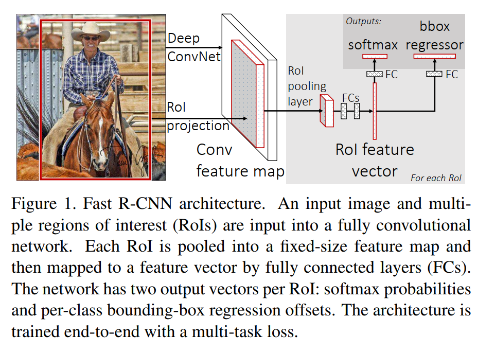
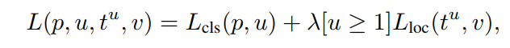
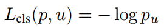
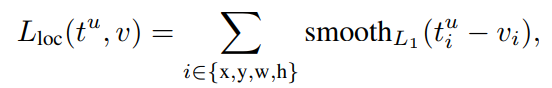
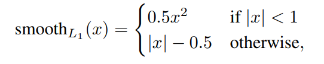

<!--
 * @Author: LOTEAT
 * @Date: 2024-08-10 19:10:30
-->

## Fast R-CNN
- 前置知识：<a href='../RCNN/rcnn.md'>RCNN</a>, <a href='../FeaturePyramidNetwork/feature_pyramid_network.md'>FPN</a>, <a href="../../../MMSeries/mmdetection"> mmdetection </a>, <a href="https://github.com/LOTEAT/mmcv-ops/blob/main/mmcv_ops/roi_align/roi_align.ipynb"> RoIAlign </a>
- 作者：Ross Girshick
- [文章链接](https://arxiv.org/pdf/1504.08083)
- [代码链接](https://github.com/open-mmlab/mmdetection)


### 1. Motivation
在RCNN论文中，RCNN虽然效果很好，但是依旧有很多不足。
- 训练是多阶段的。RCNN采用多阶段训练策略，效果很好，但是流程相对而言很复杂。
- 训练在空间和时间的开销很大。VGGNet、SVM导致训练在空间和时间上开销很大。
- 检测速度很慢。RCNN在GPU上对图像的检测速度很慢。
为了解决这三个问题，论文提出了Fast-RCNN网络。


### 2. Architecture

Fast RCNN网络将整个图像和一组region proposal作为输入。网络首先使用多个卷积和最大池化层处理整个图像以生成卷积特征图。然后，对于每个对象region proposal（依旧采用Selective Search的方法 ），通过ROI投影，并使用ROI池化层从特征图中提取固定长度的特征向量。

每个特征向量被输入到一系列全连接层中，输出会送入两个全连接层：一个是分类层，包括K个类别以及1个背景类。另一层则是回归层，这一层是预测4个值，从而对region proposal进行校正。这个校正可参见RCNN-BB。

<center>
    
    <br>
    <div style="color:orange; border-bottom: 1px solid #d9d9d9;
    display: inline-block;
    color: #999;
    padding: 2px;">
      图1：Architecture
  	</div>
</center>

#### 2.1 ROI Pooling Layer

ROI池化层使用最大池化将任何有效感兴趣区域内的特征转换为具有固定空间范围$H \times W$的小特征图，其中 $H$ 和 $W$ 是超参数。如果输入是$h \times w$的图像，我们只需让max pooling层的size是$\lceil \frac{h}{H} \rceil $，stride是$\lfloor \frac{h}{H} \rfloor $即可。

ROI在特征图上的投影是非常容易求的，只需要计算一下特征图的下采样率，那么特征图的坐标除以这个下采样率就可以获得在特征图上的坐标了。

#### 2.2 Loss
损失由两个任务（分类和回归）的损失组织处呢个，如下面公式所示。
<center>
    
    <br>
    <div style="color:orange; border-bottom: 1px solid #d9d9d9;
    display: inline-block;
    color: #999;
    padding: 2px;">
  	</div>
</center>
其中，分类损失是：
<center>
    
    <br>
    <div style="color:orange; border-bottom: 1px solid #d9d9d9;
    display: inline-block;
    color: #999;
    padding: 2px;">
  	</div>
</center>
回归损失是：
<center>
    
    <br>
    <div style="color:orange; border-bottom: 1px solid #d9d9d9;
    display: inline-block;
    color: #999;
    padding: 2px;">
  	</div>
</center>

<center>
    
    <br>
    <div style="color:orange; border-bottom: 1px solid #d9d9d9;
    display: inline-block;
    color: #999;
    padding: 2px;">
  	</div>
</center>
主要回归损失只有在这块区域非背景类才会计算。

#### 2.3 SVD
为了加速运算，论文对全连接层参数进行了SVD分解。这项偏工程上的应用，但是实际使用这个方法仍需多加斟酌。

### 3. Code
我们先来看config文件，主体内容如下，接下来主要分析模型。
```python
# model settings
model = dict(
    type='FastRCNN',
    data_preprocessor=dict(
        type='DetDataPreprocessor',
        mean=[123.675, 116.28, 103.53],
        std=[58.395, 57.12, 57.375],
        bgr_to_rgb=True,
        pad_size_divisor=32),
    backbone=dict(
        type='ResNet',
        depth=50,
        num_stages=4,
        out_indices=(0, 1, 2, 3),
        frozen_stages=1,
        norm_cfg=dict(type='BN', requires_grad=True),
        norm_eval=True,
        style='pytorch',
        init_cfg=dict(type='Pretrained', checkpoint='torchvision://resnet50')),
    neck=dict(
        type='FPN',
        in_channels=[256, 512, 1024, 2048],
        out_channels=256,
        num_outs=5),
    roi_head=dict(
        type='StandardRoIHead',
        bbox_roi_extractor=dict(
            type='SingleRoIExtractor',
            roi_layer=dict(type='RoIAlign', output_size=7, sampling_ratio=0),
            out_channels=256,
            featmap_strides=[4, 8, 16, 32]),
        bbox_head=dict(
            type='Shared2FCBBoxHead',
            in_channels=256,
            fc_out_channels=1024,
            roi_feat_size=7,
            num_classes=80,
            bbox_coder=dict(
                type='DeltaXYWHBBoxCoder',
                target_means=[0., 0., 0., 0.],
                target_stds=[0.1, 0.1, 0.2, 0.2]),
            reg_class_agnostic=False,
            loss_cls=dict(
                type='CrossEntropyLoss', use_sigmoid=False, loss_weight=1.0),
            loss_bbox=dict(type='L1Loss', loss_weight=1.0))),
    # model training and testing settings
    train_cfg=dict(
        rcnn=dict(
            assigner=dict(
                type='MaxIoUAssigner',
                pos_iou_thr=0.5,
                neg_iou_thr=0.5,
                min_pos_iou=0.5,
                match_low_quality=False,
                ignore_iof_thr=-1),
            sampler=dict(
                type='RandomSampler',
                num=512,
                pos_fraction=0.25,
                neg_pos_ub=-1,
                add_gt_as_proposals=True),
            pos_weight=-1,
            debug=False)),
    test_cfg=dict(
        rcnn=dict(
            score_thr=0.05,
            nms=dict(type='nms', iou_threshold=0.5),
            max_per_img=100)))

```
可以看到，检测器类别是`FastRCNN`，接下来进入`FastRCNN`类中。
```python
class FastRCNN(TwoStageDetector):
    """Implementation of `Fast R-CNN <https://arxiv.org/abs/1504.08083>`_"""

    def __init__(self,
                 backbone: ConfigType,
                 roi_head: ConfigType,
                 train_cfg: ConfigType,
                 test_cfg: ConfigType,
                 neck: OptConfigType = None,
                 data_preprocessor: OptConfigType = None,
                 init_cfg: OptMultiConfig = None) -> None:
        super().__init__(
            backbone=backbone,
            neck=neck,
            roi_head=roi_head,
            train_cfg=train_cfg,
            test_cfg=test_cfg,
            init_cfg=init_cfg,
            data_preprocessor=data_preprocessor)
```
`FastRCNN`是继承`TwoStageDetector`。在`TwoStageDetector`训练时，首先会对输入数据进行特征提取。在Fast R-CNN中，backbone网络是`ResNet`，neck网络是`FPN`。实际上，`FPN`并不是Fast R-CNN网络的原始内容，而是后人发现`FPN`有助于提升检测效果才加上去的。输入数据的维度在`DetDataPreprocessor`中被处理成了 `(B, 3, 800, 1216)`.

```python
    def extract_feat(self, batch_inputs: Tensor) -> Tuple[Tensor]:
        """Extract features.

        Args:
            batch_inputs (Tensor): Image tensor with shape (N, C, H ,W).

        Returns:
            tuple[Tensor]: Multi-level features that may have
            different resolutions.
        """
        # backbone是resnet
        x = self.backbone(batch_inputs)
        # neck是fpn
        if self.with_neck:
            x = self.neck(x)
        return x
```
在`mmdetection`中，region proposals是预先通过其他网络提取的。它的bbox格式是xyxy，每个图片都有1000个region proposals。这些RoI经过正负样本采样后，余留的RoI会进行通过`StandardRoIHead`进行RoIPooling。除了RoI投影外，其余部分的代码并不复杂，只需要耐心去看。要注意的是，现在RoIPooling基本是通过RoIAlign实现的，所以在前置知识中才会加入RoIAlign的内容。

整体架构其实并不复杂，但是`mmdetection`各个类封装太深，所以读源码时相对有些困难。虽然我写了一个`MMSeries`，但是我发现要想完整的写出MM框架代码作用注释十分困难，也非常耗时间。所以还是推荐自行阅读源代码，掌握MM系列设计的思想和模式。


### 4. Innovation
提出了ROI pooling，并且将RCNN的SVM替换为全连接层。