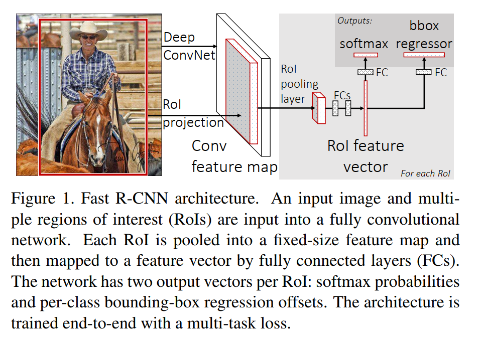
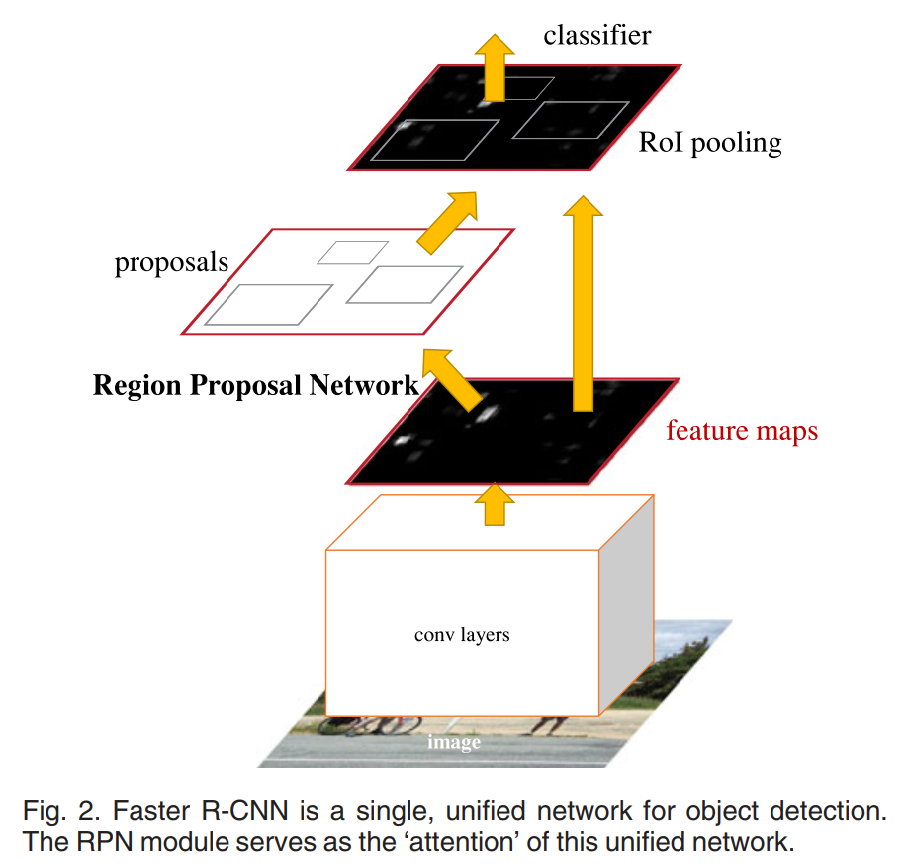
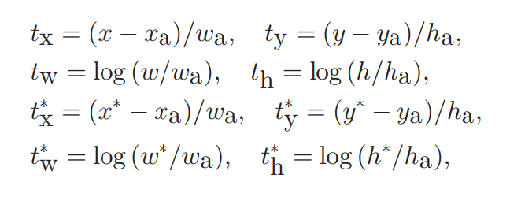
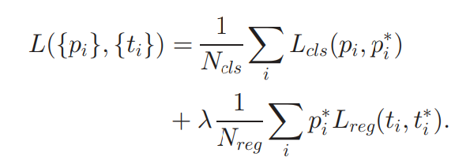

<!--
 * @Author: LOTEAT
 * @Date: 2024-08-11 10:55:52
-->

## Faster R-CNN
- 前置知识：<a href='../FastRCNN/fast_rcnn.md'>FastRCNN</a>
- 作者：Shaoqing Ren, Kaiming He, Ross Girshick, and Jian Sun
- [文章链接](https://arxiv.org/pdf/1506.01497)
- [代码链接](https://github.com/open-mmlab/mmdetection)

### 1. Motivation
在Fast R-CNN中，尽管模型推理速度很快，但是在Selective Search时会耗费大量的时间。而Faster R-CNN尝试通过深度神经网络的方式进行Region Proposal，这是第一个真正意义上的RPN网络。

### 2. Architecture
先回顾一下Fast R-CNN网络的架构。

    
     
    

      图1：Fast R-CNN网络架构
    

实际上，Faster R-CNN网络和Fast R-CNN基本是一样的。它是将SS算法替换成了RPN网络。

    
     
    

      图1：Fast R-CNN网络架构
    

#### 2.1 RPN
RPN网络接收一张图像作为输入，输出是一系列的region proposals，没有一个都会有一个object score。在RPN网络中，首先使用卷积层提取特征，这个卷积可以是任何一个backbone网络。

接下来，为了产生region proposals，论文采用滑动窗口策略，每次在特征图上滑动一个小窗口。例如，窗口大小是3\*3，滑动窗口是1\*1。每次就会只滑动一格，并且将3\*3窗口送入一个小网络中判断这个位置能否产生region proposal。事实上，这就是卷积的过程。

这个小网络会将窗口映射成一个低维的向量，然后送到框回归层和分类层中。最终输出的是一个$2k$的分数和$4k$的坐标。4代表的是region proposals的中心点、宽和高，2代表是有目标和没有目标的概率。$k$则代表的是anchor的个数，也就是参考框。因为大多数时候，直接预测框是非常困难的，因此会预先设定一些anchor，这些anchor具有固定大小的长和宽。最后只要输出中心点的偏移量和宽高的偏移量即可，这和R-CNN是一样的。

    
     
    

    

#### 2.2 Loss Function
为了计算损失函数，我们需要对正负样本进行赋值。

在论文中，正样本包括两类：1.所有anchor中与gt框IoU最大的一个，这保证了至少有一个正样本。2.anchor与gt框IoU大于0.7。
负样本则是与gt框IoU小于0.3的anchor。

    
     
    

      图2：损失函数
    

如果anchor是正标签，那么$p_i^*$为1，否则为0。$N_{reg}$是归一化参数，是最终anchor location的个数，也就是最后特征图的像素数。$N_{cls}$是256，由于最终$N_{reg}$大概是$N_{cls}$的十倍，所以$\lambda$被设置成了10。

#### 2.3 4-Step Alternating Training
第一步：单独训练一个RPN网络。
第二步：单独训练一个Fast R-CNN网络，并使用第一步训练的RPN网络进行region proposal。
第三步：作者使用Fast R-CNN网络初始化RPN网络，但是冻结卷积层参数，只微调RPN内部小网络的结构。
第四步：冻结卷积层参数，只微调Fast R-CNN内部网络的结构。

### 3. Code

### 4. Innovation
第一篇真正意义上的RPN网络。