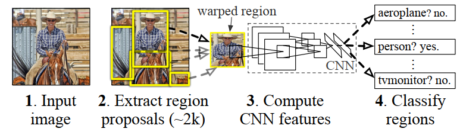
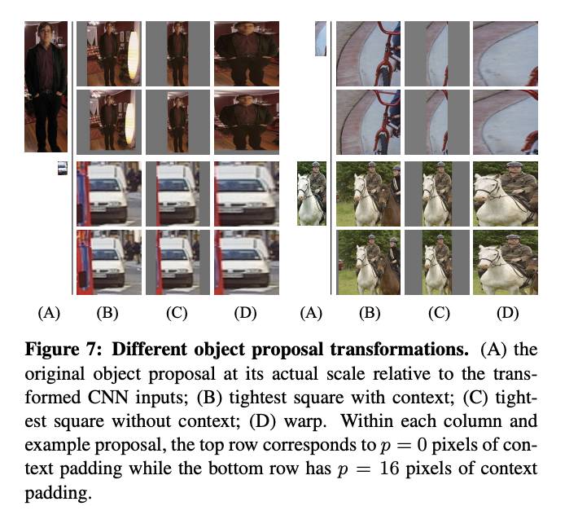

<!--
 * @Author: LOTEAT
 * @Date: 2024-07-31 21:25:17
-->
## Rich feature hierarchies for accurate object detection and semantic segmentation
- 前置知识：<a href='../Basic/mAP/mAP.md'>mAP</a>, <a href='../Basic/NMS/nms.md'>NMS</a>
- 作者：Ross Girshick, Jeff Donahue, Trevor Darrell, Jitendra Malik
- [文章链接](https://arxiv.org/pdf/1311.2524)

### 1. Motivation
在传统的目标检测算法中，由于常常使用传统机器学习算法进行特征提取，导致提取的特征是浅层特征，不利于后续的目标检测。而如果使用神经网络进行训练，由于目标检测数据集数据量上，网络也很容易欠拟合。

在RCNN之前，已经有学者尝试过一些方法。例如将检测问题转变为回归问题，预测检测框的坐标。或者使用滑动窗口，对于每一个区域使用CNN进行判别。但是这两种方法效果都不好。因此，论文借鉴了`recognition using regions`的思想，提出了RCNN。

其整体思想如`图1`所示，对于输入图片，首先提取大约2000个候选区域。由于这些候选区域大小不一，因此对其进行一个warp操作。然后使用CNN对候选框进行特征提取以及分类。

而为了解决数据量不够的问题，RCNN首先在ILSVRC进行了预训练，然后再PASCAL数据集上微调，也就是迁移学习。 

    
     
    

      图1：Overview
  	

### 2. Architecture
RCNN总共可以分成三个模块。第一个用于产生类别独立的候选区域，第二个模块是大型卷积神经网络，第三个是 一系列类别独立的SVM。

#### 2.1 Region proposals
论文使用`selective search`产生候选区域。Selective Search算法首先是通过Felzenszwalb and Huttenlocher的方法产生图像初始区域，然后使用贪心算法对区域进行迭代分组。这个流程如下：

1.计算所有邻近区域之间的相似性。
2.两个最相似的区域被组合在一起。
3.计算合并区域和相邻区域的相似度。
4.重复2、3过程，直到整个图像变为一个区域。

我们通过selective search的方法会构造约2000个候选区域。

由于CNN的输入大小是固定的，而候选区域的大小是不固定的。因此在送入CNN之前，需要先讲候选区域的大小处理为一样的大小（227*227）。 另外，在截取候选区域的时候，会在上下左右四个边界各多截取16个像素。这是因为卷积运算会损失边缘信息，之所以各边多16个像素，是因为经过卷积后图片尺寸会缩小32倍。 

论文中的处理总共有三种方法，如`图2`所示。A代表原图。B代表将原图的长边缩放至227，短边同比例缩放，空余的位置填充固定颜色的像素。C代表将候选区域缩放长边至227，短边按同比例缩放，空余的位置填充固定颜色的像素。D代表将候选区域短边和长边同时缩放至227，这也就是文中所使用的warp方法。如图所示，每个处理方法分为两行，第一行代表不进行像素扩充，第二行代表进行16个像素的扩充。论文就是使用warp这种方法。
 

    
     
    

      图2：warp
  	

#### 2.2 CNN
CNN采用`AlexNet`网络。不过由于AlexNet是个分类网络，因此最后的线性分类层被舍弃，制保留前面的卷积层。AlexNet对每一个候选区域都会提取一个特征向量，这个特征向量的大小是4096维的。

#### 2.3 SVM
对每个类别都建造一个SVM，使用SVM对每个候选框进行分类，判断其是否属于当前类别。

#### 2.4 Testing
测试流程主要分成四步：1.通过selective search产生大约2000个候选区域。2.通过CNN提取特征。3.将特征向量送入每个类别的SVM中进行分类。4.非极大值抑制。

#### 2.5 Training
训练流程首先将AlexNet送入ILSVRC2012进行分类任务的预训练，然后再在VOC数据集上进行fine-tune。训练任务同样是分类任务，但是最后一层的分类层变为21，其中20个类别是VOC本身的类别，额外加的一个类别是背景类。在fine-tune阶段学习率也要相应调小一些。但是由于VOC数据集是个目标检测的数据集，所以RCNN的训练策略是将2000个候选区域都送入AlexNet进行计算。如果候选区域与真实标注框之间的IoU$\geq$0.5，设定为正样本；否则，就设定为负样本。

另外，由于训练中正负样本数据量差别过大，如果直接随机采样，很容易导致模型将所有的数据全部预测为负样本。所以论文中在batch size为128的情况下，强制采样32个正样本以及96个负样本。这一个阶段完成后，就可以训练SVM了。

论文训练SVM的方法与AlexNet有所区别。首先，负样本的IoU是小于等于0.3，正样本只有ground truth，其余全部忽略。其次，负样本采样采用的方法是`hard negative mining`。这个方式是先用初始的正负样本训练分类器，这里的负样本是全体负样本的一个子集。然后使用训练好的分类器对样本分类。把其中错误分类的那些样本(hard negative)放入负样本子集，再继续训练分类器。如此反复，直到达到停止条件(比如分类器性能不再提升)。

这里有三个问题：1.为什么fine-tune阶段和SVM训练阶段IoU阈值设定不同？2.为什么要额外引入一个SVM，不直接用fine-tune阶段的线性分类层？3.为什么两个阶段采样方法不同。

关于这三个问题，在论文的Appendix B中给出了答案。论文作者首先使用在ImageNet预训练的模型加SVM，此时并没有fine-tune阶段。在这个过程中，作者发现SVM的阈值设定为0.3效果更好。在引入fine-tune后，作者也发现，IoU为0.3时效果不好，随后实验才得出IoU为0.5时效果较好。 

作者关于这个解释是，微调数据过少，而神经网络需要大量数据去拟合。所以在fine-tune阶段中，正负样本比例都被扩大了。这也就是使用更高IoU的原因。而在SVM中，参数量相对较少，所以可以只使用真实标注框以及更少的负样本进行训练。 

作者对SVM也进行了消融实验，实验发现，加入SVM后mAP提升约4%。这也是因为在CNN中使用了大量的抖动样本。这些抖动样本其实就是IoU大于等于0.5但是小于1的那部分样本。这些正样本的精度并不够，会导致精度的损失，所以才添加了SVM。其实从我的角度来看，SVM的训练更像是某种程度的fine-tune。

#### 2.6 RCNN-BB
在候选区域的选择中，我们采用的方法是selective search，但是这种方法选择的区域并不一定完全和真实的标注框重合。因此，RCNN预测的精度上限会收到selective search效果的影响。所以，论文中提出了一个RCNN-BB算法。核心思路就是，对于selective search算法搜索出来的候选区域，如果SVM判定是某一个类别，那么我们再使用另一个SVM进行一个回归。即，搜索出来的区域是$(P_x, P_y, P_w, P_h)$，我们希望回归一个$(\hat{G}_x, \hat{G}_y, \hat{G}_w, \hat{G}_h)=(\Delta_x, \Delta_y, \Delta_w, \Delta_h)$，使得$(P_x+\Delta_x, P_y+\Delta_y, P_w+\Delta_w, P_h+\Delta_h)$更接近真实的$(G_x, G_y, G_w, G_h)$。

当然，这只是我们的朴素想法，论文中实际上的做法是这样的：
$$
\begin{aligned}
& \hat{G}_x=P_w d_x(P)+P_x \\
& \hat{G}_y=P_h d_y(P)+P_y \\
& \hat{G}_w=P_w \exp \left(d_w(P)\right) \\
& \hat{G}_h=P_h \exp \left(d_h(P)\right) .
\end{aligned}
$$

这里我们可以发现，$d_x(P)=\Delta_x/P_w$，实际上作者预测的是x偏置的比例相对于$P_w$的比例。这主要是因为我们希望这个预测不受候选区域尺度的影响。对于$\Delta_y$也是这样的。而对于$\Delta_w$，两边同取对数，即$ln(\hat{G}_w)=ln(P_w) + d_w(P)$，也就可以化为$\frac{\hat{G}_w}{P_w}=\exp(d_w(P))$。这个形式和我们预想的差别比较大，这是因为作者的思路并不是使用加法，而是使用乘法。也就是$\hat{G}_w=P_w*\Delta_w$。之所以这样，是因为如果使用加法，会导致$\Delta_w$在$[- \infty, + \infty]$区间。这并不有利于回归任务。但是如果我们使用比例放缩，则可以限定在$[0, + \infty]$中，相对会好一些。由于是在$[0, + \infty]$中，而预测出来的$d_w(P)$可能小于0，所以我们使用指数函数将其映射到$[0, +\infty]$中。

### 3. Code
有兴趣可以自行参考github相关代码。

### 4. Innovation
提出了RPN网络。