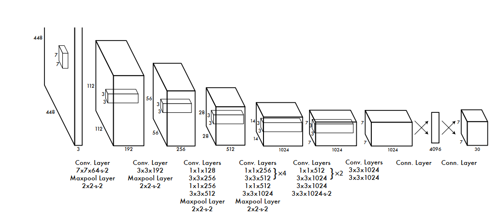

<!--
 * @Author: LOTEAT
 * @Date: 2024-10-15 19:23:16
-->
## You Only Look Once: Unified, Real-Time Object Detection
- 前置知识：PyTorch
- 作者：Joseph Redmon, Santosh Divvala, Ross Girshick, Ali Farhadi
- [文章链接](https://arxiv.org/pdf/1506.02640)
- [代码链接](https://github.com/yjh0410/PyTorch_YOLOv1.git)

### 1. Motivation
在先前的目标检测算法中，很多都是两阶段的检测算法。也就是先使用RPN网络提出region proposal，然后再进行检测。而Yolov1则尝试使用端到端的方式生成检测框。

### 2. Architecture
在Yolov1中，整体流程可以分为如下几步：
- 首先将输入图片分成$S\times S$个grid，如果某个目标的中心落在这个网格中，则这个网格就负责预测这个目标。
- 每个grid预测B个bbox，每个bbox的构成为$(x,y,w,h,\theta)$。$(x,y,w,h)$为位置，分别是中心点位置，bbox的宽和高。每个都要相对于grid归一化到0-1之间。
- $\theta$为置信度，代表着grid中含有非背景目标的概率，范围是0-1。

每个网格要预测B个bounding box还要预测C个分类概率。输出就是$S\times S \times (5 \times B + C)$的一个tensor。

这里置信度用概率表示实际上就是$P(object)$，而分类概率就是条件概率，在有$object$的情况下是$class_i$的概率，也就是$P(class_i | object)$。因此$P(class_i) = P(class_i | object) P(object)$。对于每个bounding box，都有个class-specific confidence score，也就是$P(class_i) \times IoU$。IoU为真值和预测值的交并比。

得到每个box的class-specific confidence score以后，设置阈值，滤掉得分低的BBox，对保留的BBox进行NMS处理，就得到最终的检测结果。阈值处理：去除掉大部分不含预测物体的背景框NMS处理：去除掉多余的bounding box，防止重复预测同一物体。

整个网络如下图所示：

    
     
    

      图1：Yolov1架构图
    

损失函数包含置信度误差、位置误差以及分类误差。

位置误差用于衡量预测边界框与真实边界框之间的差异。YOLOv1使用均方误差（MSE）来计算每个边界框的**位置误差**：

\[
\text{Loss}_{\text{coord}} = \lambda_{\text{coord}} \sum_{i=0}^{S^2} \mathbb{1}_{i \in \text{object}} \left[ (x_i - \hat{x}_i)^2 + (y_i - \hat{y}_i)^2 + (w_i - \hat{w}_i)^2 + (h_i - \hat{h}_i)^2 \right]
\]

- \( \mathbb{1}_{i \in \text{object}} \) 是指示器函数，如果该网格单元包含物体则为1，否则为0。
- \( (x_i, y_i, w_i, h_i) \) 是预测边界框的位置（中心坐标、宽度和高度）。
- \( (\hat{x}_i, \hat{y}_i, \hat{w}_i, \hat{h}_i) \) 是真实边界框的位置。

置信度误差衡量预测框的置信度与实际框的IoU（交并比）之间的差异。置信度表示框内包含物体的概率，以及预测框与真实框之间的重叠度。

\[
\text{Loss}_{\text{conf}} = \sum_{i=0}^{S^2} \mathbb{1}_{i \in \text{object}} \left( \text{confidence}_i - \text{IoU}_{i} \right)^2 + \lambda_{\text{noobj}} \sum_{i=0}^{S^2} \mathbb{1}_{i \notin \text{object}} \left( \text{confidence}_i \right)^2
\]

- 对于包含物体的网格单元，置信度误差是预测置信度与真实IoU之间的差异。
- 对于不包含物体的网格单元，置信度误差是预测置信度与0之间的差异。
- \( \lambda_{\text{noobj}} \) 是用于调整没有物体的网格单元的惩罚系数。

分类误差衡量预测类别与真实类别之间的差异。YOLOv1使用交叉熵损失来计算每个网格单元的**分类误差**：

\[
\text{Loss}_{\text{class}} = \sum_{i=0}^{S^2} \mathbb{1}_{i \in \text{object}} \sum_{c=0}^{C} \left( p_i(c) - \hat{p}_i(c) \right)^2
\]

- \( p_i(c) \) 是第 \( i \) 个网格单元预测的类别 \( c \) 的概率。
- \( \hat{p}_i(c) \) 是真实类别的概率（对于每个网格单元，仅有一个真实类别，其概率为1，其余类别为0）。
- \( C \) 是类别数。

YOLOv1的综合损失函数是位置误差、置信度误差和分类误差的加权和：

\[
\text{Total Loss} = \text{Loss}_{\text{coord}} + \text{Loss}_{\text{conf}} + \text{Loss}_{\text{class}}
\]

其中：
- \( \lambda_{\text{coord}} \) 和 \( \lambda_{\text{noobj}} \) 是超参数，用于调整不同误差的权重。
- \( \text{Loss}_{\text{coord}} \) 是位置误差。
- \( \text{Loss}_{\text{conf}} \) 是置信度误差。
- \( \text{Loss}_{\text{class}} \) 是分类误差。

