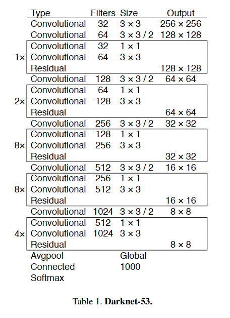

<!--
 * @Author: LOTEAT
 * @Date: 2025-02-02 10:35:12
-->
# Yolov3学习笔记

## YOLOv3: An Incremental Improvement
- 前置知识：PyTorch, <a href="./../Yolov2/yolov2.md">YOLOv2</a>
- 作者：Joseph Redmon, Ali Farhadi
- [文章链接](https://arxiv.org/pdf/1804.02767.pdf)
- [代码链接](https://github.com/ultralytics/yolov3)

### 1. Motivation
YOLOv3是YOLOv2的改进版本，主要目标是在保持快速检测速度的同时进一步提高检测精度。相比YOLOv2，YOLOv3在以下几个方面进行了改进：
- 使用更强大的特征提取网络
- 采用多尺度预测
- 改进了分类损失函数
- 提供了不同规模的模型以适应不同场景

### 2. Architecture
#### 2.1 Darknet-53
YOLOv3采用了全新的backbone网络Darknet-53，包含53个卷积层，使用了残差连接。相比Darknet-19，新的网络结构更深，特征提取能力更强。主要特点：
- 使用连续的3×3和1×1卷积层
- 添加残差连接（类似ResNet）
- 使用步长为2的卷积层进行下采样
- 每个卷积层后都使用BN层和Leaky ReLU激活函数
<center>
    
    <br>
    <div style="color:orange; border-bottom: 1px solid #d9d9d9;
    display: inline-block;
    color: #999;
    padding: 2px;">
      图1：Darknet-53
  	</div>
</center>


#### 2.2 多尺度预测
YOLOv3在三个不同尺度上进行预测：
- 大尺度特征图(52×52)：检测小目标
- 中等尺度特征图(26×26)：检测中等大小目标
- 小尺度特征图(13×13)：检测大目标

每个尺度上使用3个不同的anchor box，总共使用9个anchor box。

#### 2.3 特征金字塔网络
YOLOv3借鉴了FPN的思想，采用了类似的特征金字塔结构：
- 使用上采样和特征融合
- 高层特征语义信息强，低层特征位置信息准
- 不同层级特征的融合提高了检测效果

#### 2.4 预测过程改进
每个边界框预测：
- 4个边界框坐标(tx, ty, tw, th)
- 1个objectness score
- 80个类别置信度（使用sigmoid代替softmax）

#### 2.5 损失函数
分类损失使用二元交叉熵损失代替了多类别交叉熵损失：
- 支持多标签分类
- 每个类别独立预测概率
- 不同类别之间不互斥

#### 2.6 数据流
整个数据流可以表征为（原图见[知乎](https://zhuanlan.zhihu.com/p/76802514)）：
<center>
    
    <br>
    <div style="color:orange; border-bottom: 1px solid #d9d9d9;
    display: inline-block;
    color: #999;
    padding: 2px;">
      图2：dataflow
  	</div>
</center>

### 3. Code
先看config文件。
```python
_base_ = ['../_base_/schedules/schedule_1x.py', '../_base_/default_runtime.py']
# model settings
data_preprocessor = dict(
    type='DetDataPreprocessor',
    mean=[0, 0, 0],
    std=[255., 255., 255.],
    bgr_to_rgb=True,
    pad_size_divisor=32)
model = dict(
    type='YOLOV3',
    data_preprocessor=data_preprocessor,
    backbone=dict(
        type='Darknet',
        depth=53,
        out_indices=(3, 4, 5),
        init_cfg=dict(type='Pretrained', checkpoint='open-mmlab://darknet53')),
    neck=dict(
        type='YOLOV3Neck',
        num_scales=3,
        in_channels=[1024, 512, 256],
        out_channels=[512, 256, 128]),
    bbox_head=dict(
        type='YOLOV3Head',
        num_classes=80,
        in_channels=[512, 256, 128],
        out_channels=[1024, 512, 256],
        anchor_generator=dict(
            type='YOLOAnchorGenerator',
            base_sizes=[[(116, 90), (156, 198), (373, 326)],
                        [(30, 61), (62, 45), (59, 119)],
                        [(10, 13), (16, 30), (33, 23)]],
            strides=[32, 16, 8]),
        bbox_coder=dict(type='YOLOBBoxCoder'),
        featmap_strides=[32, 16, 8],
        loss_cls=dict(
            type='CrossEntropyLoss',
            use_sigmoid=True,
            loss_weight=1.0,
            reduction='sum'),
        loss_conf=dict(
            type='CrossEntropyLoss',
            use_sigmoid=True,
            loss_weight=1.0,
            reduction='sum'),
        loss_xy=dict(
            type='CrossEntropyLoss',
            use_sigmoid=True,
            loss_weight=2.0,
            reduction='sum'),
        loss_wh=dict(type='MSELoss', loss_weight=2.0, reduction='sum')),
    # training and testing settings
    train_cfg=dict(
        assigner=dict(
            type='GridAssigner',
            pos_iou_thr=0.5,
            neg_iou_thr=0.5,
            min_pos_iou=0)),
    test_cfg=dict(
        nms_pre=1000,
        min_bbox_size=0,
        score_thr=0.05,
        conf_thr=0.005,
        nms=dict(type='nms', iou_threshold=0.45),
        max_per_img=100))
# dataset settings
dataset_type = 'CocoDataset'
data_root = 'data/coco/'

# Example to use different file client
# Method 1: simply set the data root and let the file I/O module
# automatically infer from prefix (not support LMDB and Memcache yet)

# data_root = 's3://openmmlab/datasets/detection/coco/'

# Method 2: Use `backend_args`, `file_client_args` in versions before 3.0.0rc6
# backend_args = dict(
#     backend='petrel',
#     path_mapping=dict({
#         './data/': 's3://openmmlab/datasets/detection/',
#         'data/': 's3://openmmlab/datasets/detection/'
#     }))
backend_args = None

train_pipeline = [
    dict(type='LoadImageFromFile', backend_args=backend_args),
    dict(type='LoadAnnotations', with_bbox=True),
    dict(
        type='Expand',
        mean=data_preprocessor['mean'],
        to_rgb=data_preprocessor['bgr_to_rgb'],
        ratio_range=(1, 2)),
    dict(
        type='MinIoURandomCrop',
        min_ious=(0.4, 0.5, 0.6, 0.7, 0.8, 0.9),
        min_crop_size=0.3),
    dict(type='RandomResize', scale=[(320, 320), (608, 608)], keep_ratio=True),
    dict(type='RandomFlip', prob=0.5),
    dict(type='PhotoMetricDistortion'),
    dict(type='PackDetInputs')
]
test_pipeline = [
    dict(type='LoadImageFromFile', backend_args=backend_args),
    dict(type='Resize', scale=(608, 608), keep_ratio=True),
    dict(type='LoadAnnotations', with_bbox=True),
    dict(
        type='PackDetInputs',
        meta_keys=('img_id', 'img_path', 'ori_shape', 'img_shape',
                   'scale_factor'))
]

train_dataloader = dict(
    batch_size=8,
    num_workers=4,
    persistent_workers=True,
    sampler=dict(type='DefaultSampler', shuffle=True),
    batch_sampler=dict(type='AspectRatioBatchSampler'),
    dataset=dict(
        type=dataset_type,
        data_root=data_root,
        ann_file='annotations/instances_train2017.json',
        data_prefix=dict(img='train2017/'),
        filter_cfg=dict(filter_empty_gt=True, min_size=32),
        pipeline=train_pipeline,
        backend_args=backend_args))
val_dataloader = dict(
    batch_size=1,
    num_workers=2,
    persistent_workers=True,
    drop_last=False,
    sampler=dict(type='DefaultSampler', shuffle=False),
    dataset=dict(
        type=dataset_type,
        data_root=data_root,
        ann_file='annotations/instances_val2017.json',
        data_prefix=dict(img='val2017/'),
        test_mode=True,
        pipeline=test_pipeline,
        backend_args=backend_args))
test_dataloader = val_dataloader

val_evaluator = dict(
    type='CocoMetric',
    ann_file=data_root + 'annotations/instances_val2017.json',
    metric='bbox',
    backend_args=backend_args)
test_evaluator = val_evaluator

train_cfg = dict(max_epochs=273, val_interval=7)

# optimizer
optim_wrapper = dict(
    type='OptimWrapper',
    optimizer=dict(type='SGD', lr=0.001, momentum=0.9, weight_decay=0.0005),
    clip_grad=dict(max_norm=35, norm_type=2))

# learning policy
param_scheduler = [
    dict(type='LinearLR', start_factor=0.1, by_epoch=False, begin=0, end=2000),
    dict(type='MultiStepLR', by_epoch=True, milestones=[218, 246], gamma=0.1)
]

default_hooks = dict(checkpoint=dict(type='CheckpointHook', interval=7))

# NOTE: `auto_scale_lr` is for automatically scaling LR,
# USER SHOULD NOT CHANGE ITS VALUES.
# base_batch_size = (8 GPUs) x (8 samples per GPU)
auto_scale_lr = dict(base_batch_size=64)

```
核心就是三个，Darknet，neck以及head。
这里Darknet就不再研究，有兴趣可自行翻越代码。
```python
@MODELS.register_module()
class YOLOV3Neck(BaseModule):
    """The neck of YOLOV3.

    It can be treated as a simplified version of FPN. It
    will take the result from Darknet backbone and do some upsampling and
    concatenation. It will finally output the detection result.

    Note:
        The input feats should be from top to bottom.
            i.e., from high-lvl to low-lvl
        But YOLOV3Neck will process them in reversed order.
            i.e., from bottom (high-lvl) to top (low-lvl)

    Args:
        num_scales (int): The number of scales / stages.
        in_channels (List[int]): The number of input channels per scale.
        out_channels (List[int]): The number of output channels  per scale.
        conv_cfg (dict, optional): Config dict for convolution layer.
            Default: None.
        norm_cfg (dict, optional): Dictionary to construct and config norm
            layer. Default: dict(type='BN', requires_grad=True)
        act_cfg (dict, optional): Config dict for activation layer.
            Default: dict(type='LeakyReLU', negative_slope=0.1).
        init_cfg (dict or list[dict], optional): Initialization config dict.
            Default: None
    """

    def __init__(self,
                 num_scales: int,
                 in_channels: List[int],
                 out_channels: List[int],
                 conv_cfg: OptConfigType = None,
                 norm_cfg: ConfigType = dict(type='BN', requires_grad=True),
                 act_cfg: ConfigType = dict(
                     type='LeakyReLU', negative_slope=0.1),
                 init_cfg: OptMultiConfig = None) -> None:
        super(YOLOV3Neck, self).__init__(init_cfg)
        assert (num_scales == len(in_channels) == len(out_channels))
        self.num_scales = num_scales
        self.in_channels = in_channels
        self.out_channels = out_channels

        # shortcut
        cfg = dict(conv_cfg=conv_cfg, norm_cfg=norm_cfg, act_cfg=act_cfg)

        # To support arbitrary scales, the code looks awful, but it works.
        # Better solution is welcomed.
        self.detect1 = DetectionBlock(in_channels[0], out_channels[0], **cfg)
        for i in range(1, self.num_scales):
            in_c, out_c = self.in_channels[i], self.out_channels[i]
            inter_c = out_channels[i - 1]
            self.add_module(f'conv{i}', ConvModule(inter_c, out_c, 1, **cfg))
            # in_c + out_c : High-lvl feats will be cat with low-lvl feats
            self.add_module(f'detect{i+1}',
                            DetectionBlock(in_c + out_c, out_c, **cfg))

    def forward(self, feats=Tuple[Tensor]) -> Tuple[Tensor]:
        assert len(feats) == self.num_scales

        # processed from bottom (high-lvl) to top (low-lvl)
        outs = []
        out = self.detect1(feats[-1])
        outs.append(out)

        for i, x in enumerate(reversed(feats[:-1])):
            conv = getattr(self, f'conv{i+1}')
            tmp = conv(out)

            # Cat with low-lvl feats
            tmp = F.interpolate(tmp, scale_factor=2)
            tmp = torch.cat((tmp, x), 1)

            detect = getattr(self, f'detect{i+2}')
            out = detect(tmp)
            outs.append(out)

        return tuple(outs)
```
YOLOv3Neck接收来自Darknet的3个层级特征，它从高层语义特征开始，逐步融合低层细节。融合方式为上采样高层特征，与相邻低层特征拼接，最后通过卷积进行融合。

```python
@MODELS.register_module()
class YOLOV3Head(BaseDenseHead):
    """YOLOV3Head Paper link: https://arxiv.org/abs/1804.02767.

    Args:
        num_classes (int): The number of object classes (w/o background)
        in_channels (Sequence[int]): Number of input channels per scale.
        out_channels (Sequence[int]): The number of output channels per scale
            before the final 1x1 layer. Default: (1024, 512, 256).
        anchor_generator (:obj:`ConfigDict` or dict): Config dict for anchor
            generator.
        bbox_coder (:obj:`ConfigDict` or dict): Config of bounding box coder.
        featmap_strides (Sequence[int]): The stride of each scale.
            Should be in descending order. Defaults to (32, 16, 8).
        one_hot_smoother (float): Set a non-zero value to enable label-smooth
            Defaults to 0.
        conv_cfg (:obj:`ConfigDict` or dict, optional): Config dict for
            convolution layer. Defaults to None.
        norm_cfg (:obj:`ConfigDict` or dict): Dictionary to construct and
            config norm layer. Defaults to dict(type='BN', requires_grad=True).
        act_cfg (:obj:`ConfigDict` or dict): Config dict for activation layer.
            Defaults to dict(type='LeakyReLU', negative_slope=0.1).
        loss_cls (:obj:`ConfigDict` or dict): Config of classification loss.
        loss_conf (:obj:`ConfigDict` or dict): Config of confidence loss.
        loss_xy (:obj:`ConfigDict` or dict): Config of xy coordinate loss.
        loss_wh (:obj:`ConfigDict` or dict): Config of wh coordinate loss.
        train_cfg (:obj:`ConfigDict` or dict, optional): Training config of
            YOLOV3 head. Defaults to None.
        test_cfg (:obj:`ConfigDict` or dict, optional): Testing config of
            YOLOV3 head. Defaults to None.
    """

    def __init__(self,
                 num_classes: int,
                 in_channels: Sequence[int],
                 out_channels: Sequence[int] = (1024, 512, 256),
                 anchor_generator: ConfigType = dict(
                     type='YOLOAnchorGenerator',
                     base_sizes=[[(116, 90), (156, 198), (373, 326)],
                                 [(30, 61), (62, 45), (59, 119)],
                                 [(10, 13), (16, 30), (33, 23)]],
                     strides=[32, 16, 8]),
                 bbox_coder: ConfigType = dict(type='YOLOBBoxCoder'),
                 featmap_strides: Sequence[int] = (32, 16, 8),
                 one_hot_smoother: float = 0.,
                 conv_cfg: OptConfigType = None,
                 norm_cfg: ConfigType = dict(type='BN', requires_grad=True),
                 act_cfg: ConfigType = dict(
                     type='LeakyReLU', negative_slope=0.1),
                 loss_cls: ConfigType = dict(
                     type='CrossEntropyLoss',
                     use_sigmoid=True,
                     loss_weight=1.0),
                 loss_conf: ConfigType = dict(
                     type='CrossEntropyLoss',
                     use_sigmoid=True,
                     loss_weight=1.0),
                 loss_xy: ConfigType = dict(
                     type='CrossEntropyLoss',
                     use_sigmoid=True,
                     loss_weight=1.0),
                 loss_wh: ConfigType = dict(type='MSELoss', loss_weight=1.0),
                 train_cfg: OptConfigType = None,
                 test_cfg: OptConfigType = None) -> None:
        super().__init__(init_cfg=None)
        # Check params
        assert (len(in_channels) == len(out_channels) == len(featmap_strides))

        self.num_classes = num_classes
        self.in_channels = in_channels
        self.out_channels = out_channels
        self.featmap_strides = featmap_strides
        self.train_cfg = train_cfg
        self.test_cfg = test_cfg
        if self.train_cfg:
            self.assigner = TASK_UTILS.build(self.train_cfg['assigner'])
            if train_cfg.get('sampler', None) is not None:
                self.sampler = TASK_UTILS.build(
                    self.train_cfg['sampler'], context=self)
            else:
                self.sampler = PseudoSampler()

        self.one_hot_smoother = one_hot_smoother

        self.conv_cfg = conv_cfg
        self.norm_cfg = norm_cfg
        self.act_cfg = act_cfg

        self.bbox_coder = TASK_UTILS.build(bbox_coder)

        self.prior_generator = TASK_UTILS.build(anchor_generator)

        self.loss_cls = MODELS.build(loss_cls)
        self.loss_conf = MODELS.build(loss_conf)
        self.loss_xy = MODELS.build(loss_xy)
        self.loss_wh = MODELS.build(loss_wh)

        self.num_base_priors = self.prior_generator.num_base_priors[0]
        assert len(
            self.prior_generator.num_base_priors) == len(featmap_strides)
        self._init_layers()

    @property
    def num_levels(self) -> int:
        """int: number of feature map levels"""
        return len(self.featmap_strides)

    @property
    def num_attrib(self) -> int:
        """int: number of attributes in pred_map, bboxes (4) +
        objectness (1) + num_classes"""

        return 5 + self.num_classes

    def _init_layers(self) -> None:
        """initialize conv layers in YOLOv3 head."""
        self.convs_bridge = nn.ModuleList()
        self.convs_pred = nn.ModuleList()
        for i in range(self.num_levels):
            conv_bridge = ConvModule(
                self.in_channels[i],
                self.out_channels[i],
                3,
                padding=1,
                conv_cfg=self.conv_cfg,
                norm_cfg=self.norm_cfg,
                act_cfg=self.act_cfg)
            conv_pred = nn.Conv2d(self.out_channels[i],
                                  self.num_base_priors * self.num_attrib, 1)

            self.convs_bridge.append(conv_bridge)
            self.convs_pred.append(conv_pred)

    def init_weights(self) -> None:
        """initialize weights."""
        for m in self.modules():
            if isinstance(m, nn.Conv2d):
                normal_init(m, mean=0, std=0.01)
            if is_norm(m):
                constant_init(m, 1)

        # Use prior in model initialization to improve stability
        for conv_pred, stride in zip(self.convs_pred, self.featmap_strides):
            bias = conv_pred.bias.reshape(self.num_base_priors, -1)
            # init objectness with prior of 8 objects per feature map
            # refer to https://github.com/ultralytics/yolov3
            nn.init.constant_(bias.data[:, 4],
                              bias_init_with_prob(8 / (608 / stride)**2))
            nn.init.constant_(bias.data[:, 5:], bias_init_with_prob(0.01))

    def forward(self, x: Tuple[Tensor, ...]) -> tuple:
        """Forward features from the upstream network.

        Args:
            x (tuple[Tensor]): Features from the upstream network, each is
                a 4D-tensor.

        Returns:
            tuple[Tensor]: A tuple of multi-level predication map, each is a
                4D-tensor of shape (batch_size, 5+num_classes, height, width).
        """

        assert len(x) == self.num_levels
        pred_maps = []
        for i in range(self.num_levels):
            feat = x[i]
            feat = self.convs_bridge[i](feat)
            pred_map = self.convs_pred[i](feat)
            pred_maps.append(pred_map)

        return tuple(pred_maps),

    def predict_by_feat(self,
                        pred_maps: Sequence[Tensor],
                        batch_img_metas: Optional[List[dict]],
                        cfg: OptConfigType = None,
                        rescale: bool = False,
                        with_nms: bool = True) -> InstanceList:
        """Transform a batch of output features extracted from the head into
        bbox results. It has been accelerated since PR #5991.

        Args:
            pred_maps (Sequence[Tensor]): Raw predictions for a batch of
                images.
            batch_img_metas (list[dict], Optional): Batch image meta info.
                Defaults to None.
            cfg (:obj:`ConfigDict` or dict, optional): Test / postprocessing
                configuration, if None, test_cfg would be used.
                Defaults to None.
            rescale (bool): If True, return boxes in original image space.
                Defaults to False.
            with_nms (bool): If True, do nms before return boxes.
                Defaults to True.

        Returns:
            list[:obj:`InstanceData`]: Object detection results of each image
            after the post process. Each item usually contains following keys.

            - scores (Tensor): Classification scores, has a shape
              (num_instance, )
            - labels (Tensor): Labels of bboxes, has a shape
              (num_instances, ).
            - bboxes (Tensor): Has a shape (num_instances, 4),
              the last dimension 4 arrange as (x1, y1, x2, y2).
        """
        assert len(pred_maps) == self.num_levels
        cfg = self.test_cfg if cfg is None else cfg
        cfg = copy.deepcopy(cfg)

        num_imgs = len(batch_img_metas)
        featmap_sizes = [pred_map.shape[-2:] for pred_map in pred_maps]

        mlvl_anchors = self.prior_generator.grid_priors(
            featmap_sizes, device=pred_maps[0].device)
        flatten_preds = []
        flatten_strides = []
        for pred, stride in zip(pred_maps, self.featmap_strides):
            pred = pred.permute(0, 2, 3, 1).reshape(num_imgs, -1,
                                                    self.num_attrib)
            pred[..., :2].sigmoid_()
            flatten_preds.append(pred)
            flatten_strides.append(
                pred.new_tensor(stride).expand(pred.size(1)))

        flatten_preds = torch.cat(flatten_preds, dim=1)
        flatten_bbox_preds = flatten_preds[..., :4]
        flatten_objectness = flatten_preds[..., 4].sigmoid()
        flatten_cls_scores = flatten_preds[..., 5:].sigmoid()
        flatten_anchors = torch.cat(mlvl_anchors)
        flatten_strides = torch.cat(flatten_strides)
        flatten_bboxes = self.bbox_coder.decode(flatten_anchors,
                                                flatten_bbox_preds,
                                                flatten_strides.unsqueeze(-1))
        results_list = []
        for (bboxes, scores, objectness,
             img_meta) in zip(flatten_bboxes, flatten_cls_scores,
                              flatten_objectness, batch_img_metas):
            # Filtering out all predictions with conf < conf_thr
            conf_thr = cfg.get('conf_thr', -1)
            if conf_thr > 0:
                conf_inds = objectness >= conf_thr
                bboxes = bboxes[conf_inds, :]
                scores = scores[conf_inds, :]
                objectness = objectness[conf_inds]

            score_thr = cfg.get('score_thr', 0)
            nms_pre = cfg.get('nms_pre', -1)
            scores, labels, keep_idxs, _ = filter_scores_and_topk(
                scores, score_thr, nms_pre)

            results = InstanceData(
                scores=scores,
                labels=labels,
                bboxes=bboxes[keep_idxs],
                score_factors=objectness[keep_idxs],
            )
            results = self._bbox_post_process(
                results=results,
                cfg=cfg,
                rescale=rescale,
                with_nms=with_nms,
                img_meta=img_meta)
            results_list.append(results)
        return results_list

    def loss_by_feat(
            self,
            pred_maps: Sequence[Tensor],
            batch_gt_instances: InstanceList,
            batch_img_metas: List[dict],
            batch_gt_instances_ignore: OptInstanceList = None) -> dict:
        """Calculate the loss based on the features extracted by the detection
        head.

        Args:
            pred_maps (list[Tensor]): Prediction map for each scale level,
                shape (N, num_anchors * num_attrib, H, W)
            batch_gt_instances (list[:obj:`InstanceData`]): Batch of
                gt_instance. It usually includes ``bboxes`` and ``labels``
                attributes.
            batch_img_metas (list[dict]): Meta information of each image, e.g.,
                image size, scaling factor, etc.
            batch_gt_instances_ignore (list[:obj:`InstanceData`], optional):
                Batch of gt_instances_ignore. It includes ``bboxes`` attribute
                data that is ignored during training and testing.
                Defaults to None.

        Returns:
            dict: A dictionary of loss components.
        """
        num_imgs = len(batch_img_metas)
        device = pred_maps[0][0].device

        featmap_sizes = [
            pred_maps[i].shape[-2:] for i in range(self.num_levels)
        ]
        mlvl_anchors = self.prior_generator.grid_priors(
            featmap_sizes, device=device)
        anchor_list = [mlvl_anchors for _ in range(num_imgs)]

        responsible_flag_list = []
        for img_id in range(num_imgs):
            responsible_flag_list.append(
                self.responsible_flags(featmap_sizes,
                                       batch_gt_instances[img_id].bboxes,
                                       device))

        target_maps_list, neg_maps_list = self.get_targets(
            anchor_list, responsible_flag_list, batch_gt_instances)

        losses_cls, losses_conf, losses_xy, losses_wh = multi_apply(
            self.loss_by_feat_single, pred_maps, target_maps_list,
            neg_maps_list)

        return dict(
            loss_cls=losses_cls,
            loss_conf=losses_conf,
            loss_xy=losses_xy,
            loss_wh=losses_wh)

    def loss_by_feat_single(self, pred_map: Tensor, target_map: Tensor,
                            neg_map: Tensor) -> tuple:
        """Calculate the loss of a single scale level based on the features
        extracted by the detection head.

        Args:
            pred_map (Tensor): Raw predictions for a single level.
            target_map (Tensor): The Ground-Truth target for a single level.
            neg_map (Tensor): The negative masks for a single level.

        Returns:
            tuple:
                loss_cls (Tensor): Classification loss.
                loss_conf (Tensor): Confidence loss.
                loss_xy (Tensor): Regression loss of x, y coordinate.
                loss_wh (Tensor): Regression loss of w, h coordinate.
        """

        num_imgs = len(pred_map)
        pred_map = pred_map.permute(0, 2, 3,
                                    1).reshape(num_imgs, -1, self.num_attrib)
        neg_mask = neg_map.float()
        pos_mask = target_map[..., 4]
        pos_and_neg_mask = neg_mask + pos_mask
        pos_mask = pos_mask.unsqueeze(dim=-1)
        if torch.max(pos_and_neg_mask) > 1.:
            warnings.warn('There is overlap between pos and neg sample.')
            pos_and_neg_mask = pos_and_neg_mask.clamp(min=0., max=1.)

        pred_xy = pred_map[..., :2]
        pred_wh = pred_map[..., 2:4]
        pred_conf = pred_map[..., 4]
        pred_label = pred_map[..., 5:]

        target_xy = target_map[..., :2]
        target_wh = target_map[..., 2:4]
        target_conf = target_map[..., 4]
        target_label = target_map[..., 5:]

        loss_cls = self.loss_cls(pred_label, target_label, weight=pos_mask)
        loss_conf = self.loss_conf(
            pred_conf, target_conf, weight=pos_and_neg_mask)
        loss_xy = self.loss_xy(pred_xy, target_xy, weight=pos_mask)
        loss_wh = self.loss_wh(pred_wh, target_wh, weight=pos_mask)

        return loss_cls, loss_conf, loss_xy, loss_wh

    def get_targets(self, anchor_list: List[List[Tensor]],
                    responsible_flag_list: List[List[Tensor]],
                    batch_gt_instances: List[InstanceData]) -> tuple:
        """Compute target maps for anchors in multiple images.

        Args:
            anchor_list (list[list[Tensor]]): Multi level anchors of each
                image. The outer list indicates images, and the inner list
                corresponds to feature levels of the image. Each element of
                the inner list is a tensor of shape (num_total_anchors, 4).
            responsible_flag_list (list[list[Tensor]]): Multi level responsible
                flags of each image. Each element is a tensor of shape
                (num_total_anchors, )
            batch_gt_instances (list[:obj:`InstanceData`]): Batch of
                gt_instance. It usually includes ``bboxes`` and ``labels``
                attributes.

        Returns:
            tuple: Usually returns a tuple containing learning targets.
                - target_map_list (list[Tensor]): Target map of each level.
                - neg_map_list (list[Tensor]): Negative map of each level.
        """
        num_imgs = len(anchor_list)

        # anchor number of multi levels
        num_level_anchors = [anchors.size(0) for anchors in anchor_list[0]]

        results = multi_apply(self._get_targets_single, anchor_list,
                              responsible_flag_list, batch_gt_instances)

        all_target_maps, all_neg_maps = results
        assert num_imgs == len(all_target_maps) == len(all_neg_maps)
        target_maps_list = images_to_levels(all_target_maps, num_level_anchors)
        neg_maps_list = images_to_levels(all_neg_maps, num_level_anchors)

        return target_maps_list, neg_maps_list

    def _get_targets_single(self, anchors: List[Tensor],
                            responsible_flags: List[Tensor],
                            gt_instances: InstanceData) -> tuple:
        """Generate matching bounding box prior and converted GT.

        Args:
            anchors (List[Tensor]): Multi-level anchors of the image.
            responsible_flags (List[Tensor]): Multi-level responsible flags of
                anchors
            gt_instances (:obj:`InstanceData`): Ground truth of instance
                annotations. It should includes ``bboxes`` and ``labels``
                attributes.

        Returns:
            tuple:
                target_map (Tensor): Predication target map of each
                    scale level, shape (num_total_anchors,
                    5+num_classes)
                neg_map (Tensor): Negative map of each scale level,
                    shape (num_total_anchors,)
        """
        gt_bboxes = gt_instances.bboxes
        gt_labels = gt_instances.labels
        anchor_strides = []
        for i in range(len(anchors)):
            anchor_strides.append(
                torch.tensor(self.featmap_strides[i],
                             device=gt_bboxes.device).repeat(len(anchors[i])))
        concat_anchors = torch.cat(anchors)
        concat_responsible_flags = torch.cat(responsible_flags)

        anchor_strides = torch.cat(anchor_strides)
        assert len(anchor_strides) == len(concat_anchors) == \
               len(concat_responsible_flags)
        pred_instances = InstanceData(
            priors=concat_anchors, responsible_flags=concat_responsible_flags)

        assign_result = self.assigner.assign(pred_instances, gt_instances)
        sampling_result = self.sampler.sample(assign_result, pred_instances,
                                              gt_instances)

        target_map = concat_anchors.new_zeros(
            concat_anchors.size(0), self.num_attrib)

        target_map[sampling_result.pos_inds, :4] = self.bbox_coder.encode(
            sampling_result.pos_priors, sampling_result.pos_gt_bboxes,
            anchor_strides[sampling_result.pos_inds])

        target_map[sampling_result.pos_inds, 4] = 1

        gt_labels_one_hot = F.one_hot(
            gt_labels, num_classes=self.num_classes).float()
        if self.one_hot_smoother != 0:  # label smooth
            gt_labels_one_hot = gt_labels_one_hot * (
                1 - self.one_hot_smoother
            ) + self.one_hot_smoother / self.num_classes
        target_map[sampling_result.pos_inds, 5:] = gt_labels_one_hot[
            sampling_result.pos_assigned_gt_inds]

        neg_map = concat_anchors.new_zeros(
            concat_anchors.size(0), dtype=torch.uint8)
        neg_map[sampling_result.neg_inds] = 1

        return target_map, neg_map

    def responsible_flags(self, featmap_sizes: List[tuple], gt_bboxes: Tensor,
                          device: str) -> List[Tensor]:
        """Generate responsible anchor flags of grid cells in multiple scales.

        Args:
            featmap_sizes (List[tuple]): List of feature map sizes in multiple
                feature levels.
            gt_bboxes (Tensor): Ground truth boxes, shape (n, 4).
            device (str): Device where the anchors will be put on.

        Return:
            List[Tensor]: responsible flags of anchors in multiple level
        """
        assert self.num_levels == len(featmap_sizes)
        multi_level_responsible_flags = []
        for i in range(self.num_levels):
            anchor_stride = self.prior_generator.strides[i]
            feat_h, feat_w = featmap_sizes[i]
            gt_cx = ((gt_bboxes[:, 0] + gt_bboxes[:, 2]) * 0.5).to(device)
            gt_cy = ((gt_bboxes[:, 1] + gt_bboxes[:, 3]) * 0.5).to(device)
            gt_grid_x = torch.floor(gt_cx / anchor_stride[0]).long()
            gt_grid_y = torch.floor(gt_cy / anchor_stride[1]).long()
            # row major indexing
            gt_bboxes_grid_idx = gt_grid_y * feat_w + gt_grid_x

            responsible_grid = torch.zeros(
                feat_h * feat_w, dtype=torch.uint8, device=device)
            responsible_grid[gt_bboxes_grid_idx] = 1

            responsible_grid = responsible_grid[:, None].expand(
                responsible_grid.size(0),
                self.prior_generator.num_base_priors[i]).contiguous().view(-1)

            multi_level_responsible_flags.append(responsible_grid)
        return multi_level_responsible_flags

```
YOLOv3Head通过多尺度特征图实现目标检测，其核心结构包含三个层级的卷积预测层：每个层级先通过卷积进行特征增强，再通过1x1卷积输出预测结果（每个锚点对应4个坐标偏移、1个置信度和80个类别概率）。采用基于锚框的预测机制，通过YOLOBBoxCoder解码预测偏移量为实际坐标，使用二元交叉熵损失处理分类和置信度，MSE损失处理宽高坐标，并集成负样本采样机制，最终通过特征图拼接、阈值过滤和NMS后处理输出检测结果。