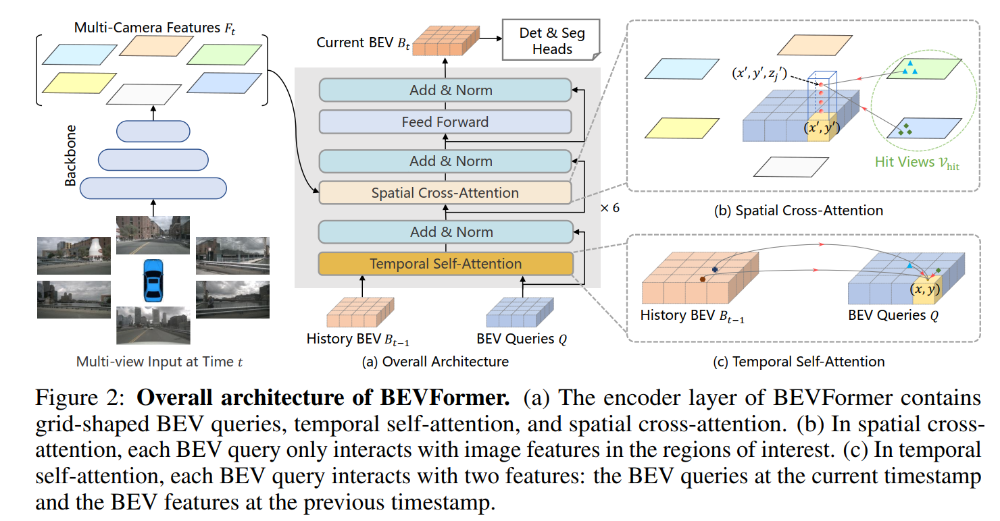

<!--
 * @Author: LOTEAT
 * @Date: 2024-08-09 09:42:59
-->
## BEVFormer: Learning Bird’s-Eye-View Representation from Multi-Camera Images via Spatiotemporal Transformers
- 前置知识：<a href='../Basic/LSS/lss.md'>LSS</a>
- 作者：Zhiqi Li, Wenhai Wang, Hongyang Li, Enze Xie, Chonghao Sima, Tong Lu, Yu Qiao, Jifeng Dai
- [文章链接](https://krmzyc-filecloud.oss-cn-beijing.aliyuncs.com/theory/BEVFormer%20Learning%20Bird%27s-Eye-View%20Representation%20from%20Multi-Camera%20Images%20via%20Spatiotemporal%20Trans.pdf)
- [代码链接](https://github.com/zhiqi-li/BEVFormer)

### 1. Motivation

BEV系列的论文，很少利用时间信息。最大的挑战是自动驾驶对时间要求严格，场景中的物体变化很快，因此简单地堆叠交叉时间戳的BEV特征会带来额外的计算成本和干扰信息。但是事实上，如果能够结合先前时间戳的信息，能够很有效的帮助3D目标检测。BEVFormer利用BEV特征循环地传递从过去到现在的时间信息，并利用空间注意力，实现端到端 3D 对象检测和地图分割。

### 2. Architecture

#### 2.1 Overall Architecture

    
     
    

      图1：backbone
  	

#### 2.2 BEV Queries

#### 2.3 Spatial Cross-Attention

#### 2.4 Temporal Self-Attention

#### 2.5 Implementation Details

### 3. Code

### 4. Innovation
