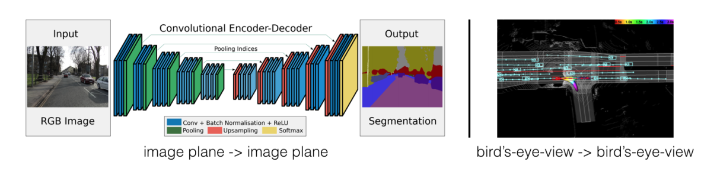
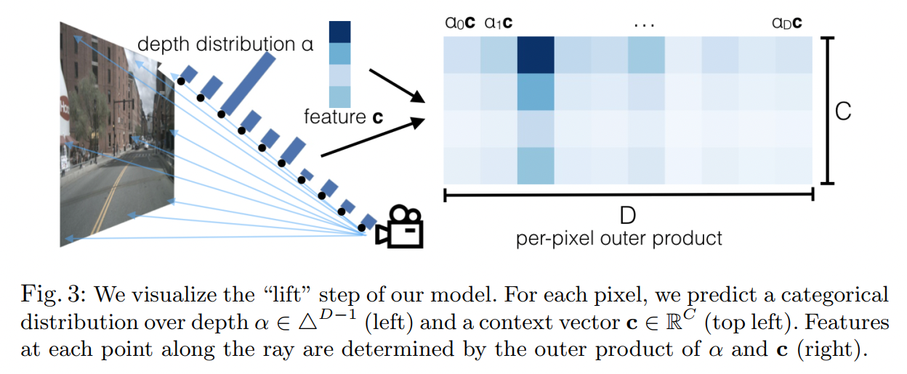
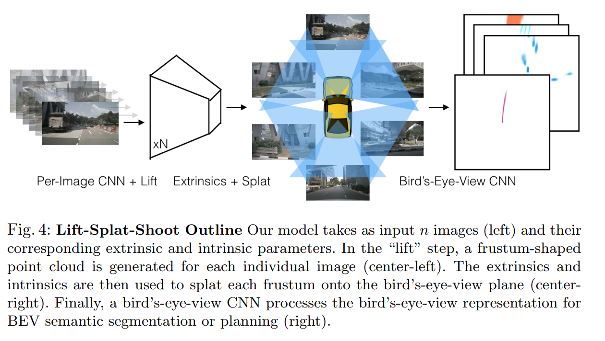
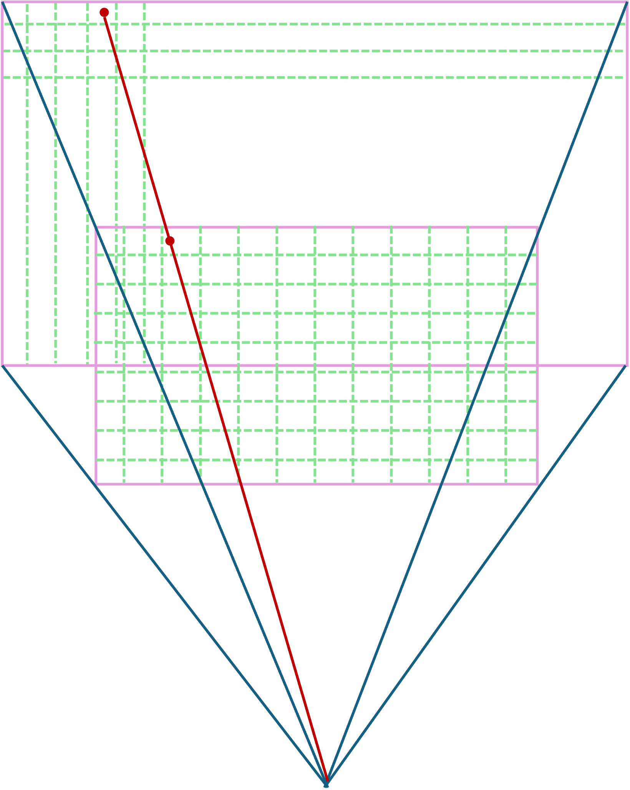

<!--
 * @Author: LOTEAT
 * @Date: 2024-08-08 15:15:21
-->
## Lift, Splat, Shoot: Encoding Images from Arbitrary Camera Rigs by Implicitly Unprojecting to 3D
- 前置知识：<a href='../../../../Backbone/EfficientNet/efficientnet.md'>EfficientNet</a>, <a href='../../../../Backbone/ResNet/resnet.md'>ResNet</a>
- 作者：Jonah Philion, Sanja Fidler
- [文章链接](https://arxiv.org/pdf/2008.05711)
- [代码链接](https://github.com/nv-tlabs/lift-splat-shoot)

### 1. Motivation

这篇论文本意是用于motion planning，但是现在却被用于BEV感知算法的开山鼻祖。在3D目标检测中，使用图像有一个很大的问题，那就是图像缺乏深度信息。而`LSS`算法核心思路就是预测图像像素的深度信息。

### 2. Architecture

LSS算法核心思路是三个过程，`lift`，`splat`和`shoot`。但是由于BEV算法只有涉及`lift`和`splat`两个过程，`shoot`并不会在本文中涉及。

#### 2.1 Lift: Latent Depth Distribution
Lift过程就是将2D图像提升至一个统一的3D空间坐标中，也就是预测像素的深度，然后通过相机内外参数lift成为3D点云。这个统一的3D空间坐标系，就是自车坐标系（ego coordinate system）。这个过程的挑战在于，我们需要预测信息，但与每个像素相关的“深度”本质上是模糊的，我们无法准确的预测深度信息。

<center>
    
    <br>
    <div style="color:orange; border-bottom: 1px solid #d9d9d9;
    display: inline-block;
    color: #999;
    padding: 2px;">
      图1：backbone
  	</div>
</center>

LSS的方法是为每个像素生成所有可能深度的表示。具体来说，首先我们先将空间的深度划分为D个深度。我们为图像的深度设置一定的限制，在代码中是4.0m到45.0m，划分成41个深度信息，也就是每隔1m采样一次。所以，图像像素深度信息只有41个值。

然后，我们通过backbone网络对像素特征进行提取，每个像素都会有个特征向量$c \in \mathbb{R}^c$。随后，深度网络也会预测每一个像素的深度分布。这个深度分布是一个概率值，也就是41个深度分布之和是1。假如最终获得的图像特征是$F_I \in \mathbb{R}^{C\times H\times W}$，深度分布是$D_P \in \mathbb{R}^{CD\times H\times W}$。对于每个像素，我们将其对应的特征向量和深度分布进行外积，最终获得特征就是$F_{lift}=\mathbb{R}^{C\times D \times H\times W}$。

<center>
    
    <br>
    <div style="color:orange; border-bottom: 1px solid #d9d9d9;
    display: inline-block;
    color: #999;
    padding: 2px;">
      图2：Lift过程
  	</div>
</center>

#### 2.2 Splat: Pillar Pooling

通过像素的2D坐标值和深度值，以及相机的内参和外参，计算出像素在自车坐标系中的3D坐标。$F_{lift}=\mathbb{R}^{C\times D \times H\times W}$实际上对应着一个椎体空间，$S_{lift}=\mathbb{R}^{H\times W \times 3}$，如`图2`所示。这部分可结合代码理解。

这个3D空间会沿着长和宽划分为很多个小的空间，这些空间长宽一定，但是高度无限，每一个小空间也就是一个pillar。每个像素对应的3D坐标点会被分配到所处相应的体素空间中，然后执行求和池化得到一个$C\times H \times W$的张量，再对该张量送入一个卷积神经网络得到BEV特征。


<center>
    
    <br>
    <div style="color:orange; border-bottom: 1px solid #d9d9d9;
    display: inline-block;
    color: #999;
    padding: 2px;">
      图3：Splat过程
  	</div>
</center>

### 3. Code
代码讲解以注释的形式给出。

我们先看Dataloader。
```python
class SegmentationData(NuscData):
    def __init__(self, *args, **kwargs):
        super(SegmentationData, self).__init__(*args, **kwargs)
    
    def __getitem__(self, index):
        rec = self.ixes[index]
        # 从6个相机中随机选择五个相机
        cams = self.choose_cams()
        # 加载数据和图片信息
        imgs, rots, trans, intrins, post_rots, post_trans = self.get_image_data(rec, cams)
        # 和BEV无关，无需关注
        binimg = self.get_binimg(rec)
        
        return imgs, rots, trans, intrins, post_rots, post_trans, binimg
```
注意，相机参数分别对应的是：
- imgs：输入的环视相机图片，(5, 3, 128, 352)
- rots：由相机坐标系->车身坐标系的旋转矩阵，(5, 3, 3)
- trans：由相机坐标系->车身坐标系的平移矩阵，(5, 3)
- intrins：相机内参，(5, 3, 3)
- post_rots：由图像增强引起的旋转矩阵，(5, 3, 3)
- post_trans：由图像增强引起的平移矩阵，(5, 3)

注意，代码中设置的batch是4，所以最终加载出来的维度全部都要乘4。

接下来，我们观察LSS模型，我们从构造函数开始看。
```python
class LiftSplatShoot(nn.Module):
    def __init__(self, grid_conf, data_aug_conf, outC):
        super(LiftSplatShoot, self).__init__()
        # grid_conf是在ego坐标系下，x、y、z的区间
        # 下边界 上边界 voxel大小
        # x = [-50.0, 50.0, 0.5]
        # y = [-50.0, 50.0, 0.5]
        # z = [-10.0, 10.0, 20.0]
        self.grid_conf = grid_conf
        # TODO:
        self.data_aug_conf = data_aug_conf
        # dx是voxel size
        # bx是下边界，注意是voxel中心的下边界
        # nx是voxel的个数，分别是x方向，y方向以及z方向
        dx, bx, nx = gen_dx_bx(self.grid_conf['xbound'],
                                              self.grid_conf['ybound'],
                                              self.grid_conf['zbound'],
                                              )
        self.dx = nn.Parameter(dx, requires_grad=False)
        self.bx = nn.Parameter(bx, requires_grad=False)
        self.nx = nn.Parameter(nx, requires_grad=False)

        self.downsample = 16
        self.camC = 64
        # 椎体创建
        self.frustum = self.create_frustum()
        self.D, _, _, _ = self.frustum.shape
        # 相机backbone
        self.camencode = CamEncode(self.D, self.camC, self.downsample)
        # BEV特征网络
        self.bevencode = BevEncode(inC=self.camC, outC=outC)

        # toggle using QuickCumsum vs. autograd
        self.use_quickcumsum = True
```
接下来是`gen_dx_bx`函数。
```python
def gen_dx_bx(xbound, ybound, zbound):
    dx = torch.Tensor([row[2] for row in [xbound, ybound, zbound]])
    bx = torch.Tensor([row[0] + row[2]/2.0 for row in [xbound, ybound, zbound]])
    nx = torch.LongTensor([(row[1] - row[0]) / row[2] for row in [xbound, ybound, zbound]])
    return dx, bx, nx

```
现在再来看椎体创建的代码。
```python
    def create_frustum(self):
        # 数据加强后图像的特征
        ogfH, ogfW = self.data_aug_conf['final_dim']
        # self.downsample是图像backbone下采样率
        # fH, fW是经过backbone后图像的大小
        fH, fW = ogfH // self.downsample, ogfW // self.downsample
        # 深度分布，4-45，每隔1m采样一次
        # 经过expand后，ds的维度是41*fH*fW
        # 最终ds[0, :, :] = 4，ds[0, :, :] = 5, ..., ds[40, :, :] = 45 
        ds = torch.arange(*self.grid_conf['dbound'], dtype=torch.float).view(-1, 1, 1).expand(-1, fH, fW)
        D, _, _ = ds.shape
        # xs是从像素坐标0到像素ogfW - 1采样fW个坐标
        # 这是因为经过backbone后的图像宽只有fW
        # 对其expand后，xs的维度是41*fH*fW
        # 最终xs[:, :, 0] = 0，xs[:, :, 1] = 16.7143, ..., ds[:, :, fW-1] = 351 
        xs = torch.linspace(0, ogfW - 1, fW, dtype=torch.float).view(1, 1, fW).expand(D, fH, fW)
        # ys也是同理
        ys = torch.linspace(0, ogfH - 1, fH, dtype=torch.float).view(1, fH, 1).expand(D, fH, fW)
        # frustum最终的维度大小是D*H*W*3
        # 其代表的含义是 D*H*W*(y, x, d) 
        # 也就是椎体每个像素对应的空间位置
        # frustum的第一维是深度信息，第二维是图像height，第三维是图像width
        frustum = torch.stack((xs, ys, ds), -1)
        return nn.Parameter(frustum, requires_grad=False)

```
frustum如`图4`所示。要注意的是，将深度离散化，不同深度对应的图像尺度发生了变化，但是像素变化的只有深度信息，在相机坐标系中的x和y并没有发生变化。所以在创建椎体的时候，每一层一共选取fH*fW个像素，这些沿着同一光线的像素x和y一样，深度信息不一样。
<center>
    
    <br>
    <div style="color:orange; border-bottom: 1px solid #d9d9d9;
    display: inline-block;
    color: #999;
    padding: 2px;">
      图4：frustum
  	</div>
</center>

接下来，我们观察forward函数。

```python
    def forward(self, x, rots, trans, intrins, post_rots, post_trans):
        # Lift和Splat过程
        x = self.get_voxels(x, rots, trans, intrins, post_rots, post_trans)
        # BEV特征提取
        x = self.bevencode(x)
        return x
```
第一步是`Lift`，也就是`self.get_voxels`。
```python
    def get_voxels(self, x, rots, trans, intrins, post_rots, post_trans):
        # Lift
        geom = self.get_geometry(rots, trans, intrins, post_rots, post_trans)
        x = self.get_cam_feats(x)
        # Splat
        x = self.voxel_pooling(geom, x)
        return x
```
我们先看`get_geometry`函数，这个函数是把像素坐标系的frustum变换到自车坐标系中。这个变换过程是：像素坐标系 $\rightarrow$ 归一化相机坐标系 $\rightarrow$ 相机坐标系 $\rightarrow$ 自车坐标系。这个时候geom就在自车坐标系下。
```python
    def get_geometry(self, rots, trans, intrins, post_rots, post_trans):
        """Determine the (x,y,z) locations (in the ego frame)
        of the points in the point cloud.
        Returns B x N x D x H/downsample x W/downsample x 3
        """
        B, N, _ = trans.shape

        # 数据增强 frustum = post_rots @ F + post_trans
        # 注意，frustum是在相机坐标系下，但是经过了数据增强
        # F是在相机坐标系下，但是没有经过数据增强
        # F = inv(post_rots) @ (frustum - post_trans)
        points = self.frustum - post_trans.view(B, N, 1, 1, 1, 3)
        points = torch.inverse(post_rots).view(B, N, 1, 1, 1, 3, 3).matmul(points.unsqueeze(-1))

        # 投影过程中涉及到像素的归一化
        # 所以这里像素位置要乘以深度
        points = torch.cat((points[:, :, :, :, :, :2] * points[:, :, :, :, :, 2:3],
                            points[:, :, :, :, :, 2:3]
                            ), 5)
        # 将归一化坐标系再转化为相机坐标系，然后相机坐标系再转化为自车坐标系
        # points_norm = intrinsic @ points_cam
        # points_ego = rots @ points_cam + points_trans
        # points_ego = rots @ inv(intrinsic) @ points_norm + points_trans
        combine = rots.matmul(torch.inverse(intrins))
        points = combine.view(B, N, 1, 1, 1, 3, 3).matmul(points).squeeze(-1)
        points += trans.view(B, N, 1, 1, 1, 3)

        return points
```
接下来我们再来看`get_cam_feats`函数。
```python
    def get_cam_feats(self, x):
        """Return B x N x D x H/downsample x W/downsample x C
        """
        B, N, C, imH, imW = x.shape

        x = x.view(B*N, C, imH, imW)
        x = self.camencode(x)
        x = x.view(B, N, self.camC, self.D, imH//self.downsample, imW//self.downsample)
        x = x.permute(0, 1, 3, 4, 5, 2)

        return x
```
`get_cam_feats`输入x就是图片，图片首先被送入到`self.camencode`模型中。
```python
class CamEncode(nn.Module):
    def __init__(self, D, C, downsample):
        super(CamEncode, self).__init__()
        self.D = D
        self.C = C
        # Efficient backbone
        self.trunk = EfficientNet.from_pretrained("efficientnet-b0")

        self.up1 = Up(320+112, 512)
        # 深度预测网络，输出的维度是self.D + self.C
        # self.C是每个像素对应的特征向量维度
        # self.D是深度分布
        self.depthnet = nn.Conv2d(512, self.D + self.C, kernel_size=1, padding=0)

    def get_depth_dist(self, x, eps=1e-20):
        # 采用softmax将深度分布转化为概率分布
        return x.softmax(dim=1)

    def get_depth_feat(self, x):
        x = self.get_eff_depth(x)
        # Depth
        x = self.depthnet(x)
        # 深度概率分布
        depth = self.get_depth_dist(x[:, :self.D])
        # 外积
        new_x = depth.unsqueeze(1) * x[:, self.D:(self.D + self.C)].unsqueeze(2)

        return depth, new_x

    def get_eff_depth(self, x):
        # adapted from https://github.com/lukemelas/EfficientNet-PyTorch/blob/master/efficientnet_pytorch/model.py#L231
        endpoints = dict()

        # Stem
        x = self.trunk._swish(self.trunk._bn0(self.trunk._conv_stem(x)))
        prev_x = x

        # Blocks
        for idx, block in enumerate(self.trunk._blocks):
            drop_connect_rate = self.trunk._global_params.drop_connect_rate
            if drop_connect_rate:
                drop_connect_rate *= float(idx) / len(self.trunk._blocks) # scale drop connect_rate
            x = block(x, drop_connect_rate=drop_connect_rate)
            if prev_x.size(2) > x.size(2):
                endpoints['reduction_{}'.format(len(endpoints)+1)] = prev_x
            prev_x = x

        # Head
        endpoints['reduction_{}'.format(len(endpoints)+1)] = x
        x = self.up1(endpoints['reduction_5'], endpoints['reduction_4'])
        return x

    def forward(self, x):
        depth, x = self.get_depth_feat(x)
        # 最终获得就是lift特征
        return x
```
接下来，我们看看`voxel_pooling`函数。输入geom_feats是椎体对应的ego坐标系的3D坐标，x是lift特征。

```python
    def voxel_pooling(self, geom_feats, x):
        B, N, D, H, W, C = x.shape
        Nprime = B*N*D*H*W

        # 将x展开
        x = x.reshape(Nprime, C)

        # 这一行代码的作用是将椎体3D坐标转化为voxel的序列号
        # self.bx - self.dx/2. 是获得x y z的下边界
        # geom_feats - (self.bx - self.dx/2.) 是将x y z坐标从负轴搬移到正轴，这时x y z最小值都是0
        # (geom_feats - (self.bx - self.dx/2.)) / self.dx 将坐标转化为voxel的序列号，x y z的序列号
        geom_feats = ((geom_feats - (self.bx - self.dx/2.)) / self.dx).long()
        # 把geom_feats展开
        geom_feats = geom_feats.view(Nprime, 3)
        # 创建batch_ix，每个点对应于哪个batch
        batch_ix = torch.cat([torch.full([Nprime//B, 1], ix,
                             device=x.device, dtype=torch.long) for ix in range(B)])
        # 为每个点赋予对应的batch idx
        geom_feats = torch.cat((geom_feats, batch_ix), 1)

        # 过滤掉越界的点
        kept = (geom_feats[:, 0] >= 0) & (geom_feats[:, 0] < self.nx[0])\
            & (geom_feats[:, 1] >= 0) & (geom_feats[:, 1] < self.nx[1])\
            & (geom_feats[:, 2] >= 0) & (geom_feats[:, 2] < self.nx[2])
        x = x[kept]
        geom_feats = geom_feats[kept]

        # 对geom_feats的每个点进行排序
        # 排序方式是 序号 = x_rank * batch_idx * z * y * b + y_rank * z * b + z_rank * b + batch_idx
        ranks = geom_feats[:, 0] * (self.nx[1] * self.nx[2] * B)\
            + geom_feats[:, 1] * (self.nx[2] * B)\
            + geom_feats[:, 2] * B\
            + geom_feats[:, 3]
        # 排序
        sorts = ranks.argsort()
        x, geom_feats, ranks = x[sorts], geom_feats[sorts], ranks[sorts]

        # pooling
        if not self.use_quickcumsum:
            x, geom_feats = cumsum_trick(x, geom_feats, ranks)
        else:
            x, geom_feats = QuickCumsum.apply(x, geom_feats, ranks)

        # 将x映射回voxel空间下
        final = torch.zeros((B, C, self.nx[2], self.nx[0], self.nx[1]), device=x.device)
        final[geom_feats[:, 3], :, geom_feats[:, 2], geom_feats[:, 0], geom_feats[:, 1]] = x

        # 实际上就是squeeze(2)
        final = torch.cat(final.unbind(dim=2), 1)

        return final
```
接下来的重点是`QuickCumsum`。
```python
class QuickCumsum(torch.autograd.Function):
    @staticmethod
    def forward(ctx, x, geom_feats, ranks):
        # 求累积和
        x = x.cumsum(0)
        kept = torch.ones(x.shape[0], device=x.device, dtype=torch.bool)
        # 这是为了判断是否存在位置重合的点
        # 因为不同视角的相机可能会存在重合的点
        # 比如，ranks是[0, 1, 1, 2, 3, 4, 5, 6, 6]
        # ranks[1:]  = [1, 1, 2, 3, 4, 5, 6, 6]
        # ranks[:-1] = [0, 1, 1, 2, 3, 4, 5, 6]
        # kept[:-1]  = [1, 0, 1, 1, 1, 1, 1, 0]
        # 这样重合的点的位置就找到了，就是等于0的点
        kept[:-1] = (ranks[1:] != ranks[:-1])

        # 选出位置不重合的点，注意此时是累加和
        x, geom_feats = x[kept], geom_feats[kept]
        # x[:1]是序列号为0的特征
        # x[1:] - x[:-1]实际上就是
        # [x[1] - x[0], x[2] - x[1], ...]
        # 注意，此时重合的点被略过，假如原来特征是x_ori
        # x = [x_ori[0], x_ori[2], x_ori[3], ...]
        # x[1] - x[0] = x_ori[2] - x_ori[0]
        # 这样，重合位置的特征直接就被求和了 
        x = torch.cat((x[:1], x[1:] - x[:-1]))

        # save kept for backward
        ctx.save_for_backward(kept)

        # no gradient for geom_feats
        ctx.mark_non_differentiable(geom_feats)

        return x, geom_feats

    @staticmethod
    def backward(ctx, gradx, gradgeom):
        kept, = ctx.saved_tensors
        back = torch.cumsum(kept, 0)
        back[kept] -= 1

        val = gradx[back]

        return val, None, None
```
最后，使用resnet18对BEV特征进行提取。
```python
class BevEncode(nn.Module):
    def __init__(self, inC, outC):
        super(BevEncode, self).__init__()

        trunk = resnet18(pretrained=False, zero_init_residual=True)
        self.conv1 = nn.Conv2d(inC, 64, kernel_size=7, stride=2, padding=3,
                               bias=False)
        self.bn1 = trunk.bn1
        self.relu = trunk.relu

        self.layer1 = trunk.layer1
        self.layer2 = trunk.layer2
        self.layer3 = trunk.layer3

        self.up1 = Up(64+256, 256, scale_factor=4)
        self.up2 = nn.Sequential(
            nn.Upsample(scale_factor=2, mode='bilinear',
                              align_corners=True),
            nn.Conv2d(256, 128, kernel_size=3, padding=1, bias=False),
            nn.BatchNorm2d(128),
            nn.ReLU(inplace=True),
            nn.Conv2d(128, outC, kernel_size=1, padding=0),
        )

    def forward(self, x):
        x = self.conv1(x)
        x = self.bn1(x)
        x = self.relu(x)

        x1 = self.layer1(x)
        x = self.layer2(x1)
        x = self.layer3(x)

        x = self.up1(x, x1)
        x = self.up2(x)

        return x

```

### 4. Innovation
通过预测图片像素的深度信息，构建了2D到3D的空间转换，将2D图像转化为BEV图像。