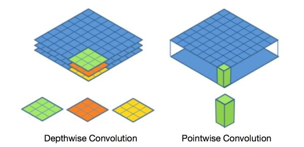
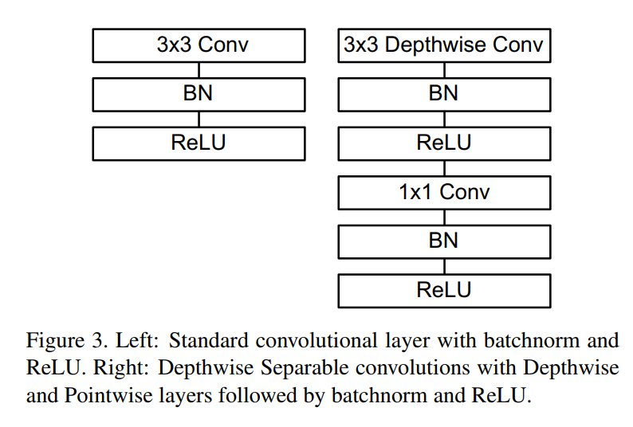
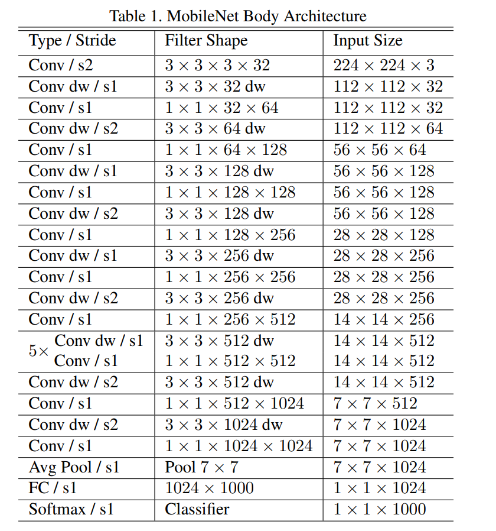

<!--
 * @Author: LOTEAT
 * @Date: 2024-07-24 17:00:25
-->
## MobileNets: Efficient Convolutional Neural Networks for Mobile Vision Applications
- 前置知识：PyTorch
- 作者：Andrew G. Howard, Menglong Zhu, Bo Chen, Dmitry Kalenichenko, Weijun Wang, Tobias Weyand, Marco Andreetto, Hartwig Adam
- [文章链接](https://arxiv.org/pdf/1704.04861)
- 代码链接：`PyTorch中似乎没有MobileNetV1?`

### 1. Motivation
传统卷积神经网络，内存需求大、运算量大。这使其无法在移动设备以及嵌入式设备上运行，因为这些设备计算资源非常有限。因此，我们需要一种方法优化神经网络的运算速度。

### 2. Architecture


#### 2.1 Depthwise Separable Convolution
`Depthwise Convolution`是Depthwise Separable Convolution的核心组件之一，如`图1`所示。若输入是$B*C*H*W$，Depthwise是指将输入分为$C$组，然后每组使用一个卷积核进行运算，每个卷积核的通道数同样为1。这样相当于收集了每个Channel的空间特征，即Depthwise特征。

`Pointwise Convolution`是Depthwise Separable Convolution的另一个核心组件，如`图1`所示。Pointwise本质上仍是传统的卷积。若输入是$B*C*H*W$，Pointwise对做$k$个普通的$1*1$卷积。这样相当于收集了每个点的特征，其实也是通道信息的交融。

<center>
    
    <br>
    <div style="color:orange; border-bottom: 1px solid #d9d9d9;
    display: inline-block;
    color: #999;
    padding: 2px;">
      图1：Depthwise Separable Convolution核心组件
  	</div>
</center>

论文中一个标准的Depthwise Separable Convolution是如`图2`所示。
<center>
    
    <br>
    <div style="color:orange; border-bottom: 1px solid #d9d9d9;
    display: inline-block;
    color: #999;
    padding: 2px;">
      图2：Depthwise Separable Convolution
  	</div>
</center>

#### 2.2 Network Structure
网络整体架构如`表1`所示。可以看到，第一层是stride为2的标准卷积，随后是Depthwise Convolution和Pointwise Convolution交替堆叠，没一层都构成一个Depthwise Separable Convolution。
<center>
    
    <br>
    <div style="color:orange; border-bottom: 1px solid #d9d9d9;
    display: inline-block;
    color: #999;
    padding: 2px;">
      图2：Depthwise Separable Convolution
  	</div>
</center>
由于我的方向和边缘计算相关程度并不大，因此并没有阅读论文中有关计算复杂度的部分，有兴趣的同学可自行阅读。

### 3. Code

```python
import torch
import torch.nn as nn
import torchvision

def BottleneckV1(in_channels, out_channels, stride):
  return  nn.Sequential(
        nn.Conv2d(in_channels=in_channels,out_channels=in_channels,kernel_size=3,stride=stride,padding=1,groups=in_channels),
        nn.BatchNorm2d(in_channels),
        nn.ReLU6(inplace=True),
        nn.Conv2d(in_channels=in_channels, out_channels=out_channels, kernel_size=1, stride=1),
        nn.BatchNorm2d(out_channels),
        nn.ReLU6(inplace=True)
    )

class MobileNetV1(nn.Module):
    def __init__(self, num_classes=1000):
        super(MobileNetV1, self).__init__()

        self.first_conv = nn.Sequential(
            nn.Conv2d(in_channels=3,out_channels=32,kernel_size=3,stride=2,padding=1),
            nn.BatchNorm2d(32),
            nn.ReLU6(inplace=True),
        )

        self.bottleneck = nn.Sequential(
            BottleneckV1(32, 64, stride=1),
            BottleneckV1(64, 128, stride=2),
            BottleneckV1(128, 128, stride=1),
            BottleneckV1(128, 256, stride=2),
            BottleneckV1(256, 256, stride=1),
            BottleneckV1(256, 512, stride=2),
            BottleneckV1(512, 512, stride=1),
            BottleneckV1(512, 512, stride=1),
            BottleneckV1(512, 512, stride=1),
            BottleneckV1(512, 512, stride=1),
            BottleneckV1(512, 512, stride=1),
            BottleneckV1(512, 1024, stride=2),
            BottleneckV1(1024, 1024, stride=1),
        )

        self.avg_pool = nn.AvgPool2d(kernel_size=7,stride=1)
        self.linear = nn.Linear(in_features=1024,out_features=num_classes)
        self.dropout = nn.Dropout(p=0.2)
        self.softmax = nn.Softmax(dim=1)

        self.init_params()

    def init_params(self):
        for m in self.modules():
            if isinstance(m, nn.Conv2d):
                nn.init.kaiming_normal_(m.weight)
                nn.init.constant_(m.bias,0)
            elif isinstance(m, nn.Linear) or isinstance(m, nn.BatchNorm2d):
                nn.init.constant_(m.weight, 1)
                nn.init.constant_(m.bias, 0)

    def forward(self, x):
        x = self.first_conv(x)
        x = self.bottleneck(x)
        x = self.avg_pool(x)
        x = x.view(x.size(0),-1)
        x = self.dropout(x)
        x = self.linear(x)
        out = self.softmax(x)
        return out
```

### 4. Innovation
MobileNet主要创新点在于使用Depthwise Separable Convolution来降低计算量。