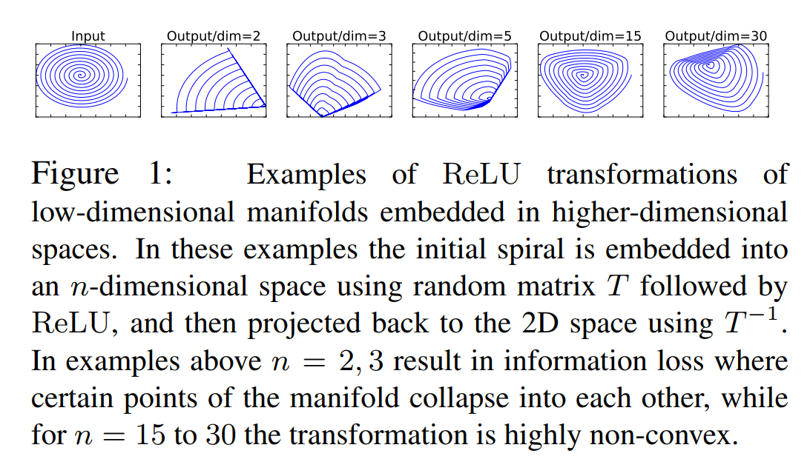
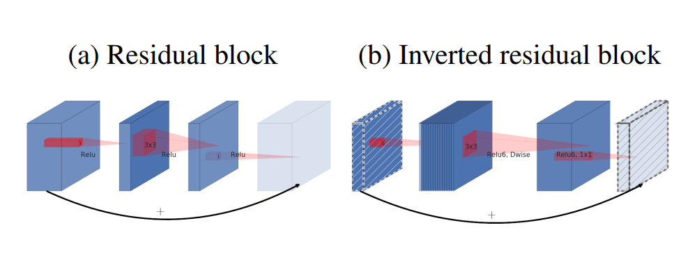
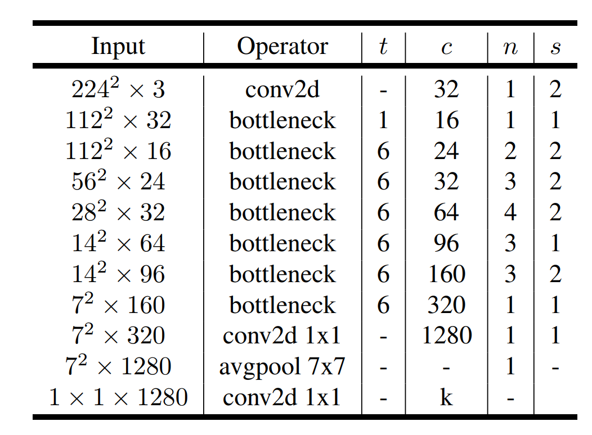
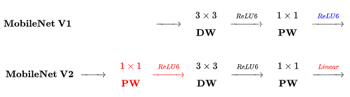

<!--
 * @Author: LOTEAT
 * @Date: 2024-07-24 17:00:25
-->
## MobileNetV2: Inverted Residuals and Linear Bottlenecks
- 前置知识：<a href='../MobileNet/mobilenet.md'>MobileNet</a>, <a href='../ResNet/resnet.md'>ResNet</a>
- 作者：Mark Sandler, Andrew Howard, Menglong Zhu, Andrey Zhmoginov, Liang-Chieh Chen
- [文章链接](https://arxiv.org/pdf/1801.04381)
- [代码链接](https://github.com/pytorch/vision/blob/main/torchvision/models/mobilenetv2.py)

### 1. Motivation
在原始MobileNet中，使用Depthwise Separable Convolution来降低计算量。但是这个架构在实际训练中常常会使得大多数卷积核参数为0，而在ReLU进一步影响下，会使得神经元最终的输出为0。输出为0会导致梯度为0，使得整体网络无法进行优化训练。因此，Andrew等人在MobileNet基础上进行改进，提出了MobileNetV2。

### 2. Architecture

MobileNetV2改进点主要在于两个部分，`Linear Bottlenecks`和`Inverted residuals`。

#### 2.1 Linear Bottlenecks
这部分可能是文中最难以理解的部分，论文不讲人话，读起来总是玄之又玄。论文中提到了一个概念，`manifold of interest`，它是指多层神经网络以及激活函数输出张量的一个集合。例如在`ResNet34`中，总共分为了4层，那么每一层的输出都是一个`manifold of interest`。

长久以来，研究人员认为每个像素特征是被编码在这个`manifold of interest`之中的，而我们将`manifold of interest`送入神经网络，实际上是将`manifold of interest`进行一个空间变换。可以膨胀到更高维的空间，也可以嵌入到低维的子空间。但是，论文认为神经网络使用非线性激活函数会造成空间映射的坍塌。

<center>
    
    <br>
    <div style="color:orange; border-bottom: 1px solid #d9d9d9;
    display: inline-block;
    color: #999;
    padding: 2px;">
    图1：Manifold of Interest
  	</div>
</center>

如图所示，输入是一个2D数据，其中`manifold of interest`是其中的蓝色螺旋线。通过矩阵$T$将输入嵌入到高维，再经过ReLU，随后用$T^{-1}$反投影到2D空间。当嵌入的维度较高时，2D数据可以较好的恢复，但是维度较低时，反投影回来的特征空间就发生了坍塌。这就意味着，如果我们既想要提升效果，又想要降低维度，采用ReLU是不现实的。因为ReLU函数可能会滤除很多有用信息。

因此，论文采用`Linear Bottleneck`进行替代，实际上也就是一个linear layer加上一个batch normalization。 

#### 2.2 Inverted residuals
在`ResNet`原有的残差连接中，是中间小两头大的架构。也就是两头的通道数大，中间的通道数小。而在`MobileNetV2`中，则是中间大两头小的架构，所以文章作者将其称之为`Inverted residuals`。这个主要还是因为采用了Depthwise Convolution，从而降低计算量。

<center>
    
    <br>
    <div style="color:orange; border-bottom: 1px solid #d9d9d9;
    display: inline-block;
    color: #999;
    padding: 2px;">
    图2：Residuals架构对比
  	</div>
</center>

#### 2.3 Architecture
MobileNetV2整体架构如`图3`所示。其中，每一个`bottleneck`都是`图4`所示的结构。

<center>
    
    <br>
    <div style="color:orange; border-bottom: 1px solid #d9d9d9;
    display: inline-block;
    color: #999;
    padding: 2px;">
    图3：MobileNetV2架构
  	</div>
</center>

<center>
    
    <br>
    <div style="color:orange; border-bottom: 1px solid #d9d9d9;
    display: inline-block;
    color: #999;
    padding: 2px;">
    图4：Bottleneck架构
  	</div>
</center>

### 3. Code
```python
class MobileNetV2(nn.Module):
    def __init__(
        self,
        num_classes: int = 1000,
        width_mult: float = 1.0,
        inverted_residual_setting: Optional[List[List[int]]] = None,
        round_nearest: int = 8,
        block: Optional[Callable[..., nn.Module]] = None,
        norm_layer: Optional[Callable[..., nn.Module]] = None,
        dropout: float = 0.2,
    ) -> None:
        """
        MobileNet V2 main class

        Args:
            num_classes (int): Number of classes
            width_mult (float): Width multiplier - adjusts number of channels in each layer by this amount
            inverted_residual_setting: Network structure
            round_nearest (int): Round the number of channels in each layer to be a multiple of this number
            Set to 1 to turn off rounding
            block: Module specifying inverted residual building block for mobilenet
            norm_layer: Module specifying the normalization layer to use
            dropout (float): The droupout probability

        """
        super().__init__()
        _log_api_usage_once(self)

        if block is None:
            block = InvertedResidual

        if norm_layer is None:
            norm_layer = nn.BatchNorm2d

        input_channel = 32
        last_channel = 1280

        if inverted_residual_setting is None:
            inverted_residual_setting = [
                # t, c, n, s
                [1, 16, 1, 1],
                [6, 24, 2, 2],
                [6, 32, 3, 2],
                [6, 64, 4, 2],
                [6, 96, 3, 1],
                [6, 160, 3, 2],
                [6, 320, 1, 1],
            ]

        # only check the first element, assuming user knows t,c,n,s are required
        if len(inverted_residual_setting) == 0 or len(inverted_residual_setting[0]) != 4:
            raise ValueError(
                f"inverted_residual_setting should be non-empty or a 4-element list, got {inverted_residual_setting}"
            )

        # building first layer
        input_channel = _make_divisible(input_channel * width_mult, round_nearest)
        self.last_channel = _make_divisible(last_channel * max(1.0, width_mult), round_nearest)
        features: List[nn.Module] = [
            Conv2dNormActivation(3, input_channel, stride=2, norm_layer=norm_layer, activation_layer=nn.ReLU6)
        ]
        # building inverted residual blocks
        for t, c, n, s in inverted_residual_setting:
            output_channel = _make_divisible(c * width_mult, round_nearest)
            for i in range(n):
                stride = s if i == 0 else 1
                features.append(block(input_channel, output_channel, stride, expand_ratio=t, norm_layer=norm_layer))
                input_channel = output_channel
        # building last several layers
        features.append(
            Conv2dNormActivation(
                input_channel, self.last_channel, kernel_size=1, norm_layer=norm_layer, activation_layer=nn.ReLU6
            )
        )
        # make it nn.Sequential
        self.features = nn.Sequential(*features)

        # building classifier
        self.classifier = nn.Sequential(
            nn.Dropout(p=dropout),
            nn.Linear(self.last_channel, num_classes),
        )

        # weight initialization
        for m in self.modules():
            if isinstance(m, nn.Conv2d):
                nn.init.kaiming_normal_(m.weight, mode="fan_out")
                if m.bias is not None:
                    nn.init.zeros_(m.bias)
            elif isinstance(m, (nn.BatchNorm2d, nn.GroupNorm)):
                nn.init.ones_(m.weight)
                nn.init.zeros_(m.bias)
            elif isinstance(m, nn.Linear):
                nn.init.normal_(m.weight, 0, 0.01)
                nn.init.zeros_(m.bias)

    def _forward_impl(self, x: Tensor) -> Tensor:
        # This exists since TorchScript doesn't support inheritance, so the superclass method
        # (this one) needs to have a name other than `forward` that can be accessed in a subclass
        x = self.features(x)
        # Cannot use "squeeze" as batch-size can be 1
        x = nn.functional.adaptive_avg_pool2d(x, (1, 1))
        x = torch.flatten(x, 1)
        x = self.classifier(x)
        return x

    def forward(self, x: Tensor) -> Tensor:
        return self._forward_impl(x)
```
上述代码是PyTorch的官方实现，整体架构比较简单。
```python
class InvertedResidual(nn.Module):
    def __init__(
        self, inp: int, oup: int, stride: int, expand_ratio: int, norm_layer: Optional[Callable[..., nn.Module]] = None
    ) -> None:
        super().__init__()
        self.stride = stride
        if stride not in [1, 2]:
            raise ValueError(f"stride should be 1 or 2 insted of {stride}")

        if norm_layer is None:
            norm_layer = nn.BatchNorm2d

        hidden_dim = int(round(inp * expand_ratio))
        self.use_res_connect = self.stride == 1 and inp == oup

        layers: List[nn.Module] = []
        if expand_ratio != 1:
            # pw
            layers.append(
                Conv2dNormActivation(inp, hidden_dim, kernel_size=1, norm_layer=norm_layer, activation_layer=nn.ReLU6)
            )
        layers.extend(
            [
                # dw
                Conv2dNormActivation(
                    hidden_dim,
                    hidden_dim,
                    stride=stride,
                    groups=hidden_dim,
                    norm_layer=norm_layer,
                    activation_layer=nn.ReLU6,
                ),
                # pw-linear
                nn.Conv2d(hidden_dim, oup, 1, 1, 0, bias=False),
                norm_layer(oup),
            ]
        )
        self.conv = nn.Sequential(*layers)
        self.out_channels = oup
        self._is_cn = stride > 1

    def forward(self, x: Tensor) -> Tensor:
        if self.use_res_connect:
            return x + self.conv(x)
        else:
            return self.conv(x)
```
这个也就是Bottleneck架构。
### 4. Innovation
采用linear layer替换ReLU，并引入残差连接，在降低参数计算量的同时提高性能。