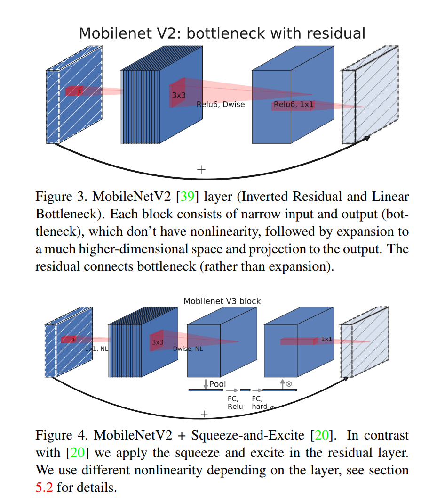
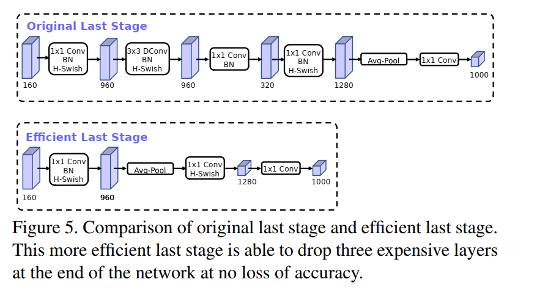
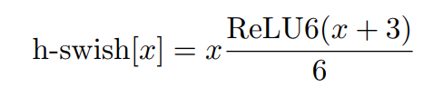
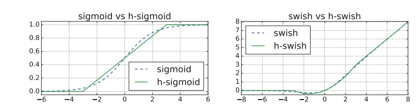
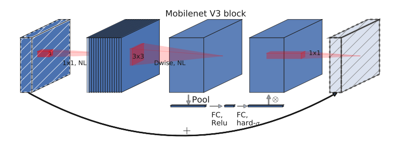
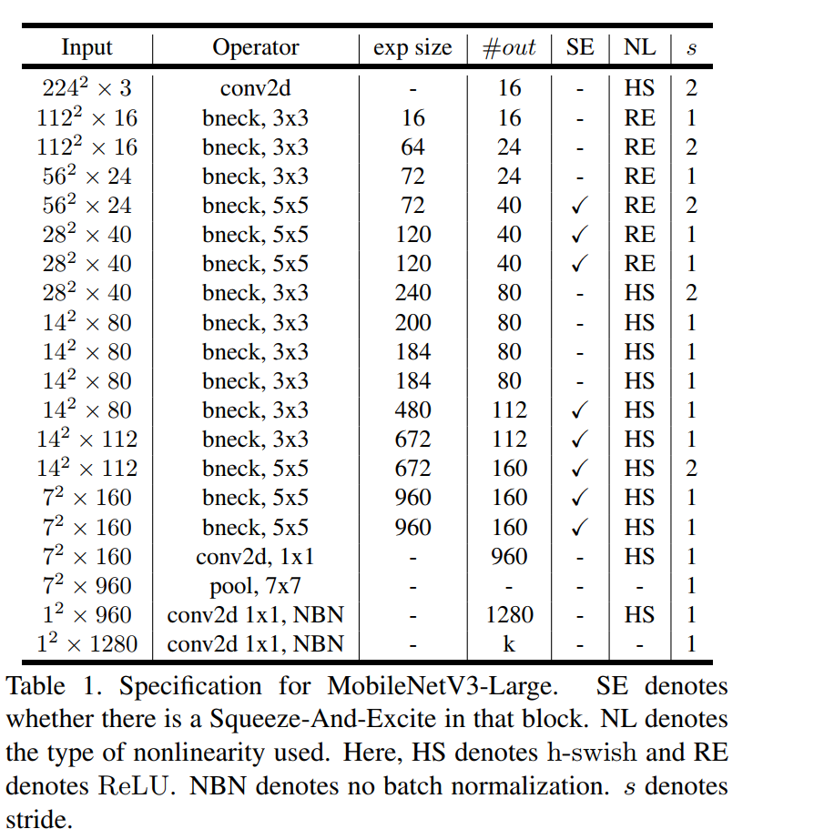
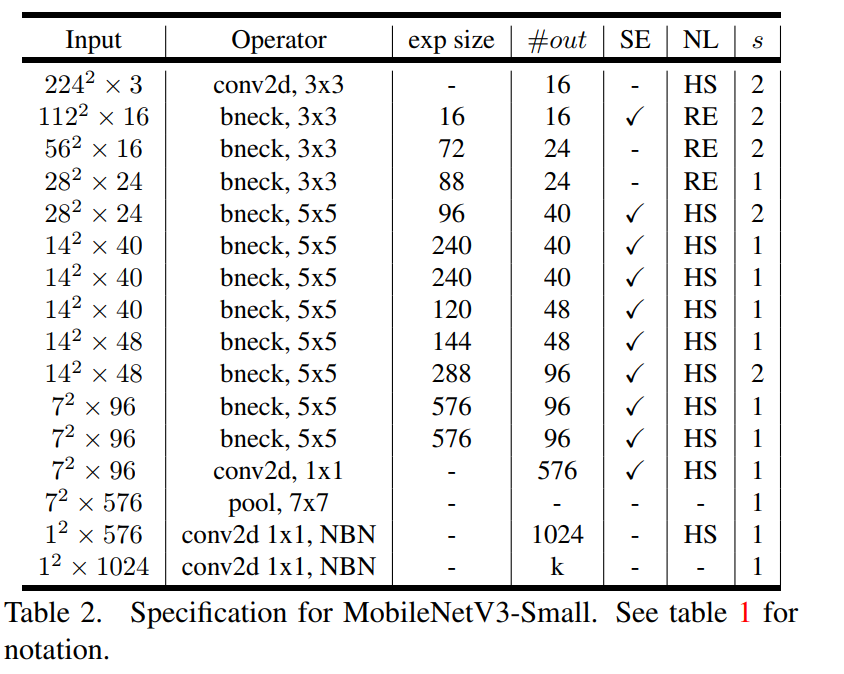

<!--
 * @Author: LOTEAT
 * @Date: 2024-07-24 17:00:25
-->
## Searching for MobileNetV3
- 前置知识：<a href='../MobileNet/mobilenet.md'>MobileNet</a>, <a href='../MobileNetV2/mobilenetv2.md'>MobileNetV2</a>
- 作者：Andrew Howard, Mark Sandler, Grace Chu, Liang-Chieh Chen, Bo Chen, Mingxing Tan, Weijun Wang, Yukun Zhu, Ruoming Pang, Vijay Vasudevan, Quoc V. Le, Hartwig Adam
- [文章链接](https://arxiv.org/pdf/1905.02244v5)
- [代码链接](https://github.com/pytorch/vision/blob/main/torchvision/models/mobilenetv3.py)

### 1. Motivation
为了进一步降低计算量并提高精度，Andrew等人提出了MobileNetV3,这是对MobileNetV1和MobileNetV2的进一步改进。由于研究方向的原因，本文并不会对NAS进行过多的解析。

### 2. Architecture

MobileNetV3改进点主要在于三个部分，`Squeeze-and-Excite`，`Last Stage`和`激活函数`。

#### 2.1 Squeeze-and-Excite
这个SE模块其实是一个简单的注意力模块，如`图1`所示，简单来说，就是通过卷积核池化计算一个注意力，然后用注意力权重乘以对应的通道，这部分可以参考代码部分更易于理解。

<center>
    
    <br>
    <div style="color:orange; border-bottom: 1px solid #d9d9d9;
    display: inline-block;
    color: #999;
    padding: 2px;">
    图1：Squeeze-and-Excite
  	</div>
</center>

#### 2.3 Last Stage
与MobileNetV2不同，MobileNetV3对最后一部分进行了网络精简，准确率没有发生变化，但是推理时间节省了7ms。
<center>
    
    <br>
    <div style="color:orange; border-bottom: 1px solid #d9d9d9;
    display: inline-block;
    color: #999;
    padding: 2px;">
    图2：Last Stage优化
  	</div>
</center>

#### 2.4 激活函数
由于swish激活函数不利于量化和求导，因此作者使用h-swish函数进行替代。其中，$\frac{\text{ReLU6}(x+3)}{6}$就是h-sigmoid激活函数。可以从`图4`看出，变换后曲线基本一样。
<center>
    
    <br>
    <div style="color:orange; border-bottom: 1px solid #d9d9d9;
    display: inline-block;
    color: #999;
    padding: 2px;">
    图3：h-swish激活函数
  	</div>
</center>

<center>
    
    <br>
    <div style="color:orange; border-bottom: 1px solid #d9d9d9;
    display: inline-block;
    color: #999;
    padding: 2px;">
    图4：激活函数对比
  	</div>
</center>

#### 2.4 Architecture
MobileNetV3由多个`bneck`模块构成，一个`bneck`如`图5`所示。这一，这里使用的卷积仍然是Depthwise和Pointwise卷积。
<center>
    
    <br>
    <div style="color:orange; border-bottom: 1px solid #d9d9d9;
    display: inline-block;
    color: #999;
    padding: 2px;">
    图5：bneck架构
  	</div>
</center>
MobileNetV3提供了两个模型用于不同的场景，MobileNetV3-Large和MobileNetV3-Small。
<center>
    
    <br>
    <div style="color:orange; border-bottom: 1px solid #d9d9d9;
    display: inline-block;
    color: #999;
    padding: 2px;">
    图6：MobileNetV3-Large
  	</div>
</center>

<center>
    
    <br>
    <div style="color:orange; border-bottom: 1px solid #d9d9d9;
    display: inline-block;
    color: #999;
    padding: 2px;">
    图7：MobileNetV3-Small
  	</div>
</center>

### 3. Code
```python
class MobileNetV3(nn.Module):
    def __init__(
        self,
        inverted_residual_setting: List[InvertedResidualConfig],
        last_channel: int,
        num_classes: int = 1000,
        block: Optional[Callable[..., nn.Module]] = None,
        norm_layer: Optional[Callable[..., nn.Module]] = None,
        dropout: float = 0.2,
        **kwargs: Any,
    ) -> None:
        """
        MobileNet V3 main class

        Args:
            inverted_residual_setting (List[InvertedResidualConfig]): Network structure
            last_channel (int): The number of channels on the penultimate layer
            num_classes (int): Number of classes
            block (Optional[Callable[..., nn.Module]]): Module specifying inverted residual building block for mobilenet
            norm_layer (Optional[Callable[..., nn.Module]]): Module specifying the normalization layer to use
            dropout (float): The droupout probability
        """
        super().__init__()
        _log_api_usage_once(self)

        if not inverted_residual_setting:
            raise ValueError("The inverted_residual_setting should not be empty")
        elif not (
            isinstance(inverted_residual_setting, Sequence)
            and all([isinstance(s, InvertedResidualConfig) for s in inverted_residual_setting])
        ):
            raise TypeError("The inverted_residual_setting should be List[InvertedResidualConfig]")

        if block is None:
            block = InvertedResidual

        if norm_layer is None:
            norm_layer = partial(nn.BatchNorm2d, eps=0.001, momentum=0.01)

        layers: List[nn.Module] = []

        # building first layer
        firstconv_output_channels = inverted_residual_setting[0].input_channels
        layers.append(
            Conv2dNormActivation(
                3,
                firstconv_output_channels,
                kernel_size=3,
                stride=2,
                norm_layer=norm_layer,
                activation_layer=nn.Hardswish,
            )
        )

        # building inverted residual blocks
        for cnf in inverted_residual_setting:
            layers.append(block(cnf, norm_layer))

        # building last several layers
        lastconv_input_channels = inverted_residual_setting[-1].out_channels
        lastconv_output_channels = 6 * lastconv_input_channels
        layers.append(
            Conv2dNormActivation(
                lastconv_input_channels,
                lastconv_output_channels,
                kernel_size=1,
                norm_layer=norm_layer,
                activation_layer=nn.Hardswish,
            )
        )

        self.features = nn.Sequential(*layers)
        self.avgpool = nn.AdaptiveAvgPool2d(1)
        self.classifier = nn.Sequential(
            nn.Linear(lastconv_output_channels, last_channel),
            nn.Hardswish(inplace=True),
            nn.Dropout(p=dropout, inplace=True),
            nn.Linear(last_channel, num_classes),
        )

        for m in self.modules():
            if isinstance(m, nn.Conv2d):
                nn.init.kaiming_normal_(m.weight, mode="fan_out")
                if m.bias is not None:
                    nn.init.zeros_(m.bias)
            elif isinstance(m, (nn.BatchNorm2d, nn.GroupNorm)):
                nn.init.ones_(m.weight)
                nn.init.zeros_(m.bias)
            elif isinstance(m, nn.Linear):
                nn.init.normal_(m.weight, 0, 0.01)
                nn.init.zeros_(m.bias)

    def _forward_impl(self, x: Tensor) -> Tensor:
        x = self.features(x)

        x = self.avgpool(x)
        x = torch.flatten(x, 1)

        x = self.classifier(x)

        return x

    def forward(self, x: Tensor) -> Tensor:
        return self._forward_impl(x)

```
上述代码是PyTorch的官方实现，整体架构比较简单。但是似乎在SE模块使用上和原始论文稍微有些出入，因此这里添加了一个原始论文中的实现。
```python
class SeModule(nn.Module):
    def __init__(self, in_size, reduction=4):
        super(SeModule, self).__init__()
        self.se = nn.Sequential(
            nn.AdaptiveAvgPool2d(1),
            nn.Conv2d(in_size, in_size // reduction, kernel_size=1, stride=1, padding=0, bias=False),
            nn.BatchNorm2d(in_size // reduction),
            nn.ReLU(inplace=True),
            nn.Conv2d(in_size // reduction, in_size, kernel_size=1, stride=1, padding=0, bias=False),
            nn.BatchNorm2d(in_size),
            hsigmoid())

    def forward(self, x):
        return x * self.se(x)
```

### 4. Innovation
引入通道注意力机制，并采用新的激活函数，在降低参数计算量的同时提高性能。