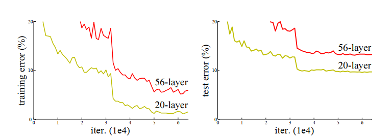
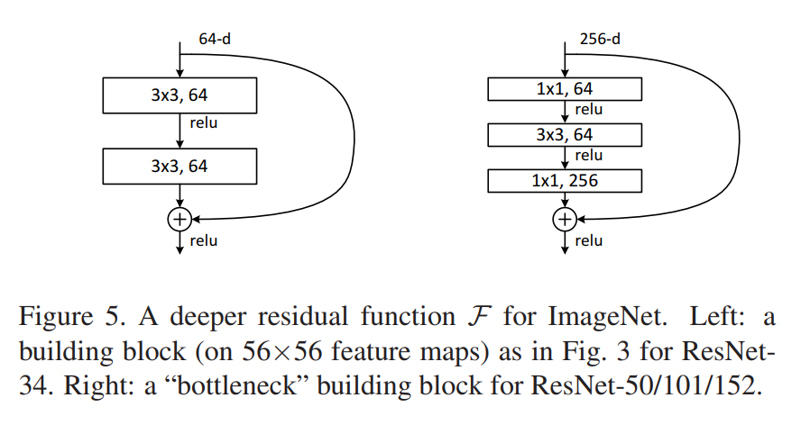
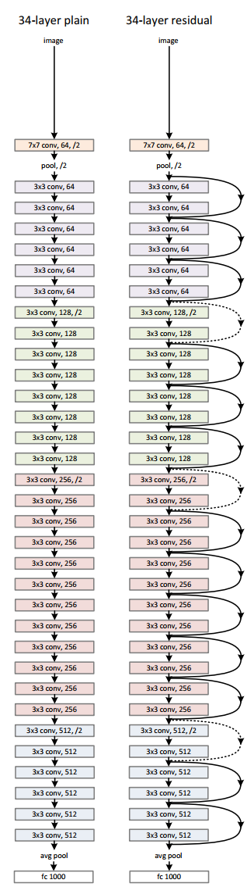
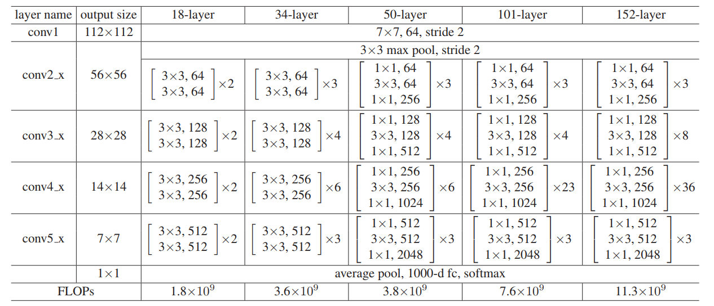

<!--
 * @Author: LOTEAT
 * @Date: 2024-07-24 17:00:25
-->
## Deep Residual Learning for Image Recognition
- 前置知识：PyTorch
- 作者：Kaiming He, Xiangyu Zhang, Shaoqing Ren, Jian Sun
- [文章链接](https://openaccess.thecvf.com/content_cvpr_2016/papers/He_Deep_Residual_Learning_CVPR_2016_paper.pdf)
- [代码链接](https://github.com/pytorch/vision/blob/main/torchvision/models/resnet.py)

### 1. Motivation
随着网络的加深，在训练过程中常常会出现梯度消失或是梯度爆炸的问题。对于一些较小的数据集来说，网络过深也常常会导致过拟合，如`图1`所示。

<center>
    
    <br>
    <div style="color:orange; border-bottom: 1px solid #d9d9d9;
    display: inline-block;
    color: #999;
    padding: 2px;">
      图1：CIFAR-10 上的训练误差（左）和测试误差（右）
  	</div>
</center>

但是，许多网络优异的效果依赖于网络的深度。因此，我们需要一种方法，在加深网络的同时，优化网络的训练效果。

### 2. Architecture
假如我们把神经网络分层，每一层都看作一个函数。那么从第$1$层到第$n$层，对应的函数分别为$f_1(x), f_2(x), f_3(x), ..., f_i(x), ..., f_n(x)$，$x$是输入。前面提到过，网络加深会造成梯度消失或者梯度爆炸的问题。那么，如果能够在每一层的网络输出中涵盖上一层的网络输出，在一定程度上就降低了网络的深度。

ResNet的思路其实很简单，对于第$i$层，如果输入是$x_{i-1}$，那么输出就是$f_i(x_{i-1}) + x_{i-1}$。我们可以考虑一种极端情况，假设第$i-1$层的输出是最优输出，也就是可以使得任务达到最好的输出。如果我们的优化器足够强大，我们可以通过将$f_{i+1}$及后续的所有层的参数都优化为0，使得最终的输出为是$x_i$。这或许也就是采用加法连接而非concat的原因。在官方实现中，残差块一种有两种实现形式，如`图2`所示。

<center>
    
    <br>
    <div style="color:orange; border-bottom: 1px solid #d9d9d9;
    display: inline-block;
    color: #999;
    padding: 2px;">
      图2：残差块
  	</div>
</center>

实际上，残差网络就是多个$1*1$卷积块，$3*3$卷积块和激活函数的组合，如`图3`和`表1`所示。
<center>
    
    <br>
    <div style="color:orange; border-bottom: 1px solid #d9d9d9;
    display: inline-block;
    color: #999;
    padding: 2px;">
      图3：ResNet34网络架构
  	</div>
</center>
<center>
    
    <br>
    <div style="color:orange; border-bottom: 1px solid #d9d9d9;
    display: inline-block;
    color: #999;
    padding: 2px;">
      表1：ResNet网络架构
  	</div>
</center>

### 3. Code
我们以PyTorch中ResNet34为例进行讲解。
```python
@register_model()
@handle_legacy_interface(weights=("pretrained", ResNet34_Weights.IMAGENET1K_V1))
def resnet34(*, weights: Optional[ResNet34_Weights] = None, progress: bool = True, **kwargs: Any) -> ResNet:
    """ResNet-34 from `Deep Residual Learning for Image Recognition <https://arxiv.org/pdf/1512.03385.pdf>`__.

    Args:
        weights (:class:`~torchvision.models.ResNet34_Weights`, optional): The
            pretrained weights to use. See
            :class:`~torchvision.models.ResNet34_Weights` below for
            more details, and possible values. By default, no pre-trained
            weights are used.
        progress (bool, optional): If True, displays a progress bar of the
            download to stderr. Default is True.
        **kwargs: parameters passed to the ``torchvision.models.resnet.ResNet``
            base class. Please refer to the `source code
            <https://github.com/pytorch/vision/blob/main/torchvision/models/resnet.py>`_
            for more details about this class.

    .. autoclass:: torchvision.models.ResNet34_Weights
        :members:
    """
    weights = ResNet34_Weights.verify(weights)

    return _resnet(BasicBlock, [3, 4, 6, 3], weights, progress, **kwargs)
```
从`renet34`函数中可以看出，ResNet的创建是通过`_resnet`函数以及多个`BasicBlock`实现的，`[3, 4, 6, 3]`对应的是每层`BasicBlock`的个数。

```python
class BasicBlock(nn.Module):
    expansion: int = 1

    def __init__(
        self,
        inplanes: int,
        planes: int,
        stride: int = 1,
        downsample: Optional[nn.Module] = None,
        groups: int = 1,
        base_width: int = 64,
        dilation: int = 1,
        norm_layer: Optional[Callable[..., nn.Module]] = None,
    ) -> None:
        super().__init__()
        if norm_layer is None:
            norm_layer = nn.BatchNorm2d
        if groups != 1 or base_width != 64:
            raise ValueError("BasicBlock only supports groups=1 and base_width=64")
        if dilation > 1:
            raise NotImplementedError("Dilation > 1 not supported in BasicBlock")
        # Both self.conv1 and self.downsample layers downsample the input when stride != 1
        self.conv1 = conv3x3(inplanes, planes, stride)
        self.bn1 = norm_layer(planes)
        self.relu = nn.ReLU(inplace=True)
        self.conv2 = conv3x3(planes, planes)
        self.bn2 = norm_layer(planes)
        self.downsample = downsample
        self.stride = stride

    def forward(self, x: Tensor) -> Tensor:
        identity = x

        out = self.conv1(x)
        out = self.bn1(out)
        out = self.relu(out)

        out = self.conv2(out)
        out = self.bn2(out)

        if self.downsample is not None:
            identity = self.downsample(x)

        out += identity
        out = self.relu(out)

        return out
```
`BasicBlock`是按照`图2`搭建的，中间加入了一些norm layer。

```python
def _resnet(
    block: Type[Union[BasicBlock, Bottleneck]],
    layers: List[int],
    weights: Optional[WeightsEnum],
    progress: bool,
    **kwargs: Any,
) -> ResNet:
    if weights is not None:
        _ovewrite_named_param(kwargs, "num_classes", len(weights.meta["categories"]))

    model = ResNet(block, layers, **kwargs)

    if weights is not None:
        model.load_state_dict(weights.get_state_dict(progress=progress))

    return model
```
`_resnet`函数通过`ResNet`类创建ResNet模型。
```python
class ResNet(nn.Module):
    def __init__(
        self,
        block: Type[Union[BasicBlock, Bottleneck]],
        layers: List[int],
        num_classes: int = 1000,
        zero_init_residual: bool = False,
        groups: int = 1,
        width_per_group: int = 64,
        replace_stride_with_dilation: Optional[List[bool]] = None,
        norm_layer: Optional[Callable[..., nn.Module]] = None,
    ) -> None:
        super().__init__()
        _log_api_usage_once(self)
        if norm_layer is None:
            norm_layer = nn.BatchNorm2d
        self._norm_layer = norm_layer

        self.inplanes = 64
        self.dilation = 1
        if replace_stride_with_dilation is None:
            # each element in the tuple indicates if we should replace
            # the 2x2 stride with a dilated convolution instead
            replace_stride_with_dilation = [False, False, False]
        if len(replace_stride_with_dilation) != 3:
            raise ValueError(
                "replace_stride_with_dilation should be None "
                f"or a 3-element tuple, got {replace_stride_with_dilation}"
            )
        self.groups = groups
        self.base_width = width_per_group
        self.conv1 = nn.Conv2d(3, self.inplanes, kernel_size=7, stride=2, padding=3, bias=False)
        self.bn1 = norm_layer(self.inplanes)
        self.relu = nn.ReLU(inplace=True)
        self.maxpool = nn.MaxPool2d(kernel_size=3, stride=2, padding=1)
        self.layer1 = self._make_layer(block, 64, layers[0])
        self.layer2 = self._make_layer(block, 128, layers[1], stride=2, dilate=replace_stride_with_dilation[0])
        self.layer3 = self._make_layer(block, 256, layers[2], stride=2, dilate=replace_stride_with_dilation[1])
        self.layer4 = self._make_layer(block, 512, layers[3], stride=2, dilate=replace_stride_with_dilation[2])
        self.avgpool = nn.AdaptiveAvgPool2d((1, 1))
        self.fc = nn.Linear(512 * block.expansion, num_classes)

        for m in self.modules():
            if isinstance(m, nn.Conv2d):
                nn.init.kaiming_normal_(m.weight, mode="fan_out", nonlinearity="relu")
            elif isinstance(m, (nn.BatchNorm2d, nn.GroupNorm)):
                nn.init.constant_(m.weight, 1)
                nn.init.constant_(m.bias, 0)

        # Zero-initialize the last BN in each residual branch,
        # so that the residual branch starts with zeros, and each residual block behaves like an identity.
        # This improves the model by 0.2~0.3% according to https://arxiv.org/abs/1706.02677
        if zero_init_residual:
            for m in self.modules():
                if isinstance(m, Bottleneck) and m.bn3.weight is not None:
                    nn.init.constant_(m.bn3.weight, 0)  # type: ignore[arg-type]
                elif isinstance(m, BasicBlock) and m.bn2.weight is not None:
                    nn.init.constant_(m.bn2.weight, 0)  # type: ignore[arg-type]

    def _make_layer(
        self,
        block: Type[Union[BasicBlock, Bottleneck]],
        planes: int,
        blocks: int,
        stride: int = 1,
        dilate: bool = False,
    ) -> nn.Sequential:
        norm_layer = self._norm_layer
        downsample = None
        previous_dilation = self.dilation
        if dilate:
            self.dilation *= stride
            stride = 1
        if stride != 1 or self.inplanes != planes * block.expansion:
            downsample = nn.Sequential(
                conv1x1(self.inplanes, planes * block.expansion, stride),
                norm_layer(planes * block.expansion),
            )

        layers = []
        layers.append(
            block(
                self.inplanes, planes, stride, downsample, self.groups, self.base_width, previous_dilation, norm_layer
            )
        )
        self.inplanes = planes * block.expansion
        for _ in range(1, blocks):
            layers.append(
                block(
                    self.inplanes,
                    planes,
                    groups=self.groups,
                    base_width=self.base_width,
                    dilation=self.dilation,
                    norm_layer=norm_layer,
                )
            )

        return nn.Sequential(*layers)

    def _forward_impl(self, x: Tensor) -> Tensor:
        # See note [TorchScript super()]
        x = self.conv1(x)
        x = self.bn1(x)
        x = self.relu(x)
        x = self.maxpool(x)

        x = self.layer1(x)
        x = self.layer2(x)
        x = self.layer3(x)
        x = self.layer4(x)

        x = self.avgpool(x)
        x = torch.flatten(x, 1)
        x = self.fc(x)

        return x

    def forward(self, x: Tensor) -> Tensor:
        return self._forward_impl(x)
```
`ResNet`类的实现。


### 4. Innovation
残差网络最大的创新点就是残差块的设计，这种设计思想已经被广泛应用在各种模型中，例如`transformer`中也有残差的思想。