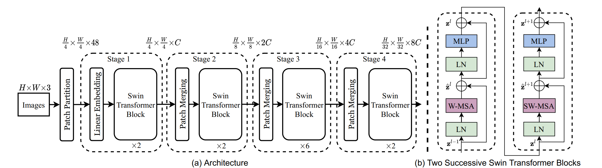

<!--
 * @Author: LOTEAT
 * @Date: 2024-10-03 20:45:10
-->

## Deep Residual Learning for Image Recognition
- 前置知识：<a href="../Basic/Transformer/transformer.md"> Transformer </a>
- 作者：Ze Liu, Yutong Lin, Yue Cao, Han Hu, Yixuan Wei, Zheng Zhang, Stephen Lin, Baining Guo
- [文章链接](https://openaccess.thecvf.com/content/ICCV2021/papers/Liu_Swin_Transformer_Hierarchical_Vision_Transformer_Using_Shifted_Windows_ICCV_2021_paper.pdf)
- [代码链接](https://github.com/open-mmlab/mmdetection)
- [视频推荐](https://www.bilibili.com/video/BV13L4y1475U/?spm_id_from=333.337.search-card.all.click&vd_source=962a14fe78f4c5b36a73df66a4d2f23b)

### 1. Motivation
在计算机视觉中，CNN长期以来一直是主导模型。然而，在NLP领域中，Transformer架构已经成为主流。这篇文章核心想法就是：1.解决在计算机视觉中，物体的尺度不同这个问题。2.将Transformer应用在视觉领域。

### 2. Architecture
Swin Transformer的架构如图1所示。可以看到，其实它的核心module是三个：Patch Partition，Patch Merging以及Swin Transformer Block。
<center>
    
    <br>
    <div style="color:orange; border-bottom: 1px solid #d9d9d9;
    display: inline-block;
    color: #999;
    padding: 2px;">
      图1：Architecture
    </div>
</center>

#### 2.1 Patch Partition
输入的 RGB 图像首先被分割成固定大小的非重叠块，（例如4x4或16x16像素）。每个图像块被展平成一个一维向量，并且通过一个线性层映射到一个高维空间。这样输入就从$H\times W \times 3$变成了$\frac{H}{4} \times \frac{W}{4} \times 48$。

#### 2.2 Parch Merging
Patch Merging会将相邻的图像块合并成更大的块，例如将2x2的块看作一个大的像素块。通过合并操作，特征图的分辨率减半，同时特征的通道数翻倍。Merging后，特征会进行一个Linear层，将特征数减半，从而减少计算量。这也就是为什么每一个stage输出后，分辨率会减半，而通道数会加倍的原因。注意，swin transformer block不改变特征的shape。

#### 2.3 Swin Transformer Block
swin transformer block中包括两个attention，分别是Window Multi-head Self Attention和Shifted Window Multi-head Self Attention
##### 2.3.1 Window Multi-head Self Attention
W-MSA是在固定窗口内计算自注意力。图像会被划分为多个不重叠的局部窗口，每个窗口内进行自注意力的计算。
##### 2.3.2 Shifted Window Multi-head Self Attention
SW-MSA是W-MSA的扩展，通过引入窗口的移位从而实现跨窗口的信息交流。这部分论文解释并不清楚，我们通过代码进行理解。


### 3. Code
先来看PatchEmbedding，其核心思路就是通过卷积进行嵌入。
```python
class PatchEmbed(BaseModule):
    """Image to Patch Embedding.

    We use a conv layer to implement PatchEmbed.

    Args:
        in_channels (int): The num of input channels. Default: 3
        embed_dims (int): The dimensions of embedding. Default: 768
        conv_type (str): The config dict for embedding
            conv layer type selection. Default: "Conv2d.
        kernel_size (int): The kernel_size of embedding conv. Default: 16.
        stride (int): The slide stride of embedding conv.
            Default: None (Would be set as `kernel_size`).
        padding (int | tuple | string ): The padding length of
            embedding conv. When it is a string, it means the mode
            of adaptive padding, support "same" and "corner" now.
            Default: "corner".
        dilation (int): The dilation rate of embedding conv. Default: 1.
        bias (bool): Bias of embed conv. Default: True.
        norm_cfg (dict, optional): Config dict for normalization layer.
            Default: None.
        input_size (int | tuple | None): The size of input, which will be
            used to calculate the out size. Only work when `dynamic_size`
            is False. Default: None.
        init_cfg (`mmengine.ConfigDict`, optional): The Config for
            initialization. Default: None.
    """

    def __init__(self,
                 in_channels: int = 3,
                 embed_dims: int = 768,
                 conv_type: str = 'Conv2d',
                 kernel_size: int = 16,
                 stride: int = 16,
                 padding: Union[int, tuple, str] = 'corner',
                 dilation: int = 1,
                 bias: bool = True,
                 norm_cfg: OptConfigType = None,
                 input_size: Union[int, tuple] = None,
                 init_cfg: OptConfigType = None) -> None:
        super(PatchEmbed, self).__init__(init_cfg=init_cfg)

        self.embed_dims = embed_dims
        if stride is None:
            stride = kernel_size

        kernel_size = to_2tuple(kernel_size)
        stride = to_2tuple(stride)
        dilation = to_2tuple(dilation)

        if isinstance(padding, str):
            self.adap_padding = AdaptivePadding(
                kernel_size=kernel_size,
                stride=stride,
                dilation=dilation,
                padding=padding)
            # disable the padding of conv
            padding = 0
        else:
            self.adap_padding = None
        padding = to_2tuple(padding)

        self.projection = build_conv_layer(
            dict(type=conv_type),
            in_channels=in_channels,
            out_channels=embed_dims,
            kernel_size=kernel_size,
            stride=stride,
            padding=padding,
            dilation=dilation,
            bias=bias)

        if norm_cfg is not None:
            self.norm = build_norm_layer(norm_cfg, embed_dims)[1]
        else:
            self.norm = None

        if input_size:
            input_size = to_2tuple(input_size)
            # `init_out_size` would be used outside to
            # calculate the num_patches
            # when `use_abs_pos_embed` outside
            self.init_input_size = input_size
            if self.adap_padding:
                pad_h, pad_w = self.adap_padding.get_pad_shape(input_size)
                input_h, input_w = input_size
                input_h = input_h + pad_h
                input_w = input_w + pad_w
                input_size = (input_h, input_w)

            # https://pytorch.org/docs/stable/generated/torch.nn.Conv2d.html
            h_out = (input_size[0] + 2 * padding[0] - dilation[0] *
                     (kernel_size[0] - 1) - 1) // stride[0] + 1
            w_out = (input_size[1] + 2 * padding[1] - dilation[1] *
                     (kernel_size[1] - 1) - 1) // stride[1] + 1
            self.init_out_size = (h_out, w_out)
        else:
            self.init_input_size = None
            self.init_out_size = None

    def forward(self, x: Tensor) -> Tuple[Tensor, Tuple[int]]:
        """
        Args:
            x (Tensor): Has shape (B, C, H, W). In most case, C is 3.

        Returns:
            tuple: Contains merged results and its spatial shape.

                - x (Tensor): Has shape (B, out_h * out_w, embed_dims)
                - out_size (tuple[int]): Spatial shape of x, arrange as
                    (out_h, out_w).
        """

        if self.adap_padding:
            x = self.adap_padding(x)

        x = self.projection(x)
        out_size = (x.shape[2], x.shape[3])
        x = x.flatten(2).transpose(1, 2)
        if self.norm is not None:
            x = self.norm(x)
        return x, out_size
```
Patch Merging也是类似的，通过卷积嵌入。
```python
class PatchMerging(BaseModule):
    """Merge patch feature map.

    This layer groups feature map by kernel_size, and applies norm and linear
    layers to the grouped feature map. Our implementation uses `nn.Unfold` to
    merge patch, which is about 25% faster than original implementation.
    Instead, we need to modify pretrained models for compatibility.

    Args:
        in_channels (int): The num of input channels.
            to gets fully covered by filter and stride you specified..
            Default: True.
        out_channels (int): The num of output channels.
        kernel_size (int | tuple, optional): the kernel size in the unfold
            layer. Defaults to 2.
        stride (int | tuple, optional): the stride of the sliding blocks in the
            unfold layer. Default: None. (Would be set as `kernel_size`)
        padding (int | tuple | string ): The padding length of
            embedding conv. When it is a string, it means the mode
            of adaptive padding, support "same" and "corner" now.
            Default: "corner".
        dilation (int | tuple, optional): dilation parameter in the unfold
            layer. Default: 1.
        bias (bool, optional): Whether to add bias in linear layer or not.
            Defaults: False.
        norm_cfg (dict, optional): Config dict for normalization layer.
            Default: dict(type='LN').
        init_cfg (dict, optional): The extra config for initialization.
            Default: None.
    """

    def __init__(self,
                 in_channels: int,
                 out_channels: int,
                 kernel_size: Optional[Union[int, tuple]] = 2,
                 stride: Optional[Union[int, tuple]] = None,
                 padding: Union[int, tuple, str] = 'corner',
                 dilation: Optional[Union[int, tuple]] = 1,
                 bias: Optional[bool] = False,
                 norm_cfg: OptConfigType = dict(type='LN'),
                 init_cfg: OptConfigType = None) -> None:
        super().__init__(init_cfg=init_cfg)
        self.in_channels = in_channels
        self.out_channels = out_channels
        if stride:
            stride = stride
        else:
            stride = kernel_size

        kernel_size = to_2tuple(kernel_size)
        stride = to_2tuple(stride)
        dilation = to_2tuple(dilation)

        if isinstance(padding, str):
            self.adap_padding = AdaptivePadding(
                kernel_size=kernel_size,
                stride=stride,
                dilation=dilation,
                padding=padding)
            # disable the padding of unfold
            padding = 0
        else:
            self.adap_padding = None

        padding = to_2tuple(padding)
        self.sampler = nn.Unfold(
            kernel_size=kernel_size,
            dilation=dilation,
            padding=padding,
            stride=stride)

        sample_dim = kernel_size[0] * kernel_size[1] * in_channels

        if norm_cfg is not None:
            self.norm = build_norm_layer(norm_cfg, sample_dim)[1]
        else:
            self.norm = None

        self.reduction = nn.Linear(sample_dim, out_channels, bias=bias)

    def forward(self, x: Tensor,
                input_size: Tuple[int]) -> Tuple[Tensor, Tuple[int]]:
        """
        Args:
            x (Tensor): Has shape (B, H*W, C_in).
            input_size (tuple[int]): The spatial shape of x, arrange as (H, W).
                Default: None.

        Returns:
            tuple: Contains merged results and its spatial shape.

                - x (Tensor): Has shape (B, Merged_H * Merged_W, C_out)
                - out_size (tuple[int]): Spatial shape of x, arrange as
                    (Merged_H, Merged_W).
        """
        B, L, C = x.shape
        assert isinstance(input_size, Sequence), f'Expect ' \
                                                 f'input_size is ' \
                                                 f'`Sequence` ' \
                                                 f'but get {input_size}'

        H, W = input_size
        assert L == H * W, 'input feature has wrong size'

        x = x.view(B, H, W, C).permute([0, 3, 1, 2])  # B, C, H, W
        # Use nn.Unfold to merge patch. About 25% faster than original method,
        # but need to modify pretrained model for compatibility

        if self.adap_padding:
            x = self.adap_padding(x)
            H, W = x.shape[-2:]

        x = self.sampler(x)
        # if kernel_size=2 and stride=2, x should has shape (B, 4*C, H/2*W/2)

        out_h = (H + 2 * self.sampler.padding[0] - self.sampler.dilation[0] *
                 (self.sampler.kernel_size[0] - 1) -
                 1) // self.sampler.stride[0] + 1
        out_w = (W + 2 * self.sampler.padding[1] - self.sampler.dilation[1] *
                 (self.sampler.kernel_size[1] - 1) -
                 1) // self.sampler.stride[1] + 1

        output_size = (out_h, out_w)
        x = x.transpose(1, 2)  # B, H/2*W/2, 4*C
        x = self.norm(x) if self.norm else x
        x = self.reduction(x)
        return x, output_size
```
W-MSA和普通的self attention一样，但是要注意把每个window展开。
```python
class WindowMSA(BaseModule):
    """Window based multi-head self-attention (W-MSA) module with relative
    position bias.

    Args:
        embed_dims (int): Number of input channels.
        num_heads (int): Number of attention heads.
        window_size (tuple[int]): The height and width of the window.
        qkv_bias (bool, optional):  If True, add a learnable bias to q, k, v.
            Default: True.
        qk_scale (float | None, optional): Override default qk scale of
            head_dim ** -0.5 if set. Default: None.
        attn_drop_rate (float, optional): Dropout ratio of attention weight.
            Default: 0.0
        proj_drop_rate (float, optional): Dropout ratio of output. Default: 0.
        init_cfg (dict | None, optional): The Config for initialization.
            Default: None.
    """

    def __init__(self,
                 embed_dims,
                 num_heads,
                 window_size,
                 qkv_bias=True,
                 qk_scale=None,
                 attn_drop_rate=0.,
                 proj_drop_rate=0.,
                 init_cfg=None):

        super().__init__()
        self.embed_dims = embed_dims
        self.window_size = window_size  # Wh, Ww
        self.num_heads = num_heads
        head_embed_dims = embed_dims // num_heads
        self.scale = qk_scale or head_embed_dims**-0.5
        self.init_cfg = init_cfg

        # define a parameter table of relative position bias
        self.relative_position_bias_table = nn.Parameter(
            torch.zeros((2 * window_size[0] - 1) * (2 * window_size[1] - 1),
                        num_heads))  # 2*Wh-1 * 2*Ww-1, nH

        # About 2x faster than original impl
        Wh, Ww = self.window_size
        rel_index_coords = self.double_step_seq(2 * Ww - 1, Wh, 1, Ww)
        rel_position_index = rel_index_coords + rel_index_coords.T
        rel_position_index = rel_position_index.flip(1).contiguous()
        self.register_buffer('relative_position_index', rel_position_index)

        self.qkv = nn.Linear(embed_dims, embed_dims * 3, bias=qkv_bias)
        self.attn_drop = nn.Dropout(attn_drop_rate)
        self.proj = nn.Linear(embed_dims, embed_dims)
        self.proj_drop = nn.Dropout(proj_drop_rate)

        self.softmax = nn.Softmax(dim=-1)

    def init_weights(self):
        trunc_normal_(self.relative_position_bias_table, std=0.02)

    def forward(self, x, mask=None):
        """
        Args:

            x (tensor): input features with shape of (num_windows*B, N, C)
            mask (tensor | None, Optional): mask with shape of (num_windows,
                Wh*Ww, Wh*Ww), value should be between (-inf, 0].
        """
        B, N, C = x.shape
        qkv = self.qkv(x).reshape(B, N, 3, self.num_heads,
                                  C // self.num_heads).permute(2, 0, 3, 1, 4)
        # make torchscript happy (cannot use tensor as tuple)
        q, k, v = qkv[0], qkv[1], qkv[2]

        q = q * self.scale
        attn = (q @ k.transpose(-2, -1))

        relative_position_bias = self.relative_position_bias_table[
            self.relative_position_index.view(-1)].view(
                self.window_size[0] * self.window_size[1],
                self.window_size[0] * self.window_size[1],
                -1)  # Wh*Ww,Wh*Ww,nH
        relative_position_bias = relative_position_bias.permute(
            2, 0, 1).contiguous()  # nH, Wh*Ww, Wh*Ww
        attn = attn + relative_position_bias.unsqueeze(0)

        if mask is not None:
            nW = mask.shape[0]
            attn = attn.view(B // nW, nW, self.num_heads, N,
                             N) + mask.unsqueeze(1).unsqueeze(0)
            attn = attn.view(-1, self.num_heads, N, N)
        attn = self.softmax(attn)

        attn = self.attn_drop(attn)

        x = (attn @ v).transpose(1, 2).reshape(B, N, C)
        x = self.proj(x)
        x = self.proj_drop(x)
        return x
```
SW-MSA稍微复杂一些。
```python
class ShiftWindowMSA(BaseModule):
    """Shifted Window Multihead Self-Attention Module.

    Args:
        embed_dims (int): Number of input channels.
        num_heads (int): Number of attention heads.
        window_size (int): The height and width of the window.
        shift_size (int, optional): The shift step of each window towards
            right-bottom. If zero, act as regular window-msa. Defaults to 0.
        qkv_bias (bool, optional): If True, add a learnable bias to q, k, v.
            Default: True
        qk_scale (float | None, optional): Override default qk scale of
            head_dim ** -0.5 if set. Defaults: None.
        attn_drop_rate (float, optional): Dropout ratio of attention weight.
            Defaults: 0.
        proj_drop_rate (float, optional): Dropout ratio of output.
            Defaults: 0.
        dropout_layer (dict, optional): The dropout_layer used before output.
            Defaults: dict(type='DropPath', drop_prob=0.).
        init_cfg (dict, optional): The extra config for initialization.
            Default: None.
    """

    def __init__(self,
                 embed_dims,
                 num_heads,
                 window_size,
                 shift_size=0,
                 qkv_bias=True,
                 qk_scale=None,
                 attn_drop_rate=0,
                 proj_drop_rate=0,
                 dropout_layer=dict(type='DropPath', drop_prob=0.),
                 init_cfg=None):
        super().__init__(init_cfg)

        self.window_size = window_size
        self.shift_size = shift_size
        assert 0 <= self.shift_size < self.window_size

        self.w_msa = WindowMSA(
            embed_dims=embed_dims,
            num_heads=num_heads,
            window_size=to_2tuple(window_size),
            qkv_bias=qkv_bias,
            qk_scale=qk_scale,
            attn_drop_rate=attn_drop_rate,
            proj_drop_rate=proj_drop_rate,
            init_cfg=None)

        self.drop = build_dropout(dropout_layer)

    def forward(self, query, hw_shape):
        B, L, C = query.shape
        H, W = hw_shape
        assert L == H * W, 'input feature has wrong size'
        query = query.view(B, H, W, C)

        # pad feature maps to multiples of window size
        pad_r = (self.window_size - W % self.window_size) % self.window_size
        pad_b = (self.window_size - H % self.window_size) % self.window_size
        query = F.pad(query, (0, 0, 0, pad_r, 0, pad_b))
        H_pad, W_pad = query.shape[1], query.shape[2]

        # cyclic shift
        if self.shift_size > 0:
            shifted_query = torch.roll(
                query,
                shifts=(-self.shift_size, -self.shift_size),
                dims=(1, 2))

            # calculate attention mask for SW-MSA
            img_mask = torch.zeros((1, H_pad, W_pad, 1), device=query.device)
            h_slices = (slice(0, -self.window_size),
                        slice(-self.window_size,
                              -self.shift_size), slice(-self.shift_size, None))
            w_slices = (slice(0, -self.window_size),
                        slice(-self.window_size,
                              -self.shift_size), slice(-self.shift_size, None))
            cnt = 0
            for h in h_slices:
                for w in w_slices:
                    img_mask[:, h, w, :] = cnt
                    cnt += 1

            # nW, window_size, window_size, 1
            mask_windows = self.window_partition(img_mask)
            mask_windows = mask_windows.view(
                -1, self.window_size * self.window_size)
            attn_mask = mask_windows.unsqueeze(1) - mask_windows.unsqueeze(2)
            attn_mask = attn_mask.masked_fill(attn_mask != 0,
                                              float(-100.0)).masked_fill(
                                                  attn_mask == 0, float(0.0))
        else:
            shifted_query = query
            attn_mask = None

        # nW*B, window_size, window_size, C
        query_windows = self.window_partition(shifted_query)
        # nW*B, window_size*window_size, C
        query_windows = query_windows.view(-1, self.window_size**2, C)

        # W-MSA/SW-MSA (nW*B, window_size*window_size, C)
        attn_windows = self.w_msa(query_windows, mask=attn_mask)

        # merge windows
        attn_windows = attn_windows.view(-1, self.window_size,
                                         self.window_size, C)

        # B H' W' C
        shifted_x = self.window_reverse(attn_windows, H_pad, W_pad)
        # reverse cyclic shift
        if self.shift_size > 0:
            x = torch.roll(
                shifted_x,
                shifts=(self.shift_size, self.shift_size),
                dims=(1, 2))
        else:
            x = shifted_x

        if pad_r > 0 or pad_b:
            x = x[:, :H, :W, :].contiguous()

        x = x.view(B, H * W, C)

        x = self.drop(x)
        return x

    def window_reverse(self, windows, H, W):
        """
        Args:
            windows: (num_windows*B, window_size, window_size, C)
            H (int): Height of image
            W (int): Width of image
        Returns:
            x: (B, H, W, C)
        """
        window_size = self.window_size
        B = int(windows.shape[0] / (H * W / window_size / window_size))
        x = windows.view(B, H // window_size, W // window_size, window_size,
                         window_size, -1)
        x = x.permute(0, 1, 3, 2, 4, 5).contiguous().view(B, H, W, -1)
        return x

    def window_partition(self, x):
        """
        Args:
            x: (B, H, W, C)
        Returns:
            windows: (num_windows*B, window_size, window_size, C)
        """
        B, H, W, C = x.shape
        window_size = self.window_size
        x = x.view(B, H // window_size, window_size, W // window_size,
                   window_size, C)
        windows = x.permute(0, 1, 3, 2, 4, 5).contiguous()
        windows = windows.view(-1, window_size, window_size, C)
        return windows

```
### 4. Innovation
通过多层级架构以及窗口注意力提取图像特征。