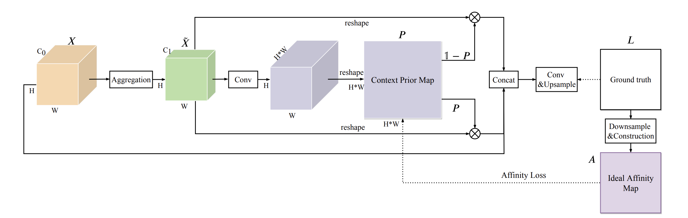
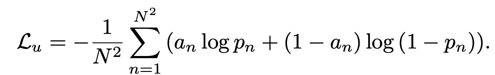
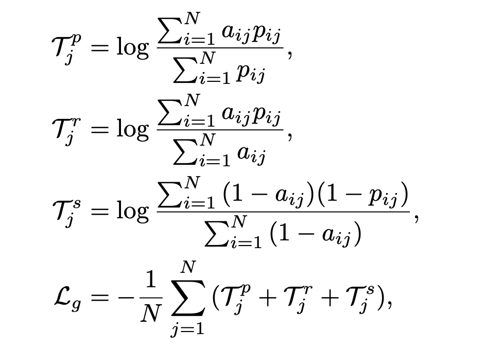
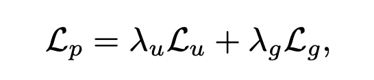
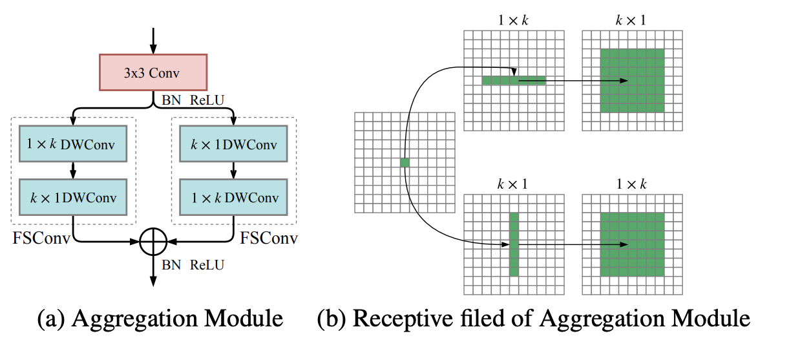

<!--
 * @Author: LOTEAT
 * @Date: 2024-09-20 15:08:14
-->
## Context Prior for Scene Segmentation
- 前置知识：MMSegmentation
- 作者：Changqian Yu, Jingbo Wang, Changxin Gao, Gang Yu, Chunhua Shen, Nong Sang
- [文章链接](https://openaccess.thecvf.com/content_CVPR_2020/papers/Yu_Context_Prior_for_Scene_Segmentation_CVPR_2020_paper.pdf)
- [代码链接](https://github.com/yu-changqian/ContextPrior)

### 1. Motivation
在场景分割中，许多研究者尝试通过上下文依赖性去提升分割精度。但是，大多数方法很少区分不同类型的上下文依赖性，这可能会污染场景理解。我对这里的理解是，传统的分割实际上是将分割任务转化为像素的分类任务。但是事实上，每个像素对应一个类别，这些类别是孤立的，并没有任何关系。所以模型想要从独立的像素中学习像素之间的相互作用关系基本是不可能的。论文的核心就是探索这种上下文关系，并且提出了Affinity Loss去捕捉这种上下文关系。

### 2. Architecture

这篇论文核心内容是三个，Affinity Loss， Context Prior Layer以及Aggregation Module。
<center>
    
    <br>
    <div style="color:orange; border-bottom: 1px solid #d9d9d9;
    display: inline-block;
    color: #999;
    padding: 2px;">
      图1：CPNet架构
    </div>
</center>

#### 2.1 Affinity Loss
Affinity 在这里指的是像素之间的相似性或关联性。在语义分割中，如果两个像素属于同一类别，它们具有较高的亲和力；如果属于不同类别，则亲和力较低。Affinity Loss 想要通过Ideal Affinity Map来指导网络学习这种像素间的关联性。

这个Ideal Affinity Map生成过程如下：
- One hot编码：首先，将输入图像的标注下采样到与特征图相同的尺寸。然后，使用 One-Hot 编码将每个类别标签转换为一个向量，这个向量中属于该类别的位置是1，其他位置是0。假如特征图的尺寸是$H \times W$，那么one hot编码应该是$H \times W \times C$，其中$C$是类别个数。我们把one hot编码reshape为$N \times C$，其中$N=H\times W$。
- 计算 Ideal Affinity Map：将编码后的标注向量进行矩阵乘法操作，生成 Ideal Affinity Map。这个矩阵的每个元素表示两个像素是否属于同一类别。那么这个Ideal Affinity Map的维度就是$N\times N$。

在Affinity Loss中，Affinity Loss 包括两个部分：Unary Loss和 Global Loss。

- Unary Loss：这是基本的二元交叉熵损失，计算预测的亲和力图（先验图）和 Ideal Affinity Map 之间的差异。

<center>
    
    <br>
    <div style="color:orange; border-bottom: 1px solid #d9d9d9;
    display: inline-block;
    color: #999;
    padding: 2px;">
      图2：Unary Loss
    </div>
</center>

- Global Loss
这个损失其实我并没有太理解原因。论文意思是，要探究像素gt之间的上下文关系，但是在Unary Loss，只考虑了只考虑了先验图中的孤立像素，忽略了与其他像素的语义相关性。可能论文作者认为0-1分类使用hard分类，作者想用一种soft的分类方式，去表征相关性，至少相关性应该是在0-1之间的。所以作者又引入了Global Loss。但是这个损失我感觉有点抽象，它计算了每列的precision，recall和specificity值取对数，然后求和。这里按列求和还是按行求和理论上是一样的，因为最优情况先验图应该是一个对称矩阵。

论文这个损失我是这样理解的，先验图中的一个列向量，实际上就是预测当前类和其他类的关系矩阵。precision越高，表示找的越准；recall越高，表示找的越全。specificity越高，表示负样本找的越全。所以通过这三个去监督先验图。个人感觉理解起来很费劲。
<center>
    
    <br>
    <div style="color:orange; border-bottom: 1px solid #d9d9d9;
    display: inline-block;
    color: #999;
    padding: 2px;">
      图3：Global Loss
    </div>
</center>

最终损失是两个损失的权重之和。

<center>
    
    <br>
    <div style="color:orange; border-bottom: 1px solid #d9d9d9;
    display: inline-block;
    color: #999;
    padding: 2px;">
      图3：Affinity Loss
    </div>
</center>

#### 2.2 Context Prior Layer

Context Prior Layer 接收来自主干网络（如 ResNet）的特征图作为输入。特征图首先通过一个聚合模块，帮助每个像素收集足够的上下文信息。聚合后的特征图通过一个1x1的卷积层，生成一个初步的上下文先验图。这个先验图的大小与输入特征图的像素数相同，每个元素表示特征图中对应像素与其他像素的关联性。然后先验图和gt计算Affinity Loss。

#### 2.3 Aggregation Module
该模块使用全分离卷积来聚合空间信息，同时使用非对称卷积去捕捉特征。
<center>
    
    <br>
    <div style="color:orange; border-bottom: 1px solid #d9d9d9;
    display: inline-block;
    color: #999;
    padding: 2px;">
      图3：Aggregation Module
    </div>
</center>

### 3. Code
CPNet现在没有放出完整的代码，不过我们可以从公开的代码中了解到CPNet的完整架构。
先来看config文件，config文件是很简单的。backbone采用resnet，decode head则是CPNet。
```python
# model settings
norm_cfg = dict(type='SyncBN', requires_grad=True)
model = dict(
    type='EncoderDecoder',
    pretrained='open-mmlab://resnet50_v1c',
    backbone=dict(
        type='ResNetV1c',
        depth=50,
        num_stages=4,
        out_indices=(0, 1, 2, 3),
        dilations=(1, 1, 2, 4),
        strides=(1, 2, 1, 1),
        norm_cfg=norm_cfg,
        norm_eval=False,
        style='pytorch',
        contract_dilation=True),
    decode_head=dict(
        type='CPHead',
        in_channels=2048,
        in_index=3,
        channels=512,
        prior_channels=512,
        prior_size=64,
        am_kernel_size=11,
        groups=1,
        drop_out_ratio=0.1,
        num_classes=19,
        norm_cfg=norm_cfg,
        align_corners=False,
        loss_decode=dict(
            type='CrossEntropyLoss', use_sigmoid=False, loss_weight=1.0),
        loss_prior_decode=dict(type='AffinityLoss', loss_weight=1.0),
    ),
    auxiliary_head=dict(
        type='FCNHead',
        in_channels=1024,
        in_index=2,
        channels=256,
        num_convs=1,
        concat_input=False,
        drop_out_ratio=0.1,
        num_classes=19,
        norm_cfg=norm_cfg,
        align_corners=False,
        loss_decode=dict(
            type='CrossEntropyLoss', use_sigmoid=False, loss_weight=0.4)))
# model training and testing settings
train_cfg = dict()
test_cfg = dict(mode='whole')
```
接下来我们看Affinity Loss。
```python
@LOSSES.register_module()
class AffinityLoss(nn.Module):
    """CrossEntropyLoss.

    Args:
        use_sigmoid (bool, optional): Whether the prediction uses sigmoid
            of softmax. Defaults to False.
        use_mask (bool, optional): Whether to use mask cross entropy loss.
            Defaults to False.
        reduction (str, optional): . Defaults to 'mean'.
            Options are "none", "mean" and "sum".
        class_weight (list[float], optional): Weight of each class.
            Defaults to None.
        loss_weight (float, optional): Weight of the loss. Defaults to 1.0.
    """

    def __init__(self, reduction='mean', loss_weight=1.0):
        super(AffinityLoss, self).__init__()
        self.reduction = reduction
        self.loss_weight = loss_weight
        self.cls_criterion = binary_cross_entropy

    def forward(self,
                cls_score,
                label,
                weight=None,
                avg_factor=None,
                reduction_override=None,
                **kwargs):
        """Forward function."""
        assert reduction_override in (None, 'none', 'mean', 'sum')
        reduction = (
            reduction_override if reduction_override else self.reduction)

        unary_term = self.cls_criterion(
            cls_score,
            label,
            reduction=reduction,
            avg_factor=avg_factor,
            **kwargs)

        diagonal_matrix = (1 - torch.eye(label.size(1))).to(label.get_device())
        vtarget = diagonal_matrix * label

        recall_part = torch.sum(cls_score * vtarget, dim=2)
        denominator = torch.sum(vtarget, dim=2)
        denominator = denominator.masked_fill_(~(denominator > 0), 1)
        recall_part = recall_part.div_(denominator)
        recall_label = torch.ones_like(recall_part)
        recall_loss = self.cls_criterion(
            recall_part,
            recall_label,
            reduction=reduction,
            avg_factor=avg_factor,
            **kwargs)

        spec_part = torch.sum((1 - cls_score) * (1 - label), dim=2)
        denominator = torch.sum(1 - label, dim=2)
        denominator = denominator.masked_fill_(~(denominator > 0), 1)
        spec_part = spec_part.div_(denominator)
        spec_label = torch.ones_like(spec_part)
        spec_loss = self.cls_criterion(
            spec_part,
            spec_label,
            reduction=reduction,
            avg_factor=avg_factor,
            **kwargs)

        precision_part = torch.sum(cls_score * vtarget, dim=2)
        denominator = torch.sum(cls_score, dim=2)
        denominator = denominator.masked_fill_(~(denominator > 0), 1)
        precision_part = precision_part.div_(denominator)
        precision_label = torch.ones_like(precision_part)
        precision_loss = self.cls_criterion(
            precision_part,
            precision_label,
            reduction=reduction,
            avg_factor=avg_factor,
            **kwargs)

        global_term = recall_loss + spec_loss + precision_loss

        loss_cls = self.loss_weight * (unary_term + global_term)
        return loss_cls
```
可以看到，损失函数计算其实很简单，就是先前说的Unary Loss和Global Loss。
```python
class AggregationModule(nn.Module):
    """Aggregation Module"""

    def __init__(self,
                 in_channels,
                 out_channels,
                 kernel_size,
                 conv_cfg=None,
                 norm_cfg=None):
        super(AggregationModule, self).__init__()
        self.in_channels = in_channels
        self.out_channels = out_channels
        self.conv_cfg = conv_cfg
        self.norm_cfg = norm_cfg

        padding = kernel_size // 2

        self.reduce_conv = ConvModule(
            in_channels,
            out_channels,
            kernel_size=3,
            padding=1,
            conv_cfg=self.conv_cfg,
            norm_cfg=self.norm_cfg,
            act_cfg=dict(type='ReLU'))

        self.t1 = ConvModule(
            out_channels,
            out_channels,
            kernel_size=(kernel_size, 1),
            padding=(padding, 0),
            groups=out_channels,
            conv_cfg=self.conv_cfg,
            norm_cfg=None,
            act_cfg=None)
        self.t2 = ConvModule(
            out_channels,
            out_channels,
            kernel_size=(1, kernel_size),
            padding=(0, padding),
            groups=out_channels,
            conv_cfg=self.conv_cfg,
            norm_cfg=None,
            act_cfg=None)

        self.p1 = ConvModule(
            out_channels,
            out_channels,
            kernel_size=(1, kernel_size),
            padding=(0, padding),
            groups=out_channels,
            conv_cfg=self.conv_cfg,
            norm_cfg=None,
            act_cfg=None)
        self.p2 = ConvModule(
            out_channels,
            out_channels,
            kernel_size=(kernel_size, 1),
            padding=(padding, 0),
            groups=out_channels,
            conv_cfg=self.conv_cfg,
            norm_cfg=None,
            act_cfg=None)
        _, self.norm = build_norm_layer(norm_cfg, out_channels)
        self.relu = nn.ReLU()

    def forward(self, x):
        """Forward function."""
        x = self.reduce_conv(x)
        x1 = self.t1(x)
        x1 = self.t2(x1)

        x2 = self.p1(x)
        x2 = self.p2(x2)

        out = self.relu(self.norm(x1 + x2))
        return out


@HEADS.register_module()
class CPHead(BaseDecodeHead):
    """Context Prior for Scene Segmentation.

    This head is the implementation of `CPNet
    <https://arxiv.org/abs/2004.01547>`_.
    """

    def __init__(self,
                 prior_channels,
                 prior_size,
                 am_kernel_size,
                 groups=1,
                 loss_prior_decode=dict(type='AffinityLoss', loss_weight=1.0),
                 **kwargs):
        super(CPHead, self).__init__(**kwargs)
        self.prior_channels = prior_channels
        self.prior_size = _pair(prior_size)
        self.am_kernel_size = am_kernel_size

        self.aggregation = AggregationModule(self.in_channels, prior_channels,
                                             am_kernel_size, self.conv_cfg,
                                             self.norm_cfg)

        self.prior_conv = ConvModule(
            self.prior_channels,
            np.prod(self.prior_size),
            1,
            padding=0,
            stride=1,
            groups=groups,
            conv_cfg=self.conv_cfg,
            norm_cfg=self.norm_cfg,
            act_cfg=None)

        self.intra_conv = ConvModule(
            self.prior_channels,
            self.prior_channels,
            1,
            padding=0,
            stride=1,
            conv_cfg=self.conv_cfg,
            norm_cfg=self.norm_cfg,
            act_cfg=self.act_cfg)

        self.inter_conv = ConvModule(
            self.prior_channels,
            self.prior_channels,
            1,
            padding=0,
            stride=1,
            conv_cfg=self.conv_cfg,
            norm_cfg=self.norm_cfg,
            act_cfg=self.act_cfg)

        self.bottleneck = ConvModule(
            self.in_channels + self.prior_channels * 2,
            self.channels,
            3,
            padding=1,
            conv_cfg=self.conv_cfg,
            norm_cfg=self.norm_cfg,
            act_cfg=self.act_cfg)

        self.loss_prior_decode = build_loss(loss_prior_decode)

    def forward(self, inputs):
        """Forward function."""
        x = self._transform_inputs(inputs)
        batch_size, channels, height, width = x.size()
        assert self.prior_size[0] == height and self.prior_size[1] == width

        value = self.aggregation(x)

        context_prior_map = self.prior_conv(value)
        context_prior_map = context_prior_map.view(batch_size,
                                                   np.prod(self.prior_size),
                                                   -1)
        context_prior_map = context_prior_map.permute(0, 2, 1)
        context_prior_map = torch.sigmoid(context_prior_map)

        inter_context_prior_map = 1 - context_prior_map

        value = value.view(batch_size, self.prior_channels, -1)
        value = value.permute(0, 2, 1)

        intra_context = torch.bmm(context_prior_map, value)
        intra_context = intra_context.div(np.prod(self.prior_size))
        intra_context = intra_context.permute(0, 2, 1).contiguous()
        intra_context = intra_context.view(batch_size, self.prior_channels,
                                           self.prior_size[0],
                                           self.prior_size[1])
        intra_context = self.intra_conv(intra_context)

        inter_context = torch.bmm(inter_context_prior_map, value)
        inter_context = inter_context.div(np.prod(self.prior_size))
        inter_context = inter_context.permute(0, 2, 1).contiguous()
        inter_context = inter_context.view(batch_size, self.prior_channels,
                                           self.prior_size[0],
                                           self.prior_size[1])
        inter_context = self.inter_conv(inter_context)

        cp_outs = torch.cat([x, intra_context, inter_context], dim=1)
        output = self.bottleneck(cp_outs)
        output = self.cls_seg(output)

        return output, context_prior_map

    def forward_test(self, inputs, img_metas, test_cfg):
        """Forward function for testing, only ``pam_cam`` is used."""
        return self.forward(inputs)[0]

    def _construct_ideal_affinity_matrix(self, label, label_size):
        scaled_labels = F.interpolate(
            label.float(), size=label_size, mode="nearest")
        scaled_labels = scaled_labels.squeeze_().long()
        scaled_labels[scaled_labels == 255] = self.num_classes
        one_hot_labels = F.one_hot(scaled_labels, self.num_classes + 1)
        one_hot_labels = one_hot_labels.view(
            one_hot_labels.size(0), -1, self.num_classes + 1).float()
        ideal_affinity_matrix = torch.bmm(one_hot_labels,
                                          one_hot_labels.permute(0, 2, 1))
        return ideal_affinity_matrix

    def losses(self, seg_logit, seg_label):
        """Compute ``seg``, ``prior_map`` loss."""
        seg_logit, context_prior_map = seg_logit
        logit_size = seg_logit.shape[2:]
        loss = dict()
        loss.update(super(CPHead, self).losses(seg_logit, seg_label))
        prior_loss = self.loss_prior_decode(
            context_prior_map,
            self._construct_ideal_affinity_matrix(seg_label, logit_size))
        loss['loss_prior'] = prior_loss
        return loss
```
它的模型有兴趣可以研究一下，但是感觉并不是很有特色的内容。