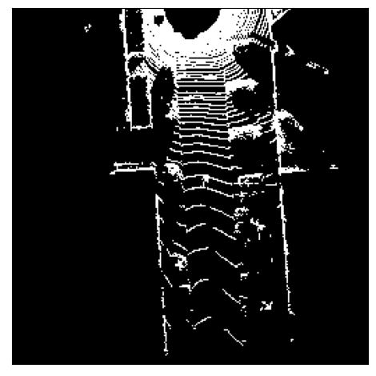

<!--
 * @Author: LOTEAT
 * @Date: 2024-09-06 13:37:20
-->
## Semantic KITTI

### 1.组织格式
Semantic KITTI数据格式如下：
```shell
dataset
├── sequences
│   ├── 00
│   │   ├── xxx.bin
│   │   ├── xxx.invalid
│   │   ├── xxx.label
│   │   ├── xxx.occluded
```
### 2.文件格式
- bin：voxel文件，类型为np.uint8。读取后，需要进一步解压。解压代码如下：
```python
def unpack(compressed):
    """given a bit encoded voxel grid, make a normal voxel grid out of it."""
    uncompressed = np.zeros(compressed.shape[0] * 8, dtype=np.uint8)
    uncompressed[::8] = compressed[:] >> 7 & 1
    uncompressed[1::8] = compressed[:] >> 6 & 1
    uncompressed[2::8] = compressed[:] >> 5 & 1
    uncompressed[3::8] = compressed[:] >> 4 & 1
    uncompressed[4::8] = compressed[:] >> 3 & 1
    uncompressed[5::8] = compressed[:] >> 2 & 1
    uncompressed[6::8] = compressed[:] >> 1 & 1
    uncompressed[7::8] = compressed[:] & 1

    return uncompressed
```
这是因为bin将8个voxel保存为一个8bit的数值，而voxel刚好是用0-1表示占用和未占用的。在Semantic KITTI数据中，体素空间大小为(256, 256, 32)，所以读取后还需要reshape。
- label：label文件夹，类型为np.uint16。与体素空间一一对应，也需要reshape为(256, 256, 32)。标签类别如下：
```yaml
  0 : "unlabeled"
  1 : "outlier"
  10: "car"
  11: "bicycle"
  13: "bus"
  15: "motorcycle"
  16: "on-rails"
  18: "truck"
  20: "other-vehicle"
  30: "person"
  31: "bicyclist"
  32: "motorcyclist0"
  40: "road"
  44: "parking"
  48: "sidewalk"
  49: "other-ground"
  50: "building"
  51: "fence"
  52: "other-structure"
  60: "lane-marking"
  70: "vegetation"
  71: "trunk"
  72: "terrain"
  80: "pole"
  81: "traffic-sign"
  99: "other-object"
  252: "moving-car"
  253: "moving-bicyclist"
  254: "moving-person"
  255: "moving-motorcyclist"
  256: "moving-on-rails"
  257: "moving-bus"
  258: "moving-truck"
  259: "moving-other-vehicle"
```
- invalid：用于标记lidar无论从什么角度都无法检测出的voxel，其实也就是物体内部。类型与处理方式和bin文件一致。
- occluded：用于标记当前lidar检测不到，但是实际被占据的voxel。这些voxel只要lidar换角度就可以检测到。处理方式和类型与bin文件一致。


### 3.可视化
由于semantic kitti api我的环境无法配置成功，所以我可视化了一张voxel的俯视图：

<center>
    
    <br>
    <div style="color:orange; border-bottom: 1px solid #d9d9d9;
    display: inline-block;
    color: #999;
    padding: 2px;">
      图1：俯视图
    </div>
</center>