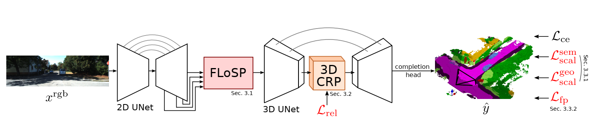
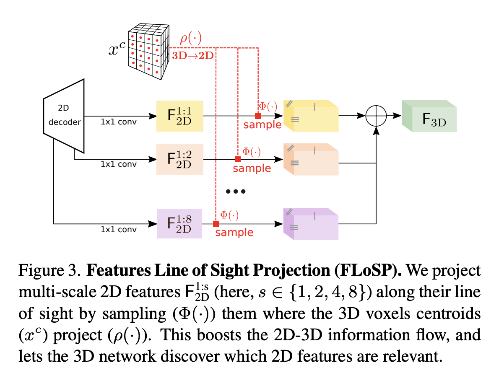
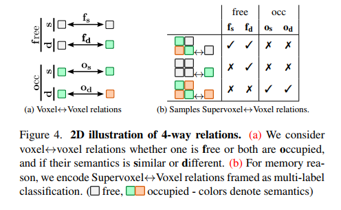
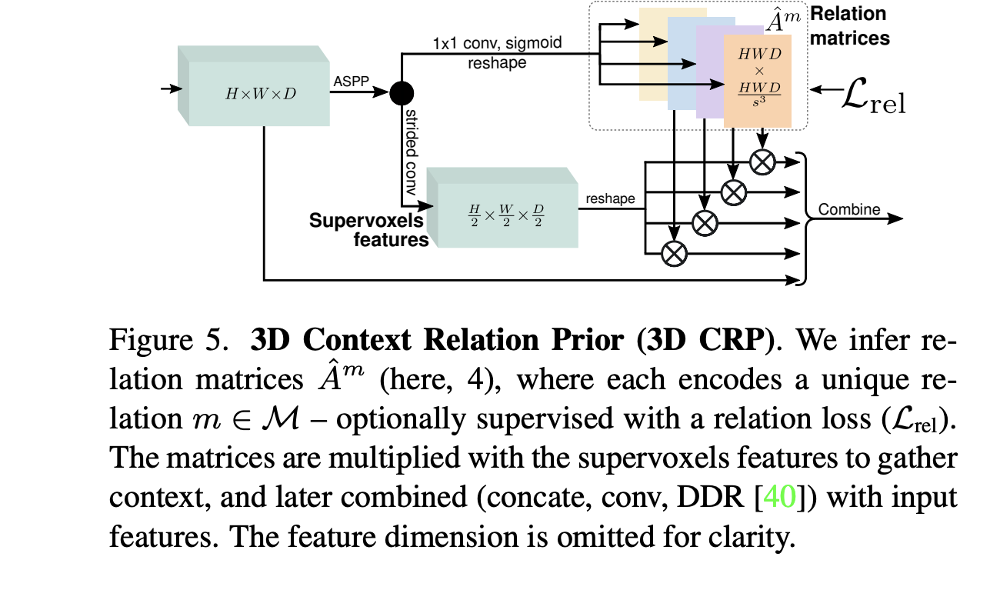
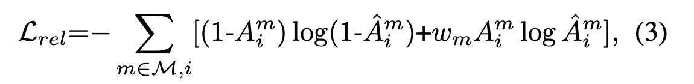
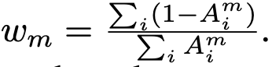
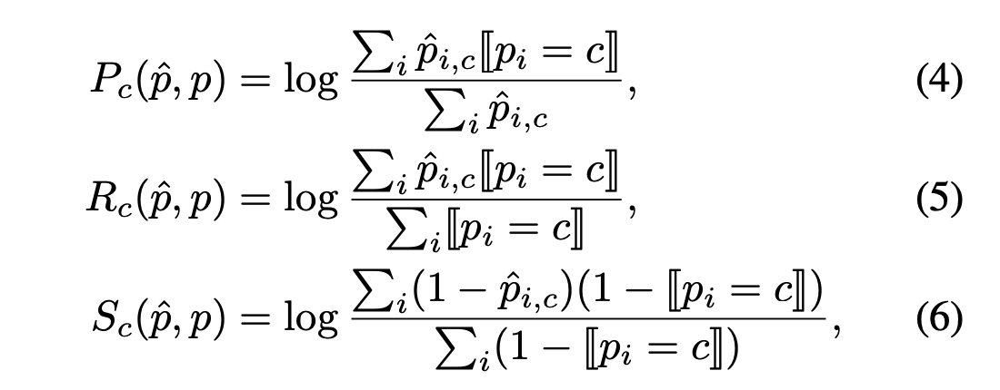
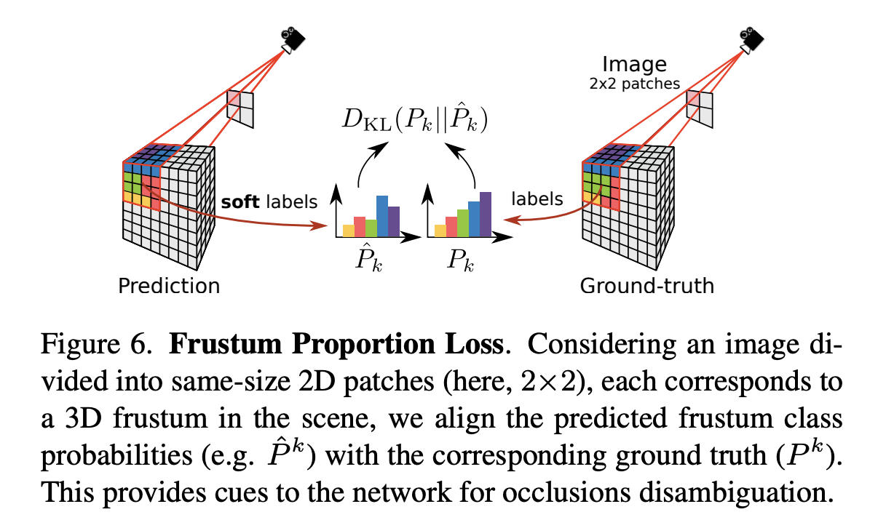

<!--
 * @Author: LOTEAT
 * @Date: 2024-09-18 16:05:19
-->
## MonoScene: Monocular 3D Semantic Scene Completion
- 前置知识：<a href="../Basic/ContextPrior/context_prior.md">CPNet</a>, <a href="../Basic/SemanticKITTI/semantic_kitti.md">SemanticKITTI</a>
- 作者：Anh-Quan Cao, Raoul de Charette
- [文章链接](https://arxiv.org/pdf/2112.00726)
- [代码链接](https://github.com/astra-vision/MonoScene)

### 1. Motivation
从单张照片中估计三维世界是计算机视觉中的一个核心问题。自动驾驶，目标检测等领域中，都离不开这个问题。本文就是从这个点出发，构建一个占据栅格网络MonoScene，去对图片所对应的3D场景进行补全。

### 2. Architecture
MonoScene的核心架构有三个，backbone网络2D UNet用于提取特征。FLoSP充当2D到3D的桥梁，将2D图像特征提升到3D空间中。3D CRP用于捕捉语义上下文。其总体流程就是输入一张图像，去预测图像所对应的3D空间voxel的语义类别。

<center>
    
    <br>
    <div style="color:orange; border-bottom: 1px solid #d9d9d9;
    display: inline-block;
    color: #999;
    padding: 2px;">
      图1：The architecture of MonoScene.
    </div>
</center>

#### 2.1 2D UNet和3D UNet
这一块文章并没有详细介绍，所以这部分介绍放到代码讲解中。现在只需要知道这两个实际上都是多阶段的backbone，会输出多阶段的特征。每个阶段的尺度也是不一样的。

#### 2.2 Features Line of Sight Projection (FLoSP)
由于单一视点的尺度模糊性，从2D提升到3D是极其不确定性的。所以论文作者通过光学原理，将多尺度2D特征反投影到所有可能的3D空间中。

其核心原理是使用2D UNet从输入RGB图像中提取多尺度的特征图。接着，FLoSP将这些2D特征图沿视线方向投影到3D体素空间中。这是通过计算每个3D体素中心在2D图像上的投影，并从相应的2D特征图中采样特征来实现的。这一步实际上就是点云投影到像素坐标系，不了解的同学可以自行查阅网上资料。FLoSP 在多个尺度（1:1, 1:2, 1:4, 1:8）上执行这种投影，然后将这些不同尺度的3D特征图融合到一个统一的3D特征表示中。在采样之前，会使用$1\times 1$的卷积


<center>
    
    <br>
    <div style="color:orange; border-bottom: 1px solid #d9d9d9;
    display: inline-block;
    color: #999;
    padding: 2px;">
      图2：The architecture of FLoSP.
    </div>
</center>


#### 2.3 3D Context Relation Prior (3D CRP)
3D CPR借鉴了CPNet的思想，去学习语义相关性。在这篇文章中，定义了4-way体素relations。
- free-free（$f_s$），未占用体素与未占用体素的相似关系
- free-occ（$f_d$），未占用体素与占用体素的非相似关系
- occ-occ（$o_s$），占用体素与占用体素的语义类别相同的相似关系
- occ1-occ2（$o_d$），占用体素与占用体素的语义类别不同的非相似关系

<center>
    
    <br>
    <div style="color:orange; border-bottom: 1px solid #d9d9d9;
    display: inline-block;
    color: #999;
    padding: 2px;">
      图3：4-way relations
    </div>
</center>

为了计算效率，3D CRP 不是直接在所有体素对上学习关系，而是定义了超体素（一组相邻体素），并学习超体素内部体素之间的关系。所谓超体素，就是将3D体素网格划分为多个块。每个块包含一定数量的体素，例如，可以定义为每9个体素形成一个超体素。注意，超体素一定是正方体。


<center>
    
    <br>
    <div style="color:orange; border-bottom: 1px solid #d9d9d9;
    display: inline-block;
    color: #999;
    padding: 2px;">
      图4：3DCRP
    </div>
</center>

对于该模块的监督，首先通过一个二元交叉熵损失：
<center>
    
    <br>
    <div style="color:orange; border-bottom: 1px solid #d9d9d9;
    display: inline-block;
    color: #999;
    padding: 2px;">
    </div>
</center>
<center>
    
    <br>
    <div style="color:orange; border-bottom: 1px solid #d9d9d9;
    display: inline-block;
    color: #999;
    padding: 2px;">
    </div>
</center>

这是因为四种关系可以定义为4种二元分类。注意，这里的$w_m$是定义的权重。

#### 2.4 Loss Function
##### 2.4.1 Scene-Class Affinity Loss
和CPNet一样，本文中也引入了亲和力损失。
<center>
    
    <br>
    <div style="color:orange; border-bottom: 1px solid #d9d9d9;
    display: inline-block;
    color: #999;
    padding: 2px;">
    图5：Scene-Class Affinity Loss
    </div>
</center>


##### 2.4.2 Frustum Proportion Loss

在3D场景理解中，由于视角的限制，某些物体可能会被其他物体遮挡。这些遮挡区域仅从单目图像中很难准确预测。为了解决这个问题，论文提出了Frustum Proportion Loss。

这个损失函数的计算过程是：首先，输入图像被划分为多个小块。每个2D块对应于3D场景中的一个锥体。这个锥体是由从相机通过每个像素的视角线形成的3D空间区域。对于每个锥体，计算其中包含的体素的真实类别分布。这包括计算每个类别在锥体中的占比。网络对每个锥体中的体素进行语义预测，生成预测的类别分布。最后使用KL散度对损失进行监督。

<center>
    
    <br>
    <div style="color:orange; border-bottom: 1px solid #d9d9d9;
    display: inline-block;
    color: #999;
    padding: 2px;">
    图6：Frustum Proportion Loss
    </div>
</center>

### 3. Code
代码中我选用SemanticKITTI作为数据集，先来看预处理流程。
```python
@hydra.main(config_name="../../config/monoscene.yaml")
def main(config: DictConfig):
    scene_size = (256, 256, 32)
    sequences = ["00", "01", "02", "03", "04", "05", "06", "07", "08", "09", "10"]
    # 加载lookup table
    remap_lut = SemanticKittiIO.get_remap_lut(
        os.path.join(
            get_original_cwd(),
            "monoscene",
            "data",
            "semantic_kitti",
            "semantic-kitti.yaml",
        )
    )
    # 对每个sequence进行处理
    for sequence in sequences:
        sequence_path = os.path.join(
            config.kitti_root, "dataset", "sequences", sequence
        )
        label_paths = sorted(
            glob.glob(os.path.join(sequence_path, "voxels", "*.label"))
        )
        invalid_paths = sorted(
            glob.glob(os.path.join(sequence_path, "voxels", "*.invalid"))
        )
        out_dir = os.path.join(config.kitti_preprocess_root, "labels", sequence)
        os.makedirs(out_dir, exist_ok=True)
        # 下采样bilibili
        downscaling = {"1_1": 1, "1_8": 8}
        for i in tqdm(range(len(label_paths))):

            frame_id, extension = os.path.splitext(os.path.basename(label_paths[i]))
            # 加载label，维度是2097152（256*256*32）
            LABEL = SemanticKittiIO._read_label_SemKITTI(label_paths[i])
            # 加载invalid，维度是2097152（256*256*32
            INVALID = SemanticKittiIO._read_invalid_SemKITTI(invalid_paths[i])
            # label重映射
            LABEL = remap_lut[LABEL.astype(np.uint16)].astype(
                np.float32
            )  # Remap 20 classes semanticKITTI SSC
            LABEL[
                np.isclose(INVALID, 1)
            ] = 255  # Setting to unknown all voxels marked on invalid mask...
            LABEL = LABEL.reshape([256, 256, 32])

            for scale in downscaling:
                filename = frame_id + "_" + scale + ".npy"
                label_filename = os.path.join(out_dir, filename)
                # If files have not been created...
                if not os.path.exists(label_filename):
                    if scale == "1_8":
                        # 下采样
                        LABEL_ds = _downsample_label(
                            LABEL, (256, 256, 32), downscaling[scale]
                        )
                    else:
                        LABEL_ds = LABEL
                    np.save(label_filename, LABEL_ds)
                    print("wrote to", label_filename)
```

简单过一下映射表的创建。
```python
def get_remap_lut(path):
  '''
  remap_lut to remap classes of semantic kitti for training...
  :return:
  '''
  # 加载数据集的标签映射信息
  dataset_config = yaml.safe_load(open(path, 'r'))

  # make lookup table for mapping
  maxkey = max(dataset_config['learning_map'].keys())

  # +100 hack making lut bigger just in case there are unknown labels
  remap_lut = np.zeros((maxkey + 100), dtype=np.int32)
  remap_lut[list(dataset_config['learning_map'].keys())] = list(dataset_config['learning_map'].values())

  # in completion we have to distinguish empty and invalid voxels.
  # Important: For voxels 0 corresponds to "empty" and not "unlabeled".
  remap_lut[remap_lut == 0] = 255  # map 0 to 'invalid'
  remap_lut[0] = 0  # only 'empty' stays 'empty'.

  return remap_lut
```
在过一下下采样函数。
```python
def _downsample_label(label, voxel_size=(240, 144, 240), downscale=4):
    r"""downsample the labeled data,
    code taken from https://github.com/waterljwant/SSC/blob/master/dataloaders/dataloader.py#L262
    Shape:
        label, (240, 144, 240)
        label_downscale, if downsample==4, then (60, 36, 60)
    """
    if downscale == 1:
        return label
    ds = downscale
    # 通过下采样倍数计算每个小方格的尺寸
    small_size = (
        voxel_size[0] // ds,
        voxel_size[1] // ds,
        voxel_size[2] // ds,
    )  # small size
    label_downscale = np.zeros(small_size, dtype=np.uint8)
    empty_t = 0.95 * ds * ds * ds  # threshold
    s01 = small_size[0] * small_size[1]
    label_i = np.zeros((ds, ds, ds), dtype=np.int32)

    for i in range(small_size[0] * small_size[1] * small_size[2]):
        z = int(i / s01)
        y = int((i - z * s01) / small_size[0])
        x = int(i - z * s01 - y * small_size[0])

        label_i[:, :, :] = label[
            x * ds : (x + 1) * ds, y * ds : (y + 1) * ds, z * ds : (z + 1) * ds
        ]
        label_bin = label_i.flatten()

        zero_count_0 = np.array(np.where(label_bin == 0)).size
        zero_count_255 = np.array(np.where(label_bin == 255)).size

        zero_count = zero_count_0 + zero_count_255
        if zero_count > empty_t:
            label_downscale[x, y, z] = 0 if zero_count_0 > zero_count_255 else 255
        else:
            label_i_s = label_bin[
                np.where(np.logical_and(label_bin > 0, label_bin < 255))
            ]
            # 以出现最多的类型作为标签
            label_downscale[x, y, z] = np.argmax(np.bincount(label_i_s))
    return label_downscale
```
接下来我们来看看训练的过程，首先是数据模块：
```python
        data_module = KittiDataModule(
            root=config.kitti_root,
            preprocess_root=config.kitti_preprocess_root,
            frustum_size=config.frustum_size,
            project_scale=project_scale,
            batch_size=int(config.batch_size / config.n_gpus),
            num_workers=int(config.num_workers_per_gpu),
        )
```
我们选用的是SemanticKITTI数据集。
```python
class KittiDataModule(pl.LightningDataModule):
    def __init__(
        self,
        root,
        preprocess_root,
        project_scale=2,
        frustum_size=4,
        batch_size=4,
        num_workers=6,
    ):
        super().__init__()
        self.root = root
        self.preprocess_root = preprocess_root
        self.project_scale = project_scale
        self.batch_size = batch_size
        self.num_workers = num_workers
        self.frustum_size = frustum_size

    def setup(self, stage=None):
        self.train_ds = KittiDataset(
            split="train",
            root=self.root,
            preprocess_root=self.preprocess_root,
            project_scale=self.project_scale,
            frustum_size=self.frustum_size,
            fliplr=0.5,
            color_jitter=(0.4, 0.4, 0.4),
        )

        self.val_ds = KittiDataset(
            split="val",
            root=self.root,
            preprocess_root=self.preprocess_root,
            project_scale=self.project_scale,
            frustum_size=self.frustum_size,
            fliplr=0,
            color_jitter=None,
        )

        self.test_ds = KittiDataset(
            split="test",
            root=self.root,
            preprocess_root=self.preprocess_root,
            project_scale=self.project_scale,
            frustum_size=self.frustum_size,
            fliplr=0,
            color_jitter=None,
        )

    def train_dataloader(self):
        return DataLoader(
            self.train_ds,
            batch_size=self.batch_size,
            drop_last=True,
            num_workers=self.num_workers,
            shuffle=True,
            pin_memory=True,
            worker_init_fn=worker_init_fn,
            collate_fn=collate_fn,
        )

    def val_dataloader(self):
        return DataLoader(
            self.val_ds,
            batch_size=self.batch_size,
            drop_last=False,
            num_workers=self.num_workers,
            shuffle=False,
            pin_memory=True,
            worker_init_fn=worker_init_fn,
            collate_fn=collate_fn,
        )

    def test_dataloader(self):
        return DataLoader(
            self.test_ds,
            batch_size=self.batch_size,
            drop_last=False,
            num_workers=self.num_workers,
            shuffle=False,
            pin_memory=True,
            worker_init_fn=worker_init_fn,
            collate_fn=collate_fn,
        )
```
在module中，实际上也就是继承了`LightningDataModule`。我们更关心这些dataset每次弹出的数据。
```python
    def __getitem__(self, index):
        # scan储存了所有的数据
        scan = self.scans[index]
        voxel_path = scan["voxel_path"]
        sequence = scan["sequence"]
        P = scan["P"]
        T_velo_2_cam = scan["T_velo_2_cam"]
        proj_matrix = scan["proj_matrix"]

        filename = os.path.basename(voxel_path)
        frame_id = os.path.splitext(filename)[0]

        rgb_path = os.path.join(
            self.root, "dataset", "sequences", sequence, "image_2", frame_id + ".png"
        )

        data = {
            "frame_id": frame_id,
            "sequence": sequence,
            "P": P,
            "T_velo_2_cam": T_velo_2_cam,
            "proj_matrix": proj_matrix,
        }
        # 设置下采样bilibili
        scale_3ds = [self.output_scale, self.project_scale]
        data["scale_3ds"] = scale_3ds
        cam_k = P[0:3, 0:3]
        data["cam_k"] = cam_k
        for scale_3d in scale_3ds:

            # compute the 3D-2D mapping
            projected_pix, fov_mask, pix_z = vox2pix(
                T_velo_2_cam,
                cam_k,
                self.vox_origin,
                self.voxel_size * scale_3d,
                self.img_W,
                self.img_H,
                self.scene_size,
            )            
            # 投影后的像素点
            data["projected_pix_{}".format(scale_3d)] = projected_pix
            # 像素点的深度
            data["pix_z_{}".format(scale_3d)] = pix_z
            # mask矩阵表示像素是否越界
            data["fov_mask_{}".format(scale_3d)] = fov_mask
        # 原始label
        target_1_path = os.path.join(self.label_root, sequence, frame_id + "_1_1.npy")
        target = np.load(target_1_path)
        data["target"] = target
        # 下采样2倍后的label，注意下采样两倍是8个方格为一个voxel
        target_8_path = os.path.join(self.label_root, sequence, frame_id + "_1_8.npy")
        target_1_8 = np.load(target_8_path)
        # 计算关系矩阵
        CP_mega_matrix = compute_CP_mega_matrix(target_1_8)
        data["CP_mega_matrix"] = CP_mega_matrix

        # Compute the masks, each indicate the voxels of a local frustum
        if self.split != "test":
            projected_pix_output = data["projected_pix_{}".format(self.output_scale)]
            pix_z_output = data[
                "pix_z_{}".format(self.output_scale)
            ]
            # 计算frustums masks
            frustums_masks, frustums_class_dists = compute_local_frustums(
                projected_pix_output,
                pix_z_output,
                target,
                self.img_W,
                self.img_H,
                dataset="kitti",
                n_classes=20,
                size=self.frustum_size,
            )
        else:
            frustums_masks = None
            frustums_class_dists = None
        data["frustums_masks"] = frustums_masks
        data["frustums_class_dists"] = frustums_class_dists

        img = Image.open(rgb_path).convert("RGB")

        # Image augmentation
        if self.color_jitter is not None:
            img = self.color_jitter(img)

        # PIL to numpy
        img = np.array(img, dtype=np.float32, copy=False) / 255.0
        img = img[:370, :1220, :]  # crop image

        # Fliplr the image
        if np.random.rand() < self.fliplr:
            img = np.ascontiguousarray(np.fliplr(img))
            for scale in scale_3ds:
                key = "projected_pix_" + str(scale)
                data[key][:, 0] = img.shape[1] - 1 - data[key][:, 0]

        data["img"] = self.normalize_rgb(img)
        return data
```
dataset的代码实际上很简单，`vox2pix`函数就是投影函数，这里重点关注两个函数：`compute_CP_mega_matrix`和`compute_local_frustums`。
前面我们提到过，亲和力损失的计算是在超体素之间的，这个函数就是提前先计算超体素内的关系。
```python
def compute_CP_mega_matrix(target, is_binary=False):
    """
    Parameters
    ---------
    target: (H, W, D)
        contains voxels semantic labels

    is_binary: bool
        if True, return binary voxels relations else return 4-way relations
    """
    label = target.reshape(-1)
    label_row = label
    N = label.shape[0]
    # 计算超体素大小
    super_voxel_size = [i//2 for i in target.shape]
    if is_binary:
        # 二元关系，只有预测类别相同和不相同
        matrix = np.zeros((2, N, super_voxel_size[0] * super_voxel_size[1] * super_voxel_size[2]), dtype=np.uint8)
    else:
        # 四元关系
        matrix = np.zeros((4, N, super_voxel_size[0] * super_voxel_size[1] * super_voxel_size[2]), dtype=np.uint8)

    for xx in range(super_voxel_size[0]):
        for yy in range(super_voxel_size[1]):
            for zz in range(super_voxel_size[2]):
                col_idx = xx * (super_voxel_size[1] * super_voxel_size[2]) + yy * super_voxel_size[2] + zz
                # 8个小方格的label
                label_col_megas = np.array([
                    target[xx * 2,     yy * 2,     zz * 2],
                    target[xx * 2 + 1, yy * 2,     zz * 2],
                    target[xx * 2,     yy * 2 + 1, zz * 2],
                    target[xx * 2,     yy * 2,     zz * 2 + 1],
                    target[xx * 2 + 1, yy * 2 + 1, zz * 2],
                    target[xx * 2 + 1, yy * 2,     zz * 2 + 1],
                    target[xx * 2,     yy * 2 + 1, zz * 2 + 1],
                    target[xx * 2 + 1, yy * 2 + 1, zz * 2 + 1],
                ])
                label_col_megas = label_col_megas[label_col_megas != 255]
                for label_col_mega in label_col_megas:
                    # 迭代循环，计算两两之间的关系
                    label_col = np.ones(N)  * label_col_mega
                    if not is_binary:
                        matrix[0, (label_row != 255) & (label_col == label_row) & (label_col != 0), col_idx] = 1.0 # non non same
                        matrix[1, (label_row != 255) & (label_col != label_row) & (label_col != 0) & (label_row != 0), col_idx] = 1.0 # non non diff
                        matrix[2, (label_row != 255) & (label_row == label_col) & (label_col == 0), col_idx] = 1.0 # empty empty
                        matrix[3, (label_row != 255) & (label_row != label_col) & ((label_row == 0) | (label_col == 0)), col_idx] = 1.0 # nonempty empty
                    else:
                        matrix[0, (label_row != 255) & (label_col != label_row), col_idx] = 1.0 # diff
                        matrix[1, (label_row != 255) & (label_col == label_row), col_idx] = 1.0 # same
    return matrix
```
接下来看一下frustums的计算。
```python
def compute_local_frustum(pix_x, pix_y, min_x, max_x, min_y, max_y, pix_z):
    # 判断像素坐标是否越界
    valid_pix = np.logical_and(pix_x >= min_x,
                np.logical_and(pix_x < max_x,
                np.logical_and(pix_y >= min_y,
                np.logical_and(pix_y < max_y,
                pix_z > 0))))
    return valid_pix

def compute_local_frustums(projected_pix, pix_z, target, img_W, img_H, dataset, n_classes, size=4):
    """
    Compute the local frustums mask and their class frequencies
    
    Parameters:
    ----------
    projected_pix: (N, 2)
        2D projected pix of all voxels
    pix_z: (N,)
        Distance of the camera sensor to voxels
    target: (H, W, D)
        Voxelized sematic labels
    img_W: int
        Image width
    img_H: int
        Image height
    dataset: str
        ="NYU" or "kitti" (for both SemKITTI and KITTI-360)
    n_classes: int
        Number of classes (12 for NYU and 20 for SemKITTI)
    size: int
        determine the number of local frustums i.e. size * size
    
    Returns
    -------
    frustums_masks: (n_frustums, N)
        List of frustums_masks, each indicates the belonging voxels  
    frustums_class_dists: (n_frustums, n_classes)
        Contains the class frequencies in each frustum
    """
    H, W, D = target.shape
    # 划分小块
    ranges = [(i * 1.0/size, (i * 1.0 + 1)/size) for i in range(size)]
    local_frustum_masks = []
    local_frustum_class_dists = []
    pix_x, pix_y = projected_pix[:, 0], projected_pix[:, 1]
    for y in ranges:
        for x in ranges:
            # 遍历每个图像小块
            start_x = x[0] * img_W
            end_x = x[1] * img_W
            start_y = y[0] * img_H
            end_y = y[1] * img_H
            # 判断投影像素是否越界图像小块
            local_frustum = compute_local_frustum(pix_x, pix_y, start_x, end_x, start_y, end_y, pix_z)
            if dataset == "NYU":
                mask = (target != 255) & np.moveaxis(local_frustum.reshape(60, 60, 36), [0, 1, 2], [0, 2, 1])
            # 因为投影后的点和voxel中心是一一对应的
            # 所以再恢复为voxel的维度
            elif dataset == "kitti":
                mask = (target != 255) & local_frustum.reshape(H, W, D)

            local_frustum_masks.append(mask)
            # 统计类别出现的频率
            classes, cnts = np.unique(target[mask], return_counts=True)
            class_counts = np.zeros(n_classes)
            class_counts[classes.astype(int)] = cnts
            local_frustum_class_dists.append(class_counts)
    frustums_masks, frustums_class_dists = np.array(local_frustum_masks), np.array(local_frustum_class_dists)
    return frustums_masks, frustums_class_dists
```
接下来我们重点关注模型的`forward`函数，从而了解整个模型的内容。
```python
x_rgb = self.net_rgb(img)
```
这个self.net_rgb实际上就是先前说的UNet2D，在代码中是使用EfficientNet实现的。这个实际上就是一个backbone，无需太关注，只需要知道目的是为了提取多尺度的特征。最后输出的就是下采样1倍，2倍，4倍，8倍和16倍的特征。但是实际上，16倍的特征我们并不会使用。
```python
        for i in range(bs):
            x3d = None
            for scale_2d in self.project_res:

                # project features at each 2D scale to target 3D scale
                scale_2d = int(scale_2d)
                projected_pix = batch["projected_pix_{}".format(self.project_scale)][i].cuda()
                fov_mask = batch["fov_mask_{}".format(self.project_scale)][i].cuda()

                # Sum all the 3D features
                if x3d is None:
                    x3d = self.projects[str(scale_2d)](
                        x_rgb["1_" + str(scale_2d)][i],
                        projected_pix // scale_2d,
                        fov_mask,
                    )
                else:
                    x3d += self.projects[str(scale_2d)](
                        x_rgb["1_" + str(scale_2d)][i],
                        projected_pix // scale_2d,
                        fov_mask,
                    )
            x3ds.append(x3d)
```
上面代码就是FLoSP的过程。
```python
class FLoSP(nn.Module):
    def __init__(self, scene_size, dataset, project_scale):
        super().__init__()
        self.scene_size = scene_size
        self.dataset = dataset
        self.project_scale = project_scale

    def forward(self, x2d, projected_pix, fov_mask):
        c, h, w = x2d.shape
        # 把特征拉平
        src = x2d.view(c, -1)
        # 添加一行额外的0向量特征
        zeros_vec = torch.zeros(c, 1).type_as(src)
        src = torch.cat([src, zeros_vec], 1)

        pix_x, pix_y = projected_pix[:, 0], projected_pix[:, 1]
        # 计算索引
        img_indices = pix_y * w + pix_x
        # 所有越界索引使用末尾的0向量填充
        img_indices[~fov_mask] = h * w
        # 扩展维度，供gather函数使用
        img_indices = img_indices.expand(c, -1).long()  # c, HWD
        src_feature = torch.gather(src, 1, img_indices)

        if self.dataset == "NYU":
            x3d = src_feature.reshape(
                c,
                self.scene_size[0] // self.project_scale,
                self.scene_size[2] // self.project_scale,
                self.scene_size[1] // self.project_scale,
            )
            x3d = x3d.permute(0, 1, 3, 2)
        elif self.dataset == "kitti":
            # 重塑维度
            x3d = src_feature.reshape(
                c,
                self.scene_size[0] // self.project_scale,
                self.scene_size[1] // self.project_scale,
                self.scene_size[2] // self.project_scale,
            )

        return x3d
```
通过FLoSP采样的特征送入UNet3D中，进行预测。
```python
class UNet3D(nn.Module):
    def __init__(
        self,
        class_num,
        norm_layer,
        full_scene_size,
        feature,
        project_scale,
        context_prior=None,
        bn_momentum=0.1,
    ):
        super(UNet3D, self).__init__()
        self.business_layer = []
        self.project_scale = project_scale
        self.full_scene_size = full_scene_size
        self.feature = feature

        size_l1 = (
            int(self.full_scene_size[0] / project_scale),
            int(self.full_scene_size[1] / project_scale),
            int(self.full_scene_size[2] / project_scale),
        )
        size_l2 = (size_l1[0] // 2, size_l1[1] // 2, size_l1[2] // 2)
        size_l3 = (size_l2[0] // 2, size_l2[1] // 2, size_l2[2] // 2)

        dilations = [1, 2, 3]
        self.process_l1 = nn.Sequential(
            Process(self.feature, norm_layer, bn_momentum, dilations=[1, 2, 3]),
            Downsample(self.feature, norm_layer, bn_momentum),
        )
        self.process_l2 = nn.Sequential(
            Process(self.feature * 2, norm_layer, bn_momentum, dilations=[1, 2, 3]),
            Downsample(self.feature * 2, norm_layer, bn_momentum),
        )

        self.up_13_l2 = Upsample(
            self.feature * 4, self.feature * 2, norm_layer, bn_momentum
        )
        self.up_12_l1 = Upsample(
            self.feature * 2, self.feature, norm_layer, bn_momentum
        )
        self.up_l1_lfull = Upsample(
            self.feature, self.feature // 2, norm_layer, bn_momentum
        )

        self.ssc_head = SegmentationHead(
            self.feature // 2, self.feature // 2, class_num, dilations
        )

        self.context_prior = context_prior
        if context_prior:
            self.CP_mega_voxels = CPMegaVoxels(
                self.feature * 4, size_l3, bn_momentum=bn_momentum
            )

    def forward(self, input_dict):
        res = {}

        x3d_l1 = input_dict["x3d"]
        # 特征提取
        x3d_l2 = self.process_l1(x3d_l1)
        # 特征提取
        x3d_l3 = self.process_l2(x3d_l2)

        if self.context_prior:
            # 计算关系
            ret = self.CP_mega_voxels(x3d_l3)
            x3d_l3 = ret["x"]
            for k in ret.keys():
                res[k] = ret[k]
        # 上采样融合
        x3d_up_l2 = self.up_13_l2(x3d_l3) + x3d_l2
        # 上采样融合
        x3d_up_l1 = self.up_12_l1(x3d_up_l2) + x3d_l1
        # 上采样融合
        x3d_up_lfull = self.up_l1_lfull(x3d_up_l1)
        # 生成分割的最终预测结果
        ssc_logit_full = self.ssc_head(x3d_up_lfull)

        res["ssc_logit"] = ssc_logit_full

        return res
```
CPMegaVoxels类。

```python
class CPMegaVoxels(nn.Module):
    def __init__(self, feature, size, n_relations=4, bn_momentum=0.0003):
        super().__init__()
        self.size = size
        self.n_relations = n_relations
        print("n_relations", self.n_relations)
        self.flatten_size = size[0] * size[1] * size[2]
        self.feature = feature
        self.context_feature = feature * 2
        self.flatten_context_size = (size[0] // 2) * (size[1] // 2) * (size[2] // 2)
        padding = ((size[0] + 1) % 2, (size[1] + 1) % 2, (size[2] + 1) % 2)
        
        self.mega_context = nn.Sequential(
            nn.Conv3d(
                feature, self.context_feature, stride=2, padding=padding, kernel_size=3
            ),
        )
        self.flatten_context_size = (size[0] // 2) * (size[1] // 2) * (size[2] // 2)

        self.context_prior_logits = nn.ModuleList(
            [
                nn.Sequential(
                    nn.Conv3d(
                        self.feature,
                        self.flatten_context_size,
                        padding=0,
                        kernel_size=1,
                    ),
                )
                for i in range(n_relations)
            ]
        )
        self.aspp = ASPP(feature, [1, 2, 3])

        self.resize = nn.Sequential(
            nn.Conv3d(
                self.context_feature * self.n_relations + feature,
                feature,
                kernel_size=1,
                padding=0,
                bias=False,
            ),
            Process(feature, nn.BatchNorm3d, bn_momentum, dilations=[1]),
        )

    def forward(self, input):
        ret = {}
        bs = input.shape[0]
        # 使用ASPP提取输入特征input特征
        x_agg = self.aspp(input)

        # get the mega context
        # 使用3D卷积层将x_agg特征进行下采样，生成Mega Context特征。
        x_mega_context_raw = self.mega_context(x_agg)
        x_mega_context = x_mega_context_raw.reshape(bs, self.context_feature, -1)
        x_mega_context = x_mega_context.permute(0, 2, 1)

        # get context prior map
        x_context_prior_logits = []
        x_context_rels = []
        for rel in range(self.n_relations):

            # Compute the relation matrices
            x_context_prior_logit = self.context_prior_logits[rel](x_agg)
            x_context_prior_logit = x_context_prior_logit.reshape(
                bs, self.flatten_context_size, self.flatten_size
            )
            x_context_prior_logits.append(x_context_prior_logit.unsqueeze(1))

            x_context_prior_logit = x_context_prior_logit.permute(0, 2, 1)
            x_context_prior = torch.sigmoid(x_context_prior_logit)

            # Multiply the relation matrices with the mega context to gather context features
            x_context_rel = torch.bmm(x_context_prior, x_mega_context)  # bs, N, f
            x_context_rels.append(x_context_rel)

        x_context = torch.cat(x_context_rels, dim=2)
        x_context = x_context.permute(0, 2, 1)
        x_context = x_context.reshape(
            bs, x_context.shape[1], self.size[0], self.size[1], self.size[2]
        )

        x = torch.cat([input, x_context], dim=1)
        x = self.resize(x)

        x_context_prior_logits = torch.cat(x_context_prior_logits, dim=1)
        ret["P_logits"] = x_context_prior_logits
        ret["x"] = x

        return ret
```
损失函数部分实际上就是亲和力损失和交KL损失。

### 4. Innovation
单目相机的Occupancy Network。