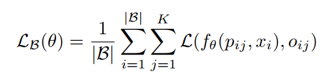

<!--
 * @Author: LOTEAT
 * @Date: 2024-07-30 20:04:47
-->
## Occupancy Networks: Learning 3D Reconstruction in Function Space
- 前置知识：PyTorch
- 作者：Lars Mescheder, Michael Oechsle, Michael Niemeyer, Sebastian Nowozin, Andreas Geiger
- [文章链接](https://openaccess.thecvf.com/content_CVPR_2019/papers/Mescheder_Occupancy_Networks_Learning_3D_Reconstruction_in_Function_Space_CVPR_2019_paper.pdf)
- [代码链接](https://github.com/autonomousvision/occupancy_networks)

### 1. Motivation
在3维重建中，一种常用的方法是使用voxel表示，但是voxel表示的内存占用量随着分辨率的增加而呈立方增长，这将极大的限制voxel网络的深度大小。Point cloud和mesh也是两种常用的表示方法，这两种方法也有一定的局限性（论文说的局限性没太理解说的什么意思）。

因此，文章提出了使用Occupancy Network（占用栅格网络）来解决这些问题。

### 2. Architecture

#### 2.1 Occupancy Network
先简单介绍一下Occupancy Network。这个其实并不是一个很新的方法，而是很早之前在SLAM中就被提出的方法。这个方法的核心是构建一种映射关系$f$，对于每一个输入的3D点$p\in \mathbb{R}^3$，我们都有一个输出$o$

$$
o = f(p), o \in \{0, 1\}
$$

其实，这也就是一个$\mathbb{R}^3 \rightarrow \{0, 1\}$的变换。这个$f$我们称之为`occupancy function`，输出$o$代表着在$p$这个点被占据的概率，或者说非空的概率，这个概率值在$[0, 1]$之间。那么，这个3维重建任务，就转化为了一个二分类任务。在传统SLAM任务中，$f$可能是某种数理统计方法，但是在深度学习中，$f$就变成了神经网络。

但是在实际应用中，$f$的输入是一对$(p, x) \in \mathbb{R}^3 \times \mathcal{X}$。$x \in \mathcal{X}$，$x$在文中是指观察，但是实际上，例如$p$是点云，就是指整个点云数据。因为要预测某个点是否被占据，那么肯定是要将整个点云数据输入进去的。

那么实际问题就变成了
$$
f_\theta: \mathbb{R}^3 \times \mathcal{X} \rightarrow[0,1]
$$

这就是Occupancy Network。由于论文中并没有具体描述网络的架构，因此这部分分析放到`Code`部分中。

#### 2.2 Training
在训练过程中，损失函数选用`cross entropy loss`，如Equation.1所示。

<center>
    
    <br>
    <div style="color:orange; border-bottom: 1px solid #d9d9d9;
    display: inline-block;
    color: #999;
    padding: 2px;">
      Equation 1：交叉熵损失
  	</div>
</center>

要注意的是，并不是所有的点都用于损失函数计算，这些点是抽样获得的。


#### 2.3  Inference
推理似乎有些类似于Octree，不过这块我没有仔细看，有兴趣的可以自行研究一下。 


### 3. Code
#### 3.1 Train
实验config选择`configs/img/onet.yaml`，稍有不同的是，我将
```yaml
model:
  encoder_latent: null
  decoder: cbatchnorm
  encoder: resnet18
  c_dim: 256
  z_dim: 0
```
更改为
```yaml
model:
  encoder_latent: simple
  decoder: cbatchnorm
  encoder: resnet18
  c_dim: 256
  z_dim: 256
```
我们先来看`dataset`。
```python
train_dataset = config.get_dataset('train', cfg)
```
数据集采用`Shapes3D`，先加载fields。
```python
    if dataset_type == 'Shapes3D':
        # 加载PointFiled VoxelsField
        fields = method_dict[method].config.get_data_fields(mode, cfg)
        # 加载ImagesField
        inputs_field = get_inputs_field(mode, cfg)
        if inputs_field is not None:
            fields['inputs'] = inputs_field
        # skip
        if return_idx:
            fields['idx'] = data.IndexField()
        # skip
        if return_category:
            fields['category'] = data.CategoryField()
        # 创建Dataset
        dataset = data.Shapes3dDataset(
            dataset_folder, fields,
            split=split,
            categories=categories,
        )
```
fileds的作用在随后介绍`__getitem__`再进行介绍。
接下来我们看`Shapes3dDataset`这个类的构造函数。
```python
    def __init__(self, dataset_folder, fields, split=None,
                 categories=None, no_except=True, transform=None):
        ''' Initialization of the the 3D shape dataset.

        Args:
            dataset_folder (str): dataset folder
            fields (dict): dictionary of fields
            split (str): which split is used
            categories (list): list of categories to use
            no_except (bool): no exception
            transform (callable): transformation applied to data points
        '''
        # Attributes
        self.dataset_folder = dataset_folder
        self.fields = fields
        self.no_except = no_except
        self.transform = transform

        # If categories is None, use all subfolders
        if categories is None:
            categories = os.listdir(dataset_folder)
            categories = [c for c in categories
                          if os.path.isdir(os.path.join(dataset_folder, c))]

        # Read metadata file
        metadata_file = os.path.join(dataset_folder, 'metadata.yaml')

        if os.path.exists(metadata_file):
            with open(metadata_file, 'r') as f:
                self.metadata = yaml.load(f)
        else:
            self.metadata = {
                c: {'id': c, 'name': 'n/a'} for c in categories
            } 
        
        # Set index
        for c_idx, c in enumerate(categories):
            self.metadata[c]['idx'] = c_idx

        # Get all models
        self.models = []
        for c_idx, c in enumerate(categories):
            subpath = os.path.join(dataset_folder, c)
            if not os.path.isdir(subpath):
                logger.warning('Category %s does not exist in dataset.' % c)

            split_file = os.path.join(subpath, split + '.lst')
            with open(split_file, 'r') as f:
                models_c = f.read().split('\n')
            
            self.models += [
                {'category': c, 'model': m}
                for m in models_c
            ]
```
在这个构造函数中，最重要的是构建了self.models这个变量。这个变量的作用是储存所有的数据文件夹。它以列表形式保存如下：
```python
[{'category': '03691459', 'model': '101354f9d8dede686f7b08d9de913afe'},
{'category': '03691459', 'model': '102f9164c5ae3846205b5aa6ba4df9c8'},
{'category': '03691459', 'model': '10421ef12dd27f3650f5fdf97aa1ef24'},
{'category': '03691459', 'model': '105d0802d1ee0430bba5c9b6de65a038'},
...,
{'category': '03691459', 'model': '10d03876d94ec5f4e7670ea63e6cabfd'}]
```
在创建完模型和数据集后，代码创建了一个`Trainer`类用于训练。
```python
    def train_step(self, data):
        ''' Performs a training step.

        Args:
            data (dict): data dictionary
        '''
        self.model.train()
        self.optimizer.zero_grad()
        loss = self.compute_loss(data)
        loss.backward()
        self.optimizer.step()
        return loss.item()
```
可以看到，在`train_step`函数中，流程和平时使用PyTorch的流程是一样的。这里我们需要了解的是数据集加载和模型。
```python
    def __getitem__(self, idx):
        ''' Returns an item of the dataset.

        Args:
            idx (int): ID of data point
        '''
        category = self.models[idx]['category']
        model = self.models[idx]['model']
        c_idx = self.metadata[category]['idx']
        # 文件夹路径
        model_path = os.path.join(self.dataset_folder, category, model)
        data = {}

        for field_name, field in self.fields.items():
            try:
                # 加载点云和图像数据
                field_data = field.load(model_path, idx, c_idx)
            except Exception:
                if self.no_except:
                    logger.warn(
                        'Error occured when loading field %s of model %s'
                        % (field_name, model)
                    )
                    return None
                else:
                    raise

            if isinstance(field_data, dict):
                for k, v in field_data.items():
                    if k is None:
                        data[field_name] = v
                    else:
                        data['%s.%s' % (field_name, k)] = v
            else:
                data[field_name] = field_data
        # 数据增强
        if self.transform is not None:
            data = self.transform(data)

        return data
```
在加载中，调用了两个field类的`load`函数。我们先看`PointField`的`load`函数。
```python
    def load(self, model_path, idx, category):
        ''' Loads the data point.

        Args:
            model_path (str): path to model
            idx (int): ID of data point
            category (int): index of category
        '''
        file_path = os.path.join(model_path, self.file_name)

        points_dict = np.load(file_path)
        # 加载点云
        points = points_dict['points']
        # Break symmetry if given in float16:
        if points.dtype == np.float16:
            points = points.astype(np.float32)
            points += 1e-4 * np.random.randn(*points.shape)
        else:
            points = points.astype(np.float32)
        # occupancy标签
        occupancies = points_dict['occupancies']
        if self.unpackbits:
            # 解压成2进制
            # 例如，点云是 100000 * 3维
            # occupancy应该也是 100000 * 3维
            # 但是由于occupancy只有01，所以每8位就可以打包成一个uint8类型的数据
            # 在原始数据中，occupancy就是这样被压缩了，所以要解压
            occupancies = np.unpackbits(occupancies)[:points.shape[0]]
        occupancies = occupancies.astype(np.float32)
        # 保存数据
        data = {
            None: points,
            'occ': occupancies,
        }
        # skip
        if self.with_transforms:
            data['loc'] = points_dict['loc'].astype(np.float32)
            data['scale'] = points_dict['scale'].astype(np.float32)
        # 数据增强
        if self.transform is not None:
            data = self.transform(data)

        return data
```
在点云中，使用了`SubSamplePoints`的数据增强策略。
```python
class SubsamplePoints(object):
    ''' Points subsampling transformation class.

    It subsamples the points data.

    Args:
        N (int): number of points to be subsampled
    '''
    def __init__(self, N):
        self.N = N

    def __call__(self, data):
        ''' Calls the transformation.

        Args:
            data (dictionary): data dictionary
        '''
        points = data[None]
        occ = data['occ']

        data_out = data.copy()
        if isinstance(self.N, int):
            # 随机采样2048个点
            idx = np.random.randint(points.shape[0], size=self.N)
            data_out.update({
                None: points[idx, :],
                'occ':  occ[idx],
            })
        else:
            Nt_out, Nt_in = self.N
            occ_binary = (occ >= 0.5)
            points0 = points[~occ_binary]
            points1 = points[occ_binary]

            idx0 = np.random.randint(points0.shape[0], size=Nt_out)
            idx1 = np.random.randint(points1.shape[0], size=Nt_in)

            points0 = points0[idx0, :]
            points1 = points1[idx1, :]
            points = np.concatenate([points0, points1], axis=0)

            occ0 = np.zeros(Nt_out, dtype=np.float32)
            occ1 = np.ones(Nt_in, dtype=np.float32)
            occ = np.concatenate([occ0, occ1], axis=0)

            volume = occ_binary.sum() / len(occ_binary)
            volume = volume.astype(np.float32)

            data_out.update({
                None: points,
                'occ': occ,
                'volume': volume,
            })
        return data_out
```
实际上，如果是val或者是test dataset，会额外加入两个Field进行数据读取，分别是`VoxelsField`和不采样的`PointsField`。
`VoxelsField`的`load`函数如下
```python
    def load(self, model_path, idx, category):
        ''' Loads the data point.

        Args:
            model_path (str): path to model
            idx (int): ID of data point
            category (int): index of category
        '''
        file_path = os.path.join(model_path, self.file_name)
        # 加载voxel文件
        with open(file_path, 'rb') as f:
            voxels = binvox_rw.read_as_3d_array(f)
        voxels = voxels.data.astype(np.float32)
        # voxels的维度是 32 * 32 * 32
        # 是将整个空间均等划分成了 32 * 32 * 32个小方格
        # 每个小方格使用01用于表示是否被占据
        if self.transform is not None:
            voxels = self.transform(voxels)

        return voxels
```
最后就是ImagesField。
```python
    def load(self, model_path, idx, category):
        ''' Loads the data point.

        Args:
            model_path (str): path to model
            idx (int): ID of data point
            category (int): index of category
        '''
        # 搜索所有的图片文件
        folder = os.path.join(model_path, self.folder_name)
        files = glob.glob(os.path.join(folder, '*.%s' % self.extension))
        files.sort()
        
        if self.random_view:
            idx_img = random.randint(0, len(files)-1)
        else:
            idx_img = 0
        # 只选择第一张图片
        filename = files[idx_img]

        image = Image.open(filename).convert('RGB')
        # 数据增强 
        if self.transform is not None:
            image = self.transform(image)

        data = {
            None: image
        }
        # skip
        if self.with_camera:
            camera_file = os.path.join(folder, 'cameras.npz')
            camera_dict = np.load(camera_file)
            Rt = camera_dict['world_mat_%d' % idx_img].astype(np.float32)
            K = camera_dict['camera_mat_%d' % idx_img].astype(np.float32)
            data['world_mat'] = Rt
            data['camera_mat'] = K

        return data
```
最后，如果是训练数据集，保存出来的data应该是
```python
{
    points: ...,
    points.occ: ...,
    inputs: ...
}
```
如果是val或者是test数据集，保存出来的data应该是
```python
{
    points: ...,
    points.occ: ...,
    points_iou: ...,
    points_iou.occ: ...,
    voxels: ...,
    inputs: ...
}
```
接下来，我们看一下模型的构建，模型构建的代码如下：
```python
def get_model(cfg, device=None, dataset=None, **kwargs):
    ''' Return the Occupancy Network model.

    Args:
        cfg (dict): imported yaml config 
        device (device): pytorch device
        dataset (dataset): dataset
    '''
    decoder = cfg['model']['decoder']
    encoder = cfg['model']['encoder']
    encoder_latent = cfg['model']['encoder_latent']
    dim = cfg['data']['dim']
    z_dim = cfg['model']['z_dim']
    c_dim = cfg['model']['c_dim']
    decoder_kwargs = cfg['model']['decoder_kwargs']
    encoder_kwargs = cfg['model']['encoder_kwargs']
    encoder_latent_kwargs = cfg['model']['encoder_latent_kwargs']

    decoder = models.decoder_dict[decoder](
        dim=dim, z_dim=z_dim, c_dim=c_dim,
        **decoder_kwargs
    )

    if z_dim != 0:
        encoder_latent = models.encoder_latent_dict[encoder_latent](
            dim=dim, z_dim=z_dim, c_dim=c_dim,
            **encoder_latent_kwargs
        )
    else:
        encoder_latent = None

    if encoder == 'idx':
        encoder = nn.Embedding(len(dataset), c_dim)
    elif encoder is not None:
        encoder = encoder_dict[encoder](
            c_dim=c_dim,
            **encoder_kwargs
        )
    else:
        encoder = None

    p0_z = get_prior_z(cfg, device)
    model = models.OccupancyNetwork(
        decoder, encoder, encoder_latent, p0_z, device=device
    )

    return model
```
接下来，逐步介绍各个模块。

我们选用的模型是`onet`。可以看到yaml配置文件中，模型的定义是
```yaml
model:
  encoder_latent: simple
  decoder: cbatchnorm
  encoder: resnet18
  c_dim: 256
  z_dim: 256
```
选用了`cbatchnorm`的Decoder。在`onet`中，`cbatchnorm`是`DecoderCBatchNorm`类
```python
class DecoderCBatchNorm(nn.Module):
    ''' Decoder with conditional batch normalization (CBN) class.

    Args:
        dim (int): input dimension
        z_dim (int): dimension of latent code z
        c_dim (int): dimension of latent conditioned code c
        hidden_size (int): hidden size of Decoder network
        leaky (bool): whether to use leaky ReLUs
        legacy (bool): whether to use the legacy structure
    '''

    def __init__(self, dim=3, z_dim=128, c_dim=128,
                 hidden_size=256, leaky=False, legacy=False):
        super().__init__()
        self.z_dim = z_dim
        if not z_dim == 0:
            self.fc_z = nn.Linear(z_dim, hidden_size)

        self.fc_p = nn.Conv1d(dim, hidden_size, 1)
        self.block0 = CResnetBlockConv1d(c_dim, hidden_size, legacy=legacy)
        self.block1 = CResnetBlockConv1d(c_dim, hidden_size, legacy=legacy)
        self.block2 = CResnetBlockConv1d(c_dim, hidden_size, legacy=legacy)
        self.block3 = CResnetBlockConv1d(c_dim, hidden_size, legacy=legacy)
        self.block4 = CResnetBlockConv1d(c_dim, hidden_size, legacy=legacy)

        if not legacy:
            self.bn = CBatchNorm1d(c_dim, hidden_size)
        else:
            self.bn = CBatchNorm1d_legacy(c_dim, hidden_size)

        self.fc_out = nn.Conv1d(hidden_size, 1, 1)

        if not leaky:
            self.actvn = F.relu
        else:
            self.actvn = lambda x: F.leaky_relu(x, 0.2)
```
可以看到，这个`DecoderCBatchNorm`是由多个`CResnetBlockConv1d`和`CBatchNorm1d`组合而成。


下面是`CBatchNorm1d`的代码。
```python
class CBatchNorm1d(nn.Module):
    ''' Conditional batch normalization layer class.

    Args:
        c_dim (int): dimension of latent conditioned code c
        f_dim (int): feature dimension
        norm_method (str): normalization method
    '''

    def __init__(self, c_dim, f_dim, norm_method='batch_norm'):
        super().__init__()
        self.c_dim = c_dim
        self.f_dim = f_dim
        self.norm_method = norm_method
        # Submodules
        self.conv_gamma = nn.Conv1d(c_dim, f_dim, 1)
        self.conv_beta = nn.Conv1d(c_dim, f_dim, 1)
        if norm_method == 'batch_norm':
            self.bn = nn.BatchNorm1d(f_dim, affine=False)
        elif norm_method == 'instance_norm':
            self.bn = nn.InstanceNorm1d(f_dim, affine=False)
        elif norm_method == 'group_norm':
            self.bn = nn.GroupNorm1d(f_dim, affine=False)
        else:
            raise ValueError('Invalid normalization method!')
        self.reset_parameters()

    def reset_parameters(self):
        nn.init.zeros_(self.conv_gamma.weight)
        nn.init.zeros_(self.conv_beta.weight)
        nn.init.ones_(self.conv_gamma.bias)
        nn.init.zeros_(self.conv_beta.bias)

    def forward(self, x, c):
        assert(x.size(0) == c.size(0))
        assert(c.size(1) == self.c_dim)

        # c is assumed to be of size batch_size x c_dim x T
        if len(c.size()) == 2:
            c = c.unsqueeze(2)

        # Affine mapping
        gamma = self.conv_gamma(c)
        beta = self.conv_beta(c)

        # Batchnorm
        net = self.bn(x)
        out = gamma * net + beta

        return out
```
可以看到，`CBatchNorm1d`接收两个输入，`x`和`c`。通过卷积对`c`变换，获得`gamma`和`beta`，对然后再对`x`进行变换。
```python
class CBatchNorm1d_legacy(nn.Module):
    ''' Conditional batch normalization legacy layer class.

    Args:
        c_dim (int): dimension of latent conditioned code c
        f_dim (int): feature dimension
        norm_method (str): normalization method
    '''

    def __init__(self, c_dim, f_dim, norm_method='batch_norm'):
        super().__init__()
        self.c_dim = c_dim
        self.f_dim = f_dim
        self.norm_method = norm_method
        # Submodules
        self.fc_gamma = nn.Linear(c_dim, f_dim)
        self.fc_beta = nn.Linear(c_dim, f_dim)
        if norm_method == 'batch_norm':
            self.bn = nn.BatchNorm1d(f_dim, affine=False)
        elif norm_method == 'instance_norm':
            self.bn = nn.InstanceNorm1d(f_dim, affine=False)
        elif norm_method == 'group_norm':
            self.bn = nn.GroupNorm1d(f_dim, affine=False)
        else:
            raise ValueError('Invalid normalization method!')
        self.reset_parameters()

    def reset_parameters(self):
        nn.init.zeros_(self.fc_gamma.weight)
        nn.init.zeros_(self.fc_beta.weight)
        nn.init.ones_(self.fc_gamma.bias)
        nn.init.zeros_(self.fc_beta.bias)

    def forward(self, x, c):
        batch_size = x.size(0)
        # Affine mapping
        gamma = self.fc_gamma(c)
        beta = self.fc_beta(c)
        gamma = gamma.view(batch_size, self.f_dim, 1)
        beta = beta.view(batch_size, self.f_dim, 1)
        # Batchnorm
        net = self.bn(x)
        out = gamma * net + beta

        return out
```
`CBatchNorm1d_legacy`本质上是与`CBatchNorm1d`一样的。

下面是`CResnetBlockConv1d`的代码。

```python
class CResnetBlockConv1d(nn.Module):
    ''' Conditional batch normalization-based Resnet block class.

    Args:
        c_dim (int): dimension of latend conditioned code c
        size_in (int): input dimension
        size_out (int): output dimension
        size_h (int): hidden dimension
        norm_method (str): normalization method
        legacy (bool): whether to use legacy blocks 
    '''

    def __init__(self, c_dim, size_in, size_h=None, size_out=None,
                 norm_method='batch_norm', legacy=False):
        super().__init__()
        # Attributes
        if size_h is None:
            size_h = size_in
        if size_out is None:
            size_out = size_in

        self.size_in = size_in
        self.size_h = size_h
        self.size_out = size_out
        # Submodules
        if not legacy:
            self.bn_0 = CBatchNorm1d(
                c_dim, size_in, norm_method=norm_method)
            self.bn_1 = CBatchNorm1d(
                c_dim, size_h, norm_method=norm_method)
        else:
            self.bn_0 = CBatchNorm1d_legacy(
                c_dim, size_in, norm_method=norm_method)
            self.bn_1 = CBatchNorm1d_legacy(
                c_dim, size_h, norm_method=norm_method)

        self.fc_0 = nn.Conv1d(size_in, size_h, 1)
        self.fc_1 = nn.Conv1d(size_h, size_out, 1)
        self.actvn = nn.ReLU()

        if size_in == size_out:
            self.shortcut = None
        else:
            self.shortcut = nn.Conv1d(size_in, size_out, 1, bias=False)
        # Initialization
        nn.init.zeros_(self.fc_1.weight)

    def forward(self, x, c):
        net = self.fc_0(self.actvn(self.bn_0(x, c)))
        dx = self.fc_1(self.actvn(self.bn_1(net, c)))

        if self.shortcut is not None:
            x_s = self.shortcut(x)
        else:
            x_s = x

        return x_s + dx
```
可以看到，`CResnetBlockConv1d`就是一个残差连接。
关于`DecoderCBatchNorm`其他参数可以先不用关注，在后面讲解前向传播时再重点研究。

为了方便研究，我将`z_dim`设置成了256，在模型中，有个隐变量(latent vector)的编码器。

```python
class Encoder(nn.Module):
    ''' Latent encoder class.

    It encodes the input points and returns mean and standard deviation for the
    posterior Gaussian distribution.

    Args:
        z_dim (int): dimension if output code z
        c_dim (int): dimension of latent conditioned code c
        dim (int): input dimension
        leaky (bool): whether to use leaky ReLUs
    '''
    def __init__(self, z_dim=128, c_dim=128, dim=3, leaky=False):
        super().__init__()
        self.z_dim = z_dim
        self.c_dim = c_dim

        # Submodules
        self.fc_pos = nn.Linear(dim, 128)

        if c_dim != 0:
            self.fc_c = nn.Linear(c_dim, 128)

        self.fc_0 = nn.Linear(1, 128)
        self.fc_1 = nn.Linear(128, 128)
        self.fc_2 = nn.Linear(256, 128)
        self.fc_3 = nn.Linear(256, 128)
        self.fc_mean = nn.Linear(128, z_dim)
        self.fc_logstd = nn.Linear(128, z_dim)

        if not leaky:
            self.actvn = F.relu
            self.pool = maxpool
        else:
            self.actvn = lambda x: F.leaky_relu(x, 0.2)
            self.pool = torch.mean
```
可以看到，基本是由线性层和激活函数组成的。

而真正的`Encoder`，是一个`ResNet18`网络
```python
class Resnet18(nn.Module):
    r''' ResNet-18 encoder network for image input.
    Args:
        c_dim (int): output dimension of the latent embedding
        normalize (bool): whether the input images should be normalized
        use_linear (bool): whether a final linear layer should be used
    '''

    def __init__(self, c_dim, normalize=True, use_linear=True):
        super().__init__()
        self.normalize = normalize
        self.use_linear = use_linear
        self.features = models.resnet18(pretrained=True)
        self.features.fc = nn.Sequential()
        if use_linear:
            self.fc = nn.Linear(512, c_dim)
        elif c_dim == 512:
            self.fc = nn.Sequential()
        else:
            raise ValueError('c_dim must be 512 if use_linear is False')

    def forward(self, x):
        if self.normalize:
            x = normalize_imagenet(x)
        net = self.features(x)
        out = self.fc(net)
        return out
```
`get_prior_z`是获取先验信息。
```python
def get_prior_z(cfg, device, **kwargs):
    ''' Returns prior distribution for latent code z.

    Args:
        cfg (dict): imported yaml config
        device (device): pytorch device
    '''
    z_dim = cfg['model']['z_dim']
    p0_z = dist.Normal(
        torch.zeros(z_dim, device=device),
        torch.ones(z_dim, device=device)
    )

    return p0_z
```
可以看到，`p0_z`是个正态分布，每次调用`p0_z.sample()`函数都会产生`z_dim`的正态分布变量。

接下来，`OccupancyNetwork`的构建就相对简单，是对之前的模块进行一个组装。
```python
class OccupancyNetwork(nn.Module):
    ''' Occupancy Network class.

    Args:
        decoder (nn.Module): decoder network
        encoder (nn.Module): encoder network
        encoder_latent (nn.Module): latent encoder network
        p0_z (dist): prior distribution for latent code z
        device (device): torch device
    '''

    def __init__(self, decoder, encoder=None, encoder_latent=None, p0_z=None,
                 device=None):
        super().__init__()
        if p0_z is None:
            p0_z = dist.Normal(torch.tensor([]), torch.tensor([]))

        self.decoder = decoder.to(device)

        if encoder_latent is not None:
            self.encoder_latent = encoder_latent.to(device)
        else:
            self.encoder_latent = None

        if encoder is not None:
            self.encoder = encoder.to(device)
        else:
            self.encoder = None

        self._device = device
        self.p0_z = p0_z
```
接下来，我们看到loss的计算。
```python
    def compute_loss(self, data):
        ''' Computes the loss.

        Args:
            data (dict): data dictionary
        '''
        device = self.device
        p = data.get('points').to(device)
        occ = data.get('points.occ').to(device)
        inputs = data.get('inputs', torch.empty(p.size(0), 0)).to(device)

        kwargs = {}

        c = self.model.encode_inputs(inputs)
        q_z = self.model.infer_z(p, occ, c, **kwargs)
        z = q_z.rsample()

        # KL-divergence
        kl = dist.kl_divergence(q_z, self.model.p0_z).sum(dim=-1)
        loss = kl.mean()

        # General points
        logits = self.model.decode(p, z, c, **kwargs).logits
        loss_i = F.binary_cross_entropy_with_logits(
            logits, occ, reduction='none')
        loss = loss + loss_i.sum(-1).mean()

        return loss
```
在loss计算时，首先会将`inputs`，也就是图片数据送入到`self.model.encode_inputs`中，这个函数本质上是在调用`ResNet18`的`forward`函数。最终，会输出一个256维的特征向量。

接下来会进行隐变量的编码。`self.model.infer_z`输入是点云、occupancy标签和图像特征。
```python
    def infer_z(self, p, occ, c, **kwargs):
        ''' Infers z.

        Args:
            p (tensor): points tensor
            occ (tensor): occupancy values for occ
            c (tensor): latent conditioned code c
        '''
        if self.encoder_latent is not None:
            mean_z, logstd_z = self.encoder_latent(p, occ, c, **kwargs)
        else:
            batch_size = p.size(0)
            mean_z = torch.empty(batch_size, 0).to(self._device)
            logstd_z = torch.empty(batch_size, 0).to(self._device)

        q_z = dist.Normal(mean_z, torch.exp(logstd_z))
        return q_z
```

在编码过程中，这些输入会送入到`Encoder`类中，讲解写入下面的注释中。
```python
    def forward(self, p, x, c=None, **kwargs):
        batch_size, T, D = p.size()

        # 通过全连接对occ进行嵌入，最终 N * T 会被嵌入到 N * T * 128的高维空间中
        net = self.fc_0(x.unsqueeze(-1))
        # 残差
        net = net + self.fc_pos(p)

        if self.c_dim != 0:
            # 假如图像特征的嵌入
            net = net + self.fc_c(c).unsqueeze(1)
        # 接下来是一系列的全连接和池化
        net = self.fc_1(self.actvn(net))
        pooled = self.pool(net, dim=1, keepdim=True).expand(net.size())
        net = torch.cat([net, pooled], dim=2)

        net = self.fc_2(self.actvn(net))
        pooled = self.pool(net, dim=1, keepdim=True).expand(net.size())
        net = torch.cat([net, pooled], dim=2)

        net = self.fc_3(self.actvn(net))
        # Reduce
        #  to  B x F
        net = self.pool(net, dim=1)
        # 最后通过全连接获得隐变量的mean和log std
        mean = self.fc_mean(net)
        logstd = self.fc_logstd(net)

        return mean, logstd
```
隐变量接收mean和log std，创建随机正态分布。
```python
q_z = dist.Normal(mean_z, torch.exp(logstd_z))
```
随后，会进行正态分布的采样。
```python
z = q_z.rsample()
```
这个采样会与模型先前创建的`p0_z`进行kl散度的计算，其实就是先验分布与后验分布的区别，但是不知道具体作用是什么。
```python
kl = dist.kl_divergence(q_z, self.model.p0_z).sum(dim=-1)
```
然后，点云、图像特征和隐变量会被解码。
```python
    def decode(self, p, z, c, **kwargs):
        ''' Returns occupancy probabilities for the sampled points.

        Args:
            p (tensor): points
            z (tensor): latent code z
            c (tensor): latent conditioned code c
        '''

        logits = self.decoder(p, z, c, **kwargs)
        p_r = dist.Bernoulli(logits=logits)
        return p_r
```
解码网络是`DecoderCBatchNorm`，可以看到是将隐变量和点云进行线性映射后相加，随后将图像特征作为condition，送入多个`CResnetBlockConv1d`中。
```python
    def forward(self, p, z, c, **kwargs):
        p = p.transpose(1, 2)
        batch_size, D, T = p.size()
        net = self.fc_p(p)

        if self.z_dim != 0:
            net_z = self.fc_z(z).unsqueeze(2)
            net = net + net_z

        net = self.block0(net, c)
        net = self.block1(net, c)
        net = self.block2(net, c)
        net = self.block3(net, c)
        net = self.block4(net, c)

        out = self.fc_out(self.actvn(self.bn(net, c)))
        out = out.squeeze(1)

        return out
```
最后输出的是 B * N的矩阵，也就是N个点occupancy的预测值。代码中又使用` dist.Bernoulli`进行伯努利二次项构造，但是看后面的代码似乎这步是毫无意义的。因为构造是用logits参数，随后又把logits参数取出来了。最后的损失就是二分类损失与KL散度之和。
```python
        logits = self.model.decode(p, z, c, **kwargs).logits
        loss_i = F.binary_cross_entropy_with_logits(
            logits, occ, reduction='none')
        loss = loss + loss_i.sum(-1).mean()
```
以上就是训练的整个pipeline。

#### 3.2 Test
有兴趣的同学可以自行研究一下`eval_meshes.py`，因为我不做3维重建，所以这块我并没有仔细看。

### 4. Innovation
将占据栅格网络引入到3维重建中，为之后的世界模型打下了基础。