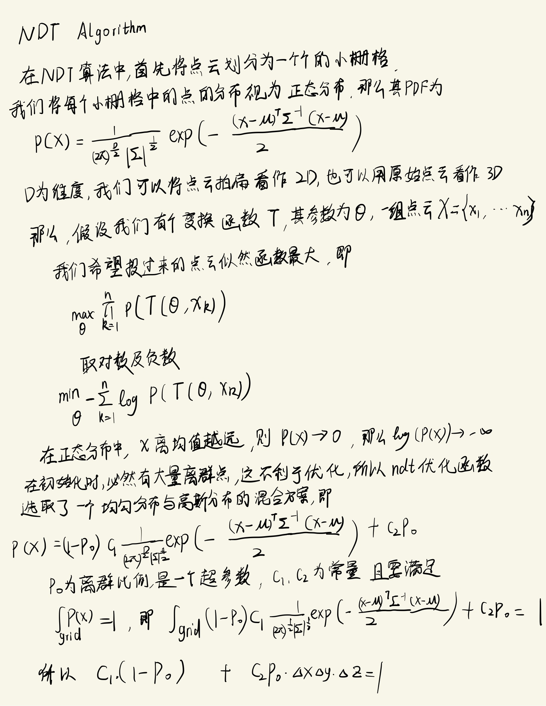
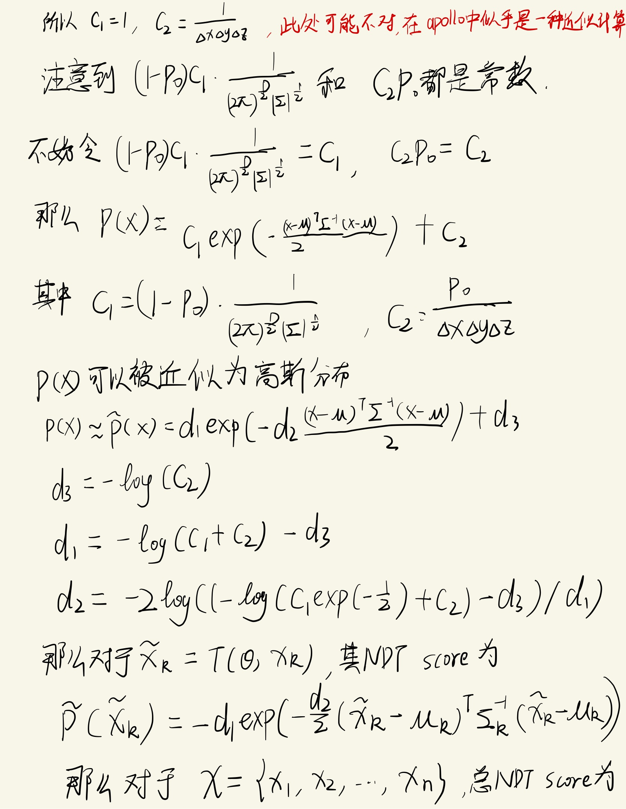
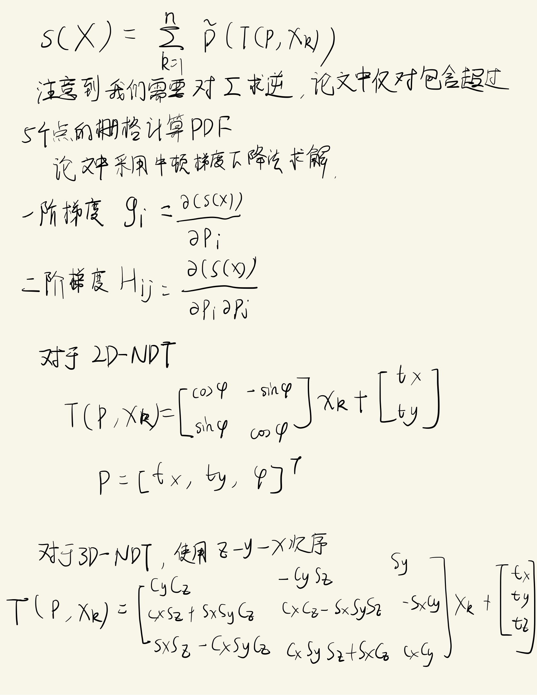
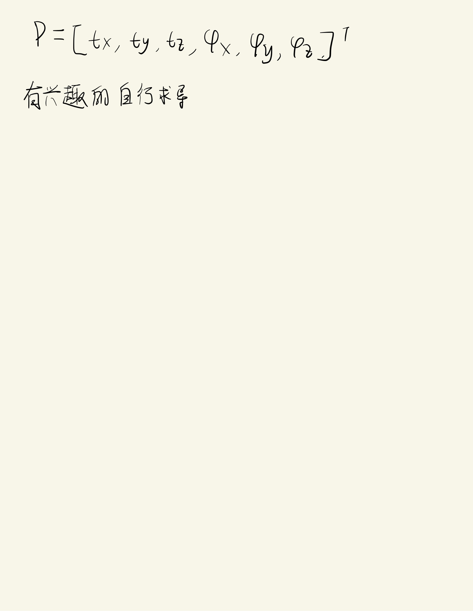

<!--
 * @Author: LOTEAT
 * @Date: 2024-12-04 21:15:00
-->
## Normal Distributions Transform
- 前置知识：<a href="../../Math/MultivariateGaussianDensity/multivariate_gaussian_density.md">Multivariate Gaussian Density</a>
- 论文推荐：[The three-dimensional normal-distributions transform: an efficient representation for registration, surface analysis, and loop detection (Chapter 6)](https://www.diva-portal.org/smash/get/diva2:276162/FULLTEXT02)
- 代码链接：[NormalDistributionsTransform-Demo](https://github.com/LOTEAT/DubinsPath-Demo.git)

### 1. 推导过程

    
     
    

    

    
     
    

    

    
     
    

    

    
     
    

    

