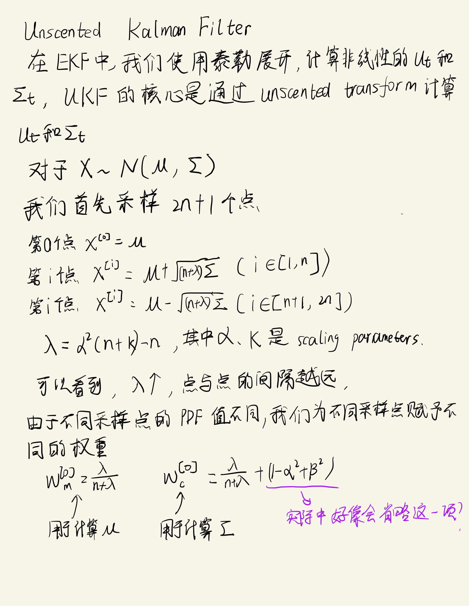
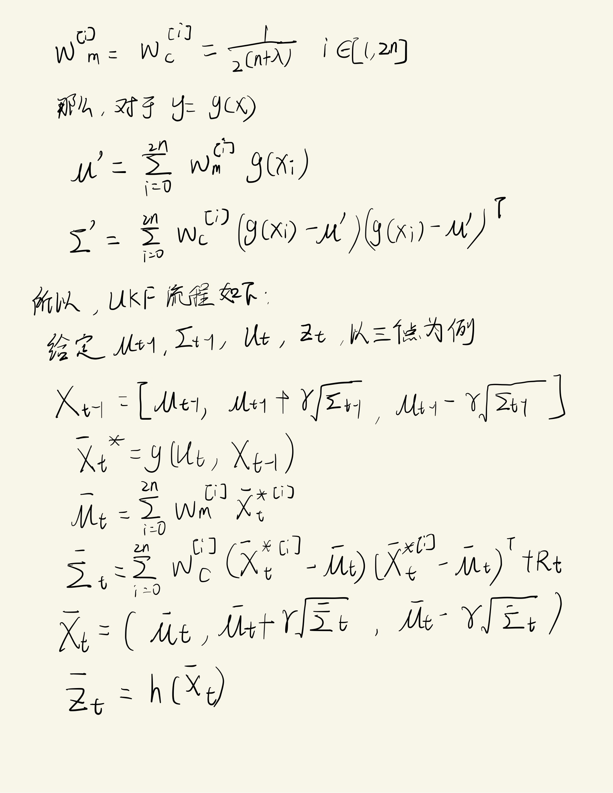
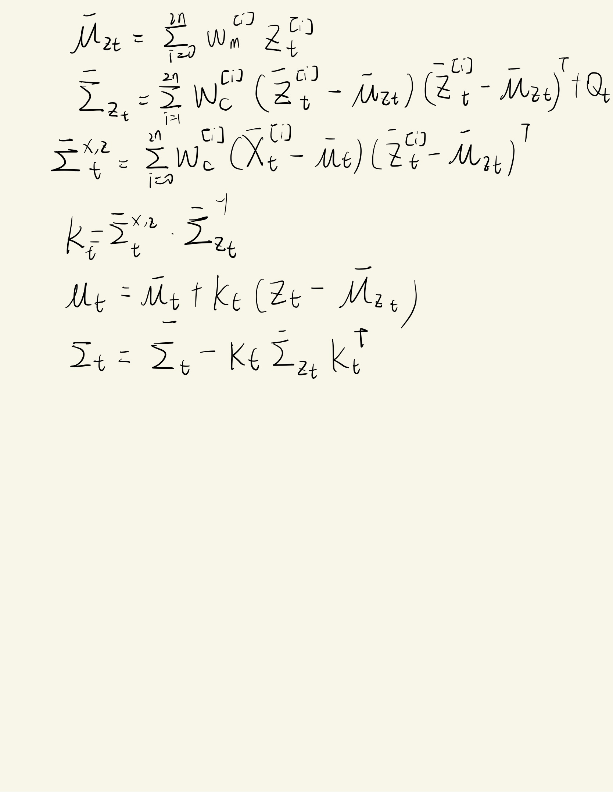

<!--
 * @Author: LOTEAT
 * @Date: 2024-07-30 15:21:33
-->
## Extended Kalman Filter
- 前置知识：概率论与数理统计, <a href='../../Math/MultivariateGaussianDensity/multivariate_gaussian_density.md'>Multivariate Gaussian Density</a>, <a href='../BayesFilter/bayes_filter.md'>Bayes Filter</a>, <a href='../KalmanFilter/kalman_filter.md'>Kalman Filter</a>, <a href='../KalmanFilter/extended_kalman_filter.md'>Extended Kalman Filter</a>

### 解析

    
     
    

  	

    
     
    

  	

    
     
    

  	

