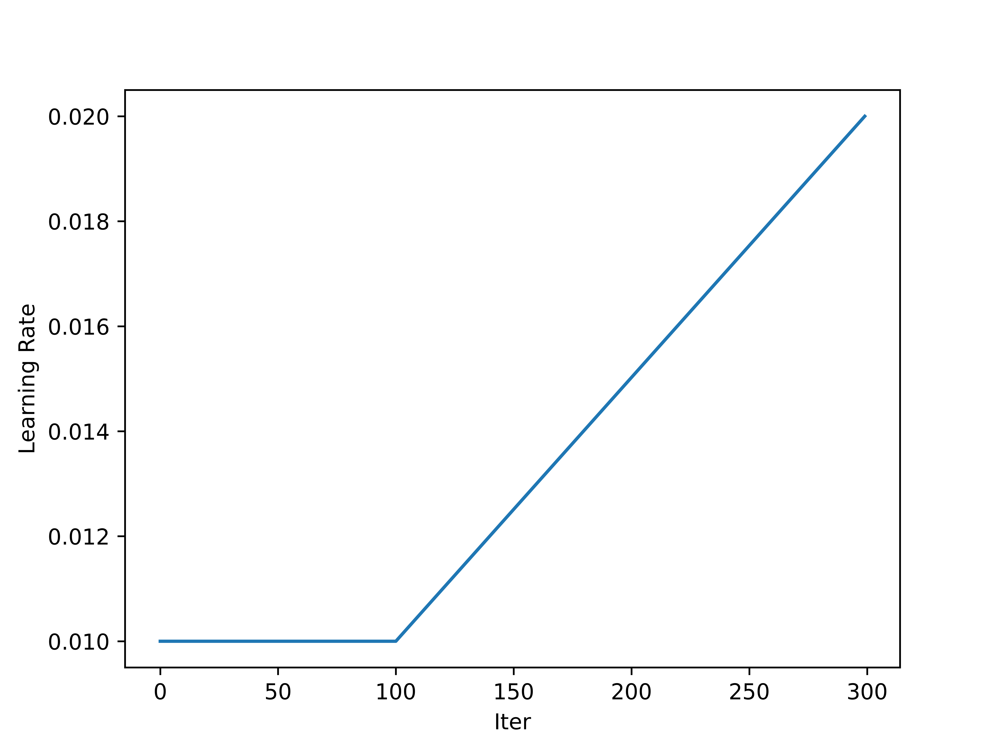

<!--
 * @Author: LOTEAT
 * @Date: 2024-08-12 21:12:36
-->
## Linear Scheduler
- 前置知识：<a href='../Basic/scheduler.md'>Scheduler</a>
- [代码链接](https://github.com/open-mmlab/mmengine)

### 1. Linear Scheduler
Linear Scheduler是学习率调整的一个非常常用的方法。其原理是在每个step中，通过一定的系数对学习率进行调整。Linear Scheduler通常也被用为warmup。这是由于刚开始训练时，模型的权重是随机初始化的，此时若选择一个较大的学习率，可能带来模型的不稳定，选择warmup预热学习率的方式，可以使得开始训练的几个epoch或者一些step内学习率较小，在warmup的小学习率下，模型可以慢慢趋于稳定，等模型相对稳定后在选择预先设置的学习率进行训练，使得模型收敛速度变得更快，模型效果更佳。一般学习率warmup过程中都是设定训练的前几个epoch或者前几百个iter进行warmup。


在线性衰减中，我们有两个参数：起始系数$f_s$，终止系数$f_e$。在第$t$个step时，如果处于学习率的调整期间，那么学习率变化为：
$$
lr_{t} = lr_{t-1} \times (1 + \frac{(f_e - f_s)}{n \times f_s + (t - 1) \times (f_e - f_s)})
$$

这是从`mmengine`代码中推导得到的，不过我们可以看一看这个线性调整最终结果。不妨假设$d=1-\frac{f_s}{f_e}$，那么原先的式子就可以写为：
$$
\begin{aligned}
lr_{t} & = lr_{init} \times \frac{\prod_{1}^{t}(nf_s + td)}{\prod_{1}^{t}(nf_s + (t-1)d)} \\
& = lr_{init} \times \frac{(n+d)(n+2d)...(n+td)}{n(n+d)(n+2d)...(n+(t-1)d)} \\
&lr_{init} \times \frac{n+td}{n} \\
\end{aligned}
$$
当$t=n$时，$lr_n=lr_{init}(1+d)$。这个warmup的斜率是$\frac{d}{n}lr_{init}$，截距是$lr_{init}$，最终调整后的学习率是$lr_{init}(2-\frac{f_s}{f_e})$。

我们通过下面代码进行验证：
```python
lr = 0.01
start_factor = 1.0 / 3
end_factor = 1.0
start = 100
end = 300
n = end - start
lr_records = []
for i in range(0, end):
    lr_records.append(lr)
    if start <= i < end:
        lr = lr * (1 + (end_factor - start_factor) / (n * start_factor + (i - 1) * (end_factor - start_factor)) )
    else:
        lr = lr
import matplotlib.pyplot as plt
x = list(range(len(lr_records)))
plt.xlabel('Iter')
plt.ylabel('Learning Rate')
plt.plot(x, lr_records)
plt.savefig('lr.png', dpi=1200)
```
最终结果如下图：
<center>
    
    <br>
    <div style="color:orange; border-bottom: 1px solid #d9d9d9;
    display: inline-block;
    color: #999;
    padding: 2px;">
      图1：Linear Scheduler
  	</div>
</center>

### 2. Code
在`mmengine`中，`LinearLR`继承自`LRSchedulerMixin`， `LinearParamScheduler`。
```python
@PARAM_SCHEDULERS.register_module()
class LinearLR(LRSchedulerMixin, LinearParamScheduler):
    """Decays the learning rate of each parameter group by linearly changing
    small multiplicative factor until the number of epoch reaches a pre-defined
    milestone: ``end``.

    Notice that such decay can happen simultaneously with other changes to the
    learning rate from outside this scheduler.

    Args:
        optimizer (Optimizer or OptimWrapper): Wrapped optimizer.
        start_factor (float): The number we multiply learning rate in the
            first epoch. The multiplication factor changes towards end_factor
            in the following epochs. Defaults to 1./3.
        end_factor (float): The number we multiply learning rate at the end
            of linear changing process. Defaults to 1.0.
        begin (int): Step at which to start updating the learning rate.
            Defaults to 0.
        end (int): Step at which to stop updating the learning rate.
            Defaults to INF.
        last_step (int): The index of last step. Used for resume without
            state dict. Defaults to -1.
        by_epoch (bool): Whether the scheduled learning rate is updated by
            epochs. Defaults to True.
        verbose (bool): Whether to print the learning rate for each update.
            Defaults to False.
    """
```
`LRSchedulerMixin`的作用是传参，其中在param_groups中只有学习率被优化。
```python
class LRSchedulerMixin:
    """A mixin class for learning rate schedulers."""

    def __init__(self, optimizer, *args, **kwargs):
        super().__init__(optimizer, 'lr', *args, **kwargs)
```
`LinearParamScheduler`核心函数是`_get_value`，可以看到实现和公式中一致。
```python
@PARAM_SCHEDULERS.register_module()
class LinearParamScheduler(_ParamScheduler):
    """Decays the parameter value of each parameter group by linearly changing
    small multiplicative factor until the number of epoch reaches a pre-defined
    milestone: ``end``.

    Notice that such decay can happen simultaneously with other changes to the
    parameter value from outside this scheduler.

    Args:
        optimizer (Optimizer or BaseOptimWrapper): optimizer or Wrapped
            optimizer.
        param_name (str): Name of the parameter to be adjusted, such as
            ``lr``, ``momentum``.
        start_factor (float): The number we multiply parameter value in the
            first epoch. The multiplication factor changes towards end_factor
            in the following epochs. Defaults to 1./3.
        end_factor (float): The number we multiply parameter value at the end
            of linear changing process. Defaults to 1.0.
        begin (int): Step at which to start updating the parameters.
            Defaults to 0.
        end (int): Step at which to stop updating the parameters.
            Defaults to INF.
        last_step (int): The index of last step. Used for resume without
            state dict. Defaults to -1.
        by_epoch (bool): Whether the scheduled parameters are updated by
            epochs. Defaults to True.
        verbose (bool): Whether to print the value for each update.
            Defaults to False.
    """

    def __init__(self,
                 optimizer: Union[Optimizer, BaseOptimWrapper],
                 param_name: str,
                 start_factor: float = 1.0 / 3,
                 end_factor: float = 1.0,
                 begin: int = 0,
                 end: int = INF,
                 last_step: int = -1,
                 by_epoch: bool = True,
                 verbose: bool = False):
        if start_factor > 1.0 or start_factor < 0:
            raise ValueError(
                'Starting multiplicative factor should between 0 and 1.')

        if end_factor > 1.0 or end_factor < 0:
            raise ValueError(
                'Ending multiplicative factor should between 0 and 1.')

        self.start_factor = start_factor
        self.end_factor = end_factor
        self.total_iters = end - begin - 1
        super().__init__(
            optimizer,
            param_name=param_name,
            begin=begin,
            end=end,
            last_step=last_step,
            by_epoch=by_epoch,
            verbose=verbose)

    @classmethod
    def build_iter_from_epoch(cls,
                              *args,
                              begin=0,
                              end=INF,
                              by_epoch=True,
                              epoch_length=None,
                              **kwargs):
        """Build an iter-based instance of this scheduler from an epoch-based
        config."""
        assert by_epoch, 'Only epoch-based kwargs whose `by_epoch=True` can ' \
                         'be converted to iter-based.'
        assert epoch_length is not None and epoch_length > 0, \
            f'`epoch_length` must be a positive integer, ' \
            f'but got {epoch_length}.'
        by_epoch = False
        begin = int(begin * epoch_length)
        if end != INF:
            end = int(end * epoch_length)
        return cls(*args, begin=begin, end=end, by_epoch=by_epoch, **kwargs)

    def _get_value(self):
        """Compute value using chainable form of the scheduler."""
        if self.last_step == 0:
            return [
                group[self.param_name] * self.start_factor
                for group in self.optimizer.param_groups
            ]

        return [
            group[self.param_name] *
            (1. + (self.end_factor - self.start_factor) /
             (self.total_iters * self.start_factor + (self.last_step - 1) *
              (self.end_factor - self.start_factor)))
            for group in self.optimizer.param_groups
        ]

```