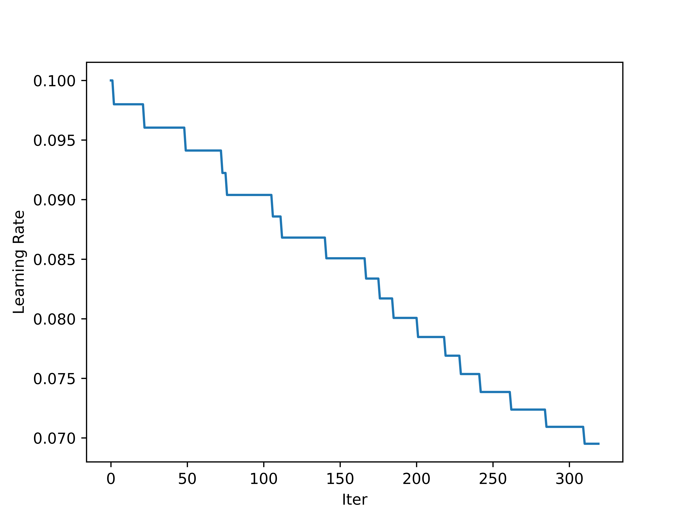

<!--
 * @Author: LOTEAT
 * @Date: 2024-08-13 10:38:21
-->
## Multi Step Learning Rate Scheduler
- 前置知识：<a href='../StepScheduler/step_scheduler.md'>StepScheduler</a>
- [代码链接](https://github.com/open-mmlab/mmengine)

### 1. Multi Step Learning Rate Scheduler
同StepLR一样，MultiStepLR的更新策略同样是
$$
lr_t = \gamma \times lr_{t-1}
$$
不过不同的是，MultiStepLR只会在设定好的milestone中进行更新，例如设置节点epoch8和节点epoch11，那么只会在这两个地方更新学习率

我们通过下面代码进行验证：
```python
import random
lr = 0.1
start = 0
end = 320
milestones = [1, ]
for i in range(20):
    milestone = random.randint(milestones[-1], milestones[-1] + 30)
    milestones.append(milestone)
lr_records = []
for i in range(0, end):
    lr_records.append(lr)
    if i in milestones:
        lr = lr * gamma
    else:
        lr = lr
import matplotlib.pyplot as plt
x = list(range(len(lr_records)))
plt.xlabel('Iter')
plt.ylabel('Learning Rate')
plt.plot(x, lr_records)
plt.savefig('lr.png', dpi=1200)
```
最终结果如下图：
<center>
    
    <br>
    <div style="color:orange; border-bottom: 1px solid #d9d9d9;
    display: inline-block;
    color: #999;
    padding: 2px;">
      图1：Multi Step Scheduler
  	</div>
</center>

### 2. Code
在`mmengine`中，`MultiStepLR`继承自`LRSchedulerMixin`， `MultiStepParamScheduler`。
```python
@PARAM_SCHEDULERS.register_module()
class MultiStepLR(LRSchedulerMixin, MultiStepParamScheduler):
    """Decays the specified learning rate in each parameter group by gamma once
    the number of epoch reaches one of the milestones. Notice that such decay
    can happen simultaneously with other changes to the learning rate from
    outside this scheduler.

    Args:
        optimizer (Optimizer or OptimWrapper): Wrapped optimizer.
        milestones (list): List of epoch indices. Must be increasing.
        gamma (float): Multiplicative factor of learning rate decay.
            Defaults to 0.1.
        begin (int): Step at which to start updating the learning rate.
            Defaults to 0.
        end (int): Step at which to stop updating the learning rate.
            Defaults to INF.
        last_step (int): The index of last step. Used for resume without
            state dict. Defaults to -1.
        by_epoch (bool): Whether the scheduled learning rate is updated by
            epochs. Defaults to True.
        verbose (bool): Whether to print the learning rate for each update.
            Defaults to False.
    """
```
`LRSchedulerMixin`的作用是传参，其中在param_groups中只有学习率被优化。
```python
class LRSchedulerMixin:
    """A mixin class for learning rate schedulers."""

    def __init__(self, optimizer, *args, **kwargs):
        super().__init__(optimizer, 'lr', *args, **kwargs)
```
`MultiStepParamScheduler`核心函数是`_get_value`，可以看到实现和公式中一致。有区别的一点是，可以通过添加多个重复的milestone，重复进行衰减。
```python

@PARAM_SCHEDULERS.register_module()
class MultiStepParamScheduler(_ParamScheduler):
    """Decays the specified parameter in each parameter group by gamma once the
    number of epoch reaches one of the milestones. Notice that such decay can
    happen simultaneously with other changes to the parameter from outside this
    scheduler.

    Args:
        optimizer (BaseOptimWrapper or Optimizer): Wrapped optimizer.
        param_name (str): Name of the parameter to be adjusted, such as
            ``lr``, ``momentum``.
        milestones (list): List of epoch indices. Must be increasing.
        gamma (float): Multiplicative factor of parameter value decay.
            Defaults to 0.1.
        begin (int): Step at which to start updating the parameters.
            Defaults to 0.
        end (int): Step at which to stop updating the parameters.
            Defaults to INF.
        last_step (int): The index of last step. Used for resume without
            state dict. Defaults to -1.
        by_epoch (bool): Whether the scheduled parameters are updated by
            epochs. Defaults to True.
        verbose (bool): Whether to print the value for each update.
            Defaults to False.
    """

    def __init__(self,
                 optimizer: OptimizerType,
                 param_name: str,
                 milestones: List[int],
                 gamma: float = 0.1,
                 last_step: int = -1,
                 begin: int = 0,
                 end: int = INF,
                 by_epoch: bool = True,
                 verbose: bool = False):
        self.milestones = Counter(milestones)
        self.gamma = gamma
        super().__init__(
            optimizer,
            param_name=param_name,
            begin=begin,
            end=end,
            last_step=last_step,
            by_epoch=by_epoch,
            verbose=verbose)

    @classmethod
    def build_iter_from_epoch(cls,
                              *args,
                              milestones,
                              begin=0,
                              end=INF,
                              by_epoch=True,
                              epoch_length=None,
                              **kwargs):
        """Build an iter-based instance of this scheduler from an epoch-based
        config."""
        assert by_epoch, 'Only epoch-based kwargs whose `by_epoch=True` can ' \
                         'be converted to iter-based.'
        assert epoch_length is not None and epoch_length > 0, \
            f'`epoch_length` must be a positive integer, ' \
            f'but got {epoch_length}.'
        by_epoch = False
        milestones = [i * epoch_length for i in milestones]
        begin = int(begin * epoch_length)
        if end != INF:
            end = int(end * epoch_length)
        return cls(
            *args,
            milestones=milestones,
            begin=begin,
            end=end,
            by_epoch=by_epoch,
            **kwargs)

    def _get_value(self):
        """Compute value using chainable form of the scheduler."""
        if self.last_step not in self.milestones:
            return [
                group[self.param_name] for group in self.optimizer.param_groups
            ]
        return [
            group[self.param_name] *
            self.gamma**self.milestones[self.last_step]
            for group in self.optimizer.param_groups
        ]
```