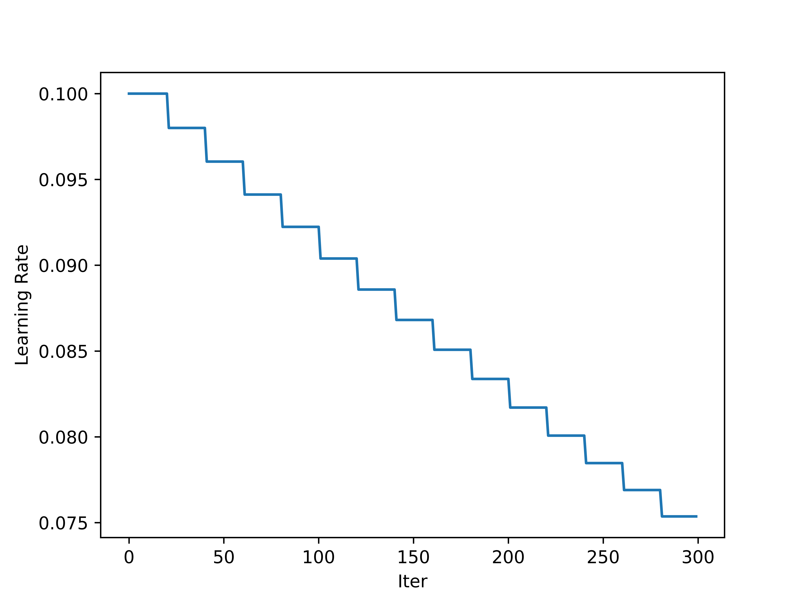

<!--
 * @Author: LOTEAT
 * @Date: 2024-08-13 10:38:03
-->
## Step Learning Rate Scheduler
- 前置知识：<a href='../Basic/scheduler.md'>Scheduler</a>
- [代码链接](https://github.com/open-mmlab/mmengine)

### 1. Step Learning Rate Scheduler
在学习率warmup之后，模型会大致趋于稳定。如果此时仍使用较高的学习率，可能会导致损失震荡。因此，我们常常会让学习率随着epoch的增加而降低。StepLR就是其中的一个方法。

它的思路是每过step_size个epoch，做一次更新：
$$
lr_t = \gamma \times lr_{t-1}
$$


我们通过下面代码进行验证：
```python
lr = 0.1
start = 0
end = 300
step_size = 20
gamma = 0.98
lr_records = []
for i in range(0, end):
    lr_records.append(lr)
    if i % step_size == 0 and i != 0:
        lr = lr * gamma
    else:
        lr = lr
import matplotlib.pyplot as plt
x = list(range(len(lr_records)))
plt.xlabel('Iter')
plt.ylabel('Learning Rate')
plt.plot(x, lr_records)
plt.savefig('lr.png', dpi=1200)
```
最终结果如下图：
<center>
    
    <br>
    <div style="color:orange; border-bottom: 1px solid #d9d9d9;
    display: inline-block;
    color: #999;
    padding: 2px;">
      图1：Step Scheduler
  	</div>
</center>

### 2. Code
在`mmengine`中，`StepLR`继承自`LRSchedulerMixin`， `StepParamScheduler`。
```python
@PARAM_SCHEDULERS.register_module()
class StepLR(LRSchedulerMixin, StepParamScheduler):
    """Decays the learning rate of each parameter group by gamma every
    step_size epochs. Notice that such decay can happen simultaneously with
    other changes to the learning rate from outside this scheduler.

    Args:
        optimizer (Optimizer or OptimWrapper): Wrapped optimizer.
        step_size (int): Period of learning rate decay.
        gamma (float): Multiplicative factor of learning rate decay.
            Defaults to 0.1.
        begin (int): Step at which to start updating the learning rate.
            Defaults to 0.
        end (int): Step at which to stop updating the learning rate.
            Defaults to INF.
        last_step (int): The index of last step. Used for resume without
            state dict. Defaults to -1.
        by_epoch (bool): Whether the scheduled learning rate is updated by
            epochs. Defaults to True.
        verbose (bool): Whether to print the learning rate for each update.
            Defaults to False.
    """
```
`LRSchedulerMixin`的作用是传参，其中在param_groups中只有学习率被优化。
```python
class LRSchedulerMixin:
    """A mixin class for learning rate schedulers."""

    def __init__(self, optimizer, *args, **kwargs):
        super().__init__(optimizer, 'lr', *args, **kwargs)
```
`StepParamScheduler`核心函数是`_get_value`，可以看到实现和公式中一致。
```python
@PARAM_SCHEDULERS.register_module()
class StepParamScheduler(_ParamScheduler):
    """Decays the parameter value of each parameter group by gamma every
    step_size epochs. Notice that such decay can happen simultaneously with
    other changes to the parameter value from outside this scheduler.

    Args:
        optimizer (BaseOptimWrapper or Optimizer): Wrapped optimizer.
        param_name (str): Name of the parameter to be adjusted, such as
            ``lr``, ``momentum``.
        step_size (int): Period of parameter value decay.
        gamma (float): Multiplicative factor of parameter value decay.
            Defaults to 0.1.
        begin (int): Step at which to start updating the parameters.
            Defaults to 0.
        end (int): Step at which to stop updating the parameters.
            Defaults to INF.
        last_step (int): The index of last step. Used for resume without
            state dict. Defaults to -1.
        by_epoch (bool): Whether the scheduled parameters are updated by
            epochs. Defaults to True.
        verbose (bool): Whether to print the value for each update.
            Defaults to False.
    """

    def __init__(self,
                 optimizer: OptimizerType,
                 param_name: str,
                 step_size: int,
                 gamma: float = 0.1,
                 begin: int = 0,
                 end: int = INF,
                 last_step: int = -1,
                 by_epoch: bool = True,
                 verbose: bool = False):
        self.step_size = step_size
        self.gamma = gamma
        super().__init__(
            optimizer=optimizer,
            param_name=param_name,
            begin=begin,
            end=end,
            last_step=last_step,
            by_epoch=by_epoch,
            verbose=verbose)

    @classmethod
    def build_iter_from_epoch(cls,
                              *args,
                              step_size,
                              begin=0,
                              end=INF,
                              by_epoch=True,
                              epoch_length=None,
                              **kwargs):
        """Build an iter-based instance of this scheduler from an epoch-based
        config."""
        assert by_epoch, 'Only epoch-based kwargs whose `by_epoch=True` can ' \
                         'be converted to iter-based.'
        assert epoch_length is not None and epoch_length > 0, \
            f'`epoch_length` must be a positive integer, ' \
            f'but got {epoch_length}.'
        by_epoch = False
        step_size = step_size * epoch_length
        begin = int(begin * epoch_length)
        if end != INF:
            end = int(end * epoch_length)
        return cls(
            *args,
            step_size=step_size,
            begin=begin,
            end=end,
            by_epoch=by_epoch,
            **kwargs)

    def _get_value(self):
        """Compute value using chainable form of the scheduler."""
        if (self.last_step == 0) or (self.last_step % self.step_size != 0):
            return [
                group[self.param_name] for group in self.optimizer.param_groups
            ]
        return [
            group[self.param_name] * self.gamma
            for group in self.optimizer.param_groups
        ]
```