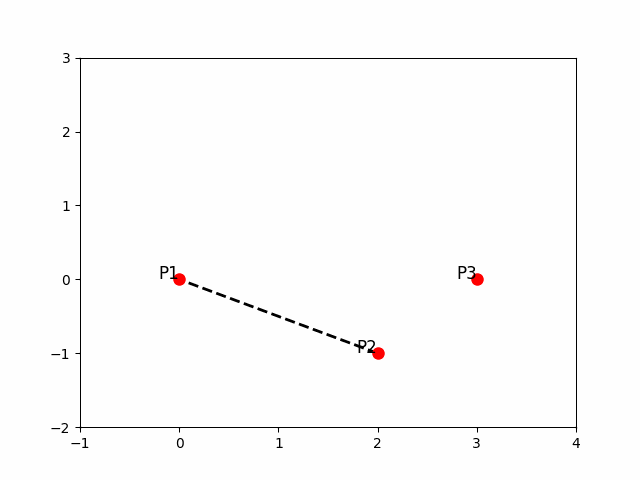
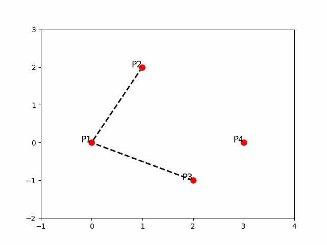

<!--
 * @Author: LOTEAT
 * @Date: 2024-09-11 12:49:12
-->
## Bézier Curve
- 前置知识：组合数学

### 1. 推导过程
贝塞尔曲线于1962年，由法国工程师皮埃尔·贝兹（Pierre Bézier）发表。贝塞尔曲线由$n$个控制点对应着$n-1$阶的贝塞尔曲线，贝塞尔曲线必过控制起点和控制终点。接下来先以一阶、二阶和三阶的贝塞尔曲线解释其推导过程。

    
     
    

      图1：1阶贝塞尔曲线
    

如图1所示，是一阶的贝塞尔曲线。那么加入设运动的点是$P_t$，$t$为运动时间，那么$t\in (0, 1)$。$P_t$和$P_1$， $P_2$的关系为：

$$
P_t = P_1 + (P_2 - P_1)t = (1 - t)P_0 + P_1t
$$

由于坐标点是个二维点，所以实际上可以再对x轴和y轴坐标进行拆分，同样符合上面的公式。

    
     
    

      图1：2阶贝塞尔曲线
    

如图二所示，是一个二阶的贝塞尔曲线。二阶贝塞尔曲线由$P_1, P_2, P_3$三个点来确定，其中$P_1$是起点，$P_2$是控制点，$P_3$是终点，曲线方程为：

$$
P_t = (1-t)^2P_1 + 2t(1-t)P_2 + t^2P_3, \quad t\in (0, 1)
$$

这里推导其实很简单。在二阶贝塞尔曲线中。我们构造两个向量，$P_1P_2$和$P_2P_3$。假设$P_t^a$在$P_1P_2$上运动，$P_t^b$在$P_2P_3$上运动。那么在时间为$t$时，满足

$$
\begin{aligned}
&\frac{|P_1P_t^a|}{|P_2P_t^b|}=t \\
&\frac{|P_t^bP_2|}{|P_2P_3|}=t \\
&\frac{|P_t^aP_t|}{|P_tP_t^b|} =t \\ 
\end{aligned}
$$
带入即可计算出$P_t$的坐标。

    
     
    

      图1：3阶贝塞尔曲线
    

三阶贝塞尔曲线，及以上的贝塞尔曲线，都是在套娃。
最后，贝塞尔曲线的公式为：
$$
B(t)=\sum_{i=0}^n\binom{n}{i}(1-t)^{n-i} t^i P_i, t \in[0,1]
$$
### 2. 性质
