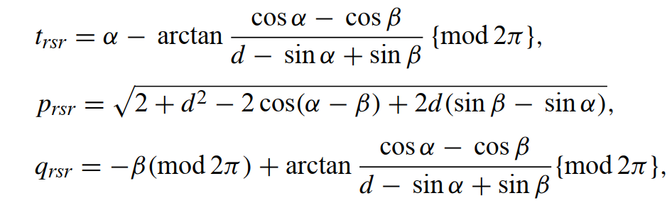
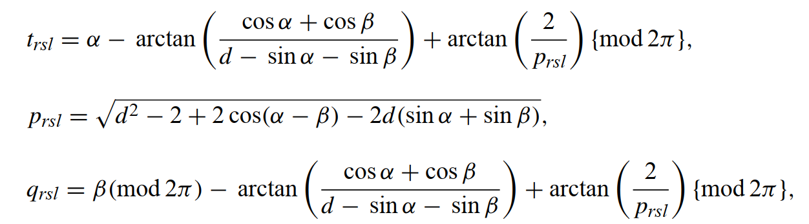
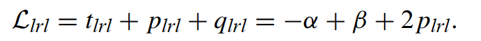

<!--
 * @Author: LOTEAT
 * @Date: 2024-09-11 19:54:00
-->
## Dubins Curve
- 前置知识：<a href="../../MotionPlanning/MotionModel/OdometryMotionModel/odometry_motion_model.md">OdometryModel</a>
- 论文推荐：[Classification of the Dubins set](https://bpb-us-e2.wpmucdn.com/faculty.sites.uci.edu/dist/e/700/files/2014/04/Dubins_Set_Robotics_2001.pdf)
- 代码链接：[DubinsPath-Demo](https://github.com/LOTEAT/DubinsPath-Demo.git)

### 1. 推导过程
Dubins曲线是Dubins在1957年提出的，后来被Reeds和Shepp证明。但是原始的Dubins曲线过于古早，所以这里更关注[这篇论文](https://bpb-us-e2.wpmucdn.com/faculty.sites.uci.edu/dist/e/700/files/2014/04/Dubins_Set_Robotics_2001.pdf)。Dubins证明了任何最短路径都由恰好三个路径段组成，这些段可以是圆弧（C）或直线（S），并且每个圆弧的半径必须至少为最小转弯半径$\rho$。Dubins曲线包含六种可能的路径，LSL，RSR，RSL，LSR，RLR，LRL。其中，L代表左转，S代表执行，R代表右转。也就是说，Dubins曲线就是有转弯-直行-转弯三段所构成。背后的原理证明我没有看，有兴趣的可自行查阅原始论文。

在Dubins曲线中，为了更方便计算曲线轨迹，我们常常会对转弯半径进行归一化。那么只需要对坐标系全体除以$\rho$即可，也就是实际上起点和终点的距离变为了$d=D/\rho$。这里的$D$而二者实际上的欧氏距离。基于此，我们可以很快求得在初始位姿为$(x, y, \phi)$情况下，左转、右转、直行的坐标变换。

    
     
    

      图1：Dubins曲线
    

此外，为了更易于求解，我们将坐标系同时进行变换。另初始点$P_i=(0, 0, \alpha)$，让终止点$P_f=(d, 0, \beta)$。最后再将轨迹变换到原始坐标系中即可。

此时，假设三段轨迹路径长分别是$t,p,q$，那么总轨迹长就是$L=t+p+q$。同时，我们很容易获得三组方程，因为要满足位姿变换要求，以LSL举例，即$L_q\left(S_p\left(L_t(0,0, \alpha)\right)\right)=(d, 0, \beta)$。所以有：

$$
\begin{aligned} & p \cos (\alpha+t)-\sin \alpha+\sin \beta=d \\ & p \sin (\alpha+t)+\cos \alpha-\cos \beta=0 \\ & \alpha+t+q=\beta\{\bmod 2 \pi\}\end{aligned}
$$
可以求得

    
     
    

    

其路径总长度为：

    
     
    

    

同理，我们可以求得其他五组。
RSR:

    
     
    

    

    
     
    

    

LSR:

    
     
    

    

    
     
    

    

RSL:

    
     
    

    

    
     
    

    

RLR:

    
     
    

    

    
     
    

    

LRL:

    
     
    

    

    
     
    

    

