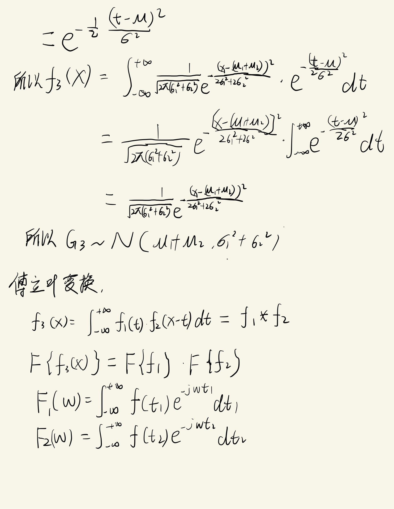
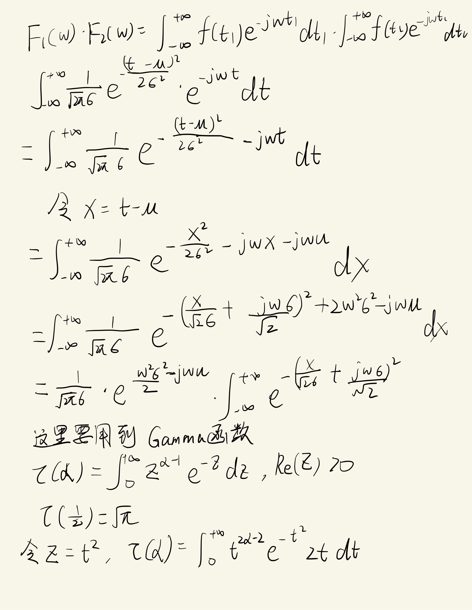
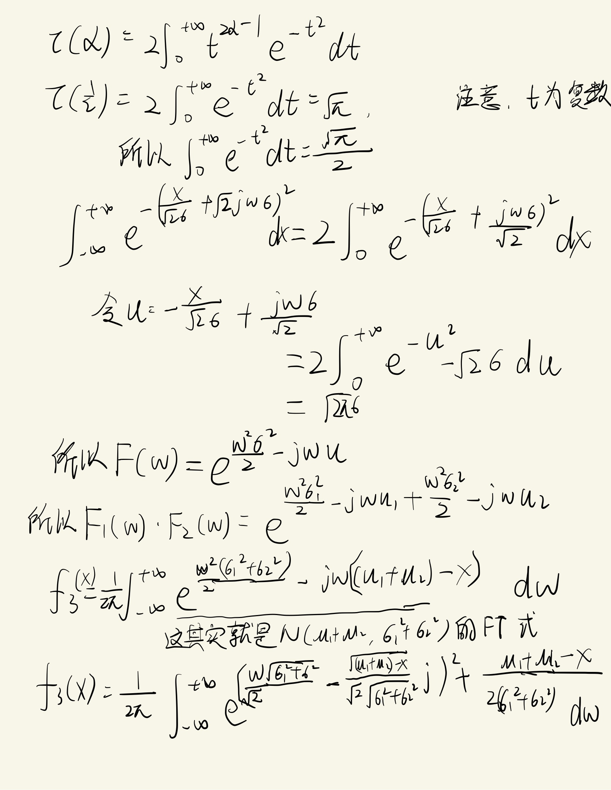
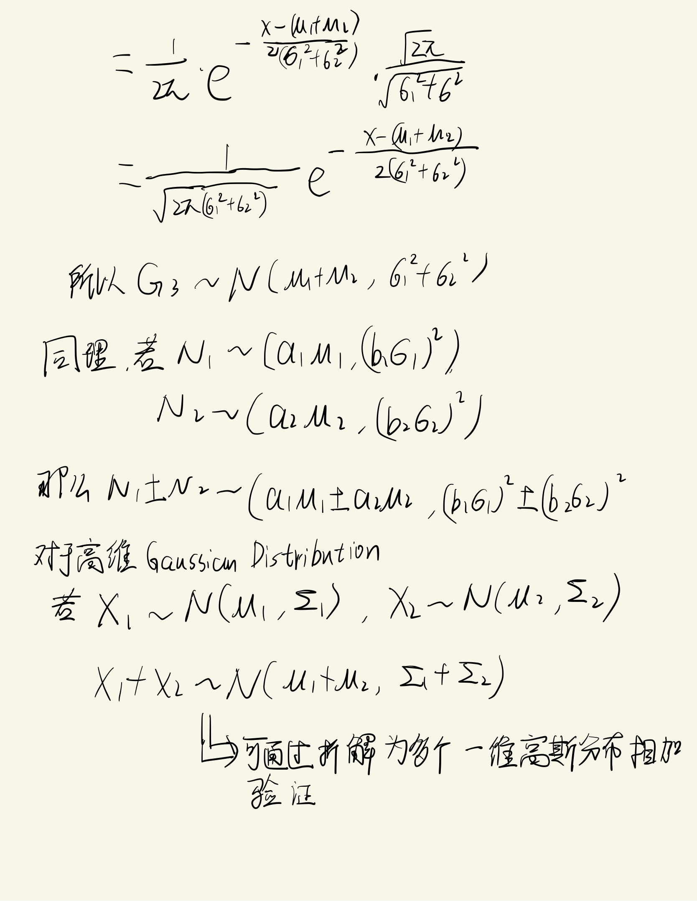

<!--
 * @Author: LOTEAT
 * @Date: 2024-07-28 19:47:26
-->
## Addition of Gaussian Distribution
- 前置知识：概率论与数理统计，傅里叶变换

### 推导

    
     
    

  	

    
     
    

  	

    
     
    

  	

    
     
    

  	

    
     
    

  	

    
     
    

  	

