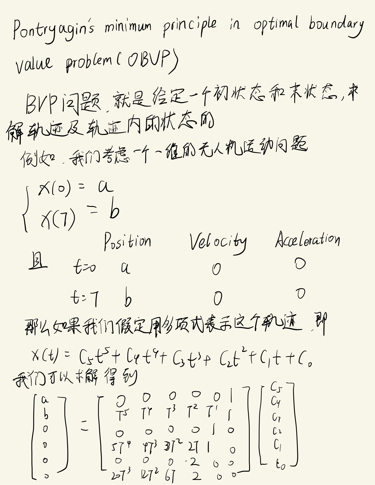
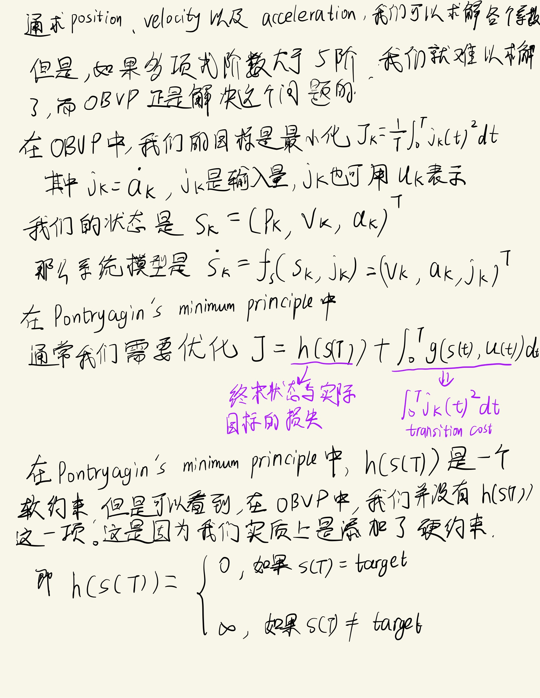
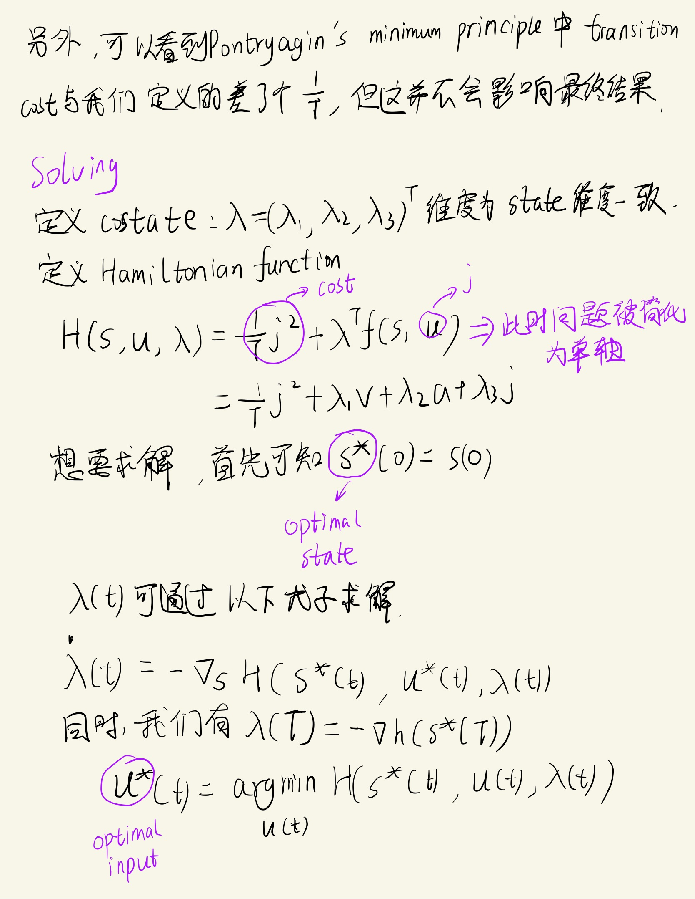
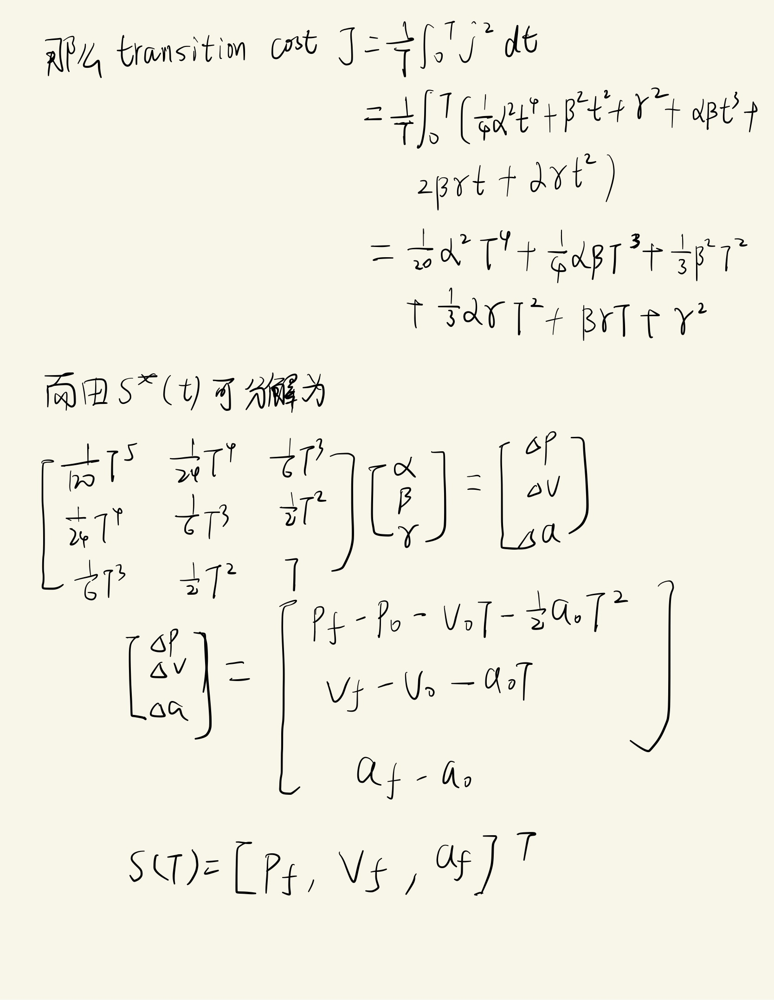

<!--
 * @Author: LOTEAT
 * @Date: 2024-07-29 21:35:14
-->
## OBVP
- 前置知识：微积分，微分方程
### 解析

    
     
    

  	

    
     
    

  	

    
     
    

  	

    
     
    

  	

    
     
    

  	

