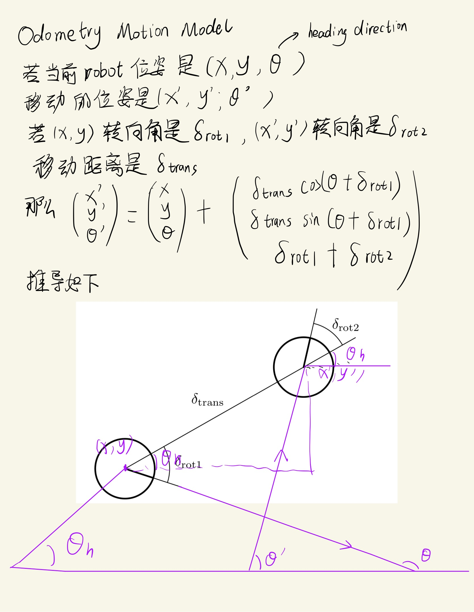
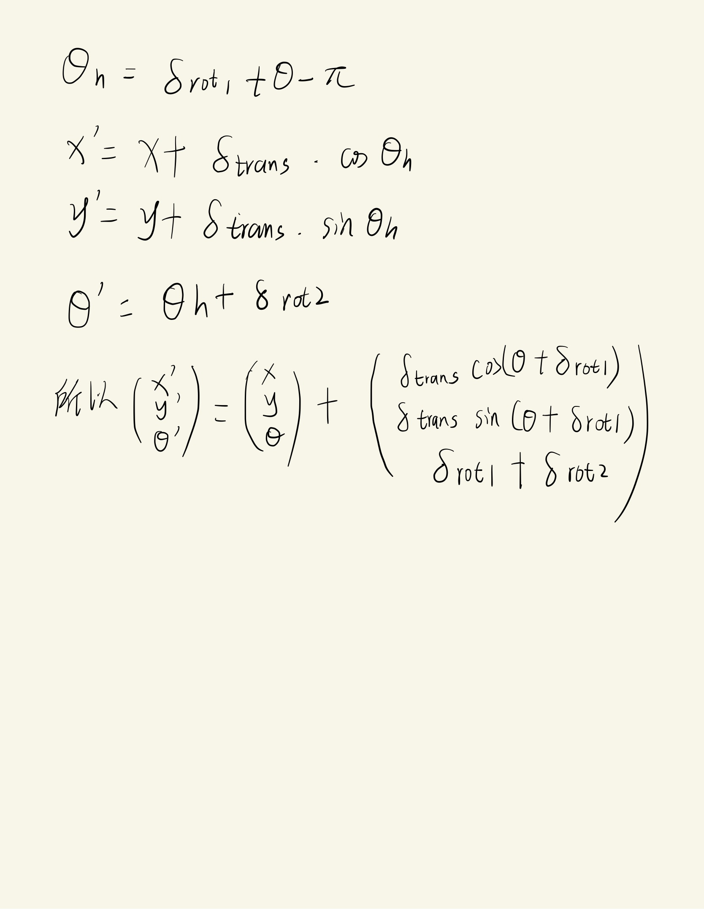
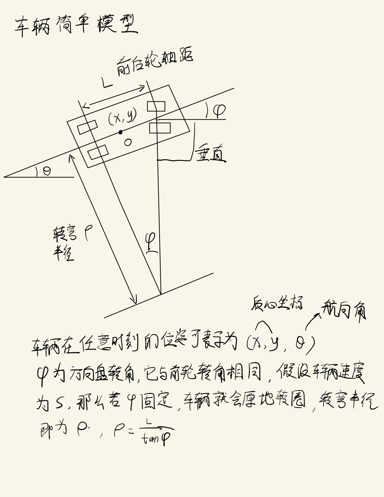
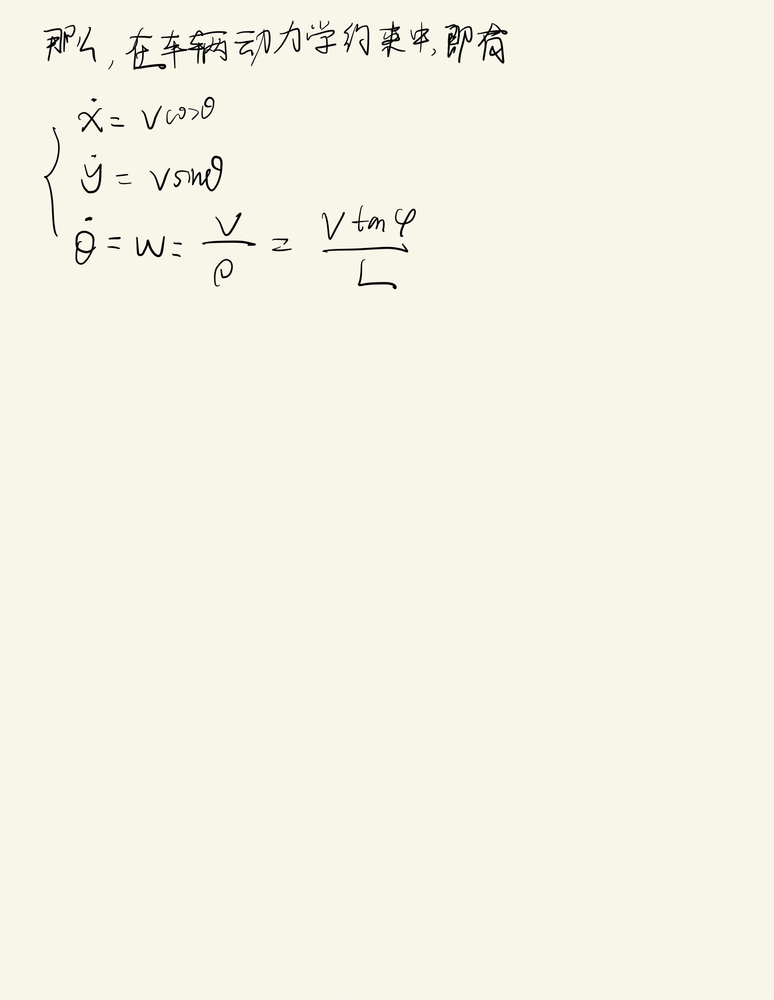

<!--
 * @Author: LOTEAT
 * @Date: 2024-07-31 11:08:37
-->
## Odometry Motion Model
- 前置知识: 无

### 推导
Odometry Motion Model是通过$\delta_{rot1}$，$\delta_{rot2}$和$\delta_{trans}$控制robot进行移动，那么在这三个就是控制的$u_t$，通常这三个值是有robot自带的传感器所测量出来的。

    
     
    

  	

    
     
    

  	

这里再额外补充一下车辆简单模型。

    
     
    

  	

    
     
    

  	

### Demo实现
[Odometry Motion Model Demo](https://github.com/LOTEAT/PaperReading/blob/main/MotionPlanning/MotionModel/OdometryMotionModel/OdometryModelDemo).