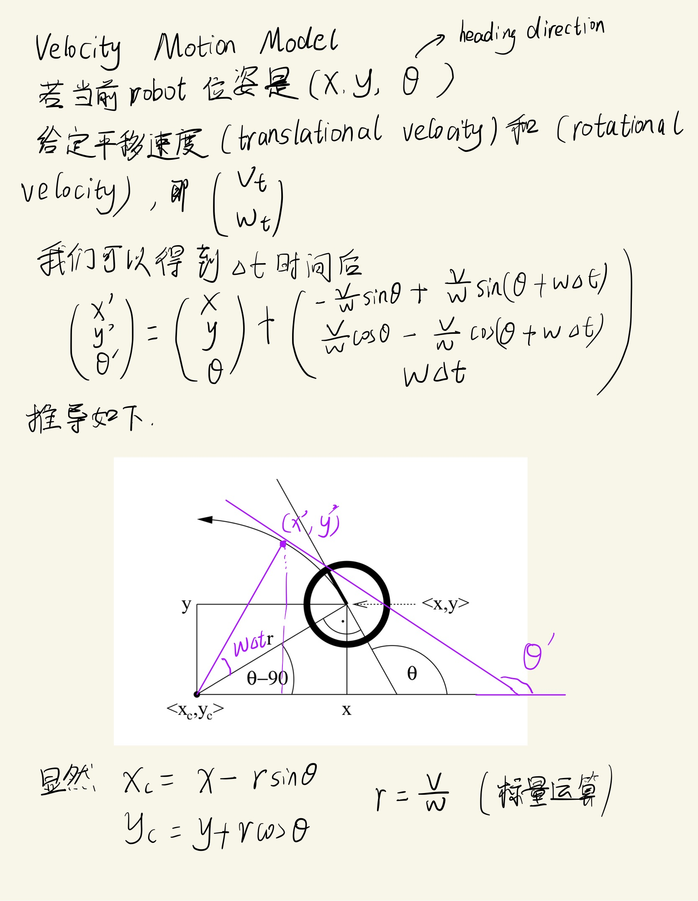
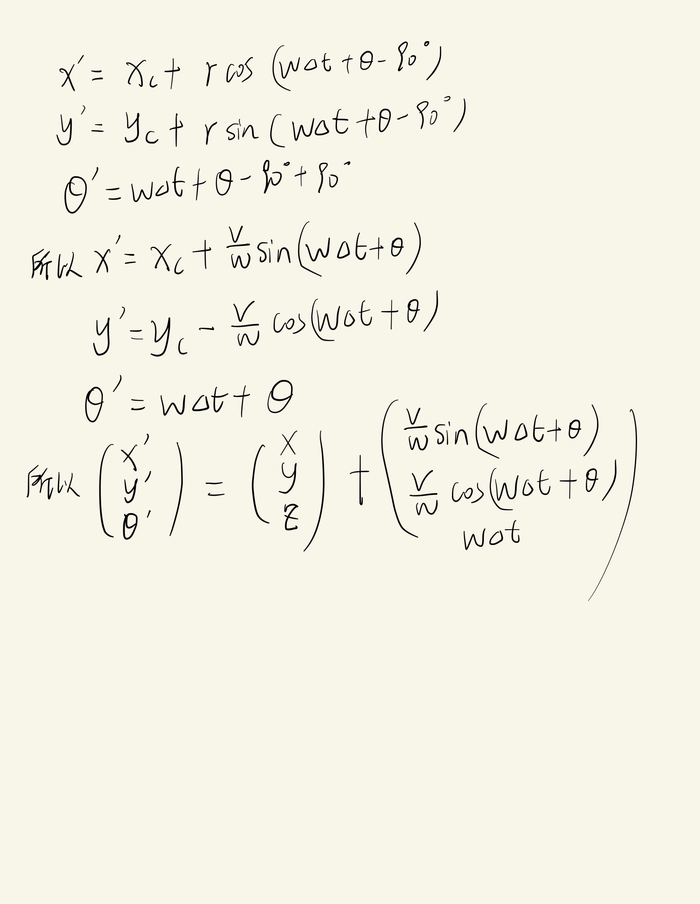

<!--
 * @Author: LOTEAT
 * @Date: 2024-07-31 11:08:20
-->
## Velocity Motion Model
- 前置知识: 无

### 推导
Velocity Motion Model是通过$v_t$和$w_t$控制robot进行移动，那么在这两个就是控制的$u_t$。

    
     
    

  	

    
     
    

  	

