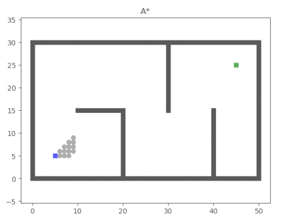

<!--
 * @Author: LOTEAT
 * @Date: 2024-07-27 20:39:03
-->
## A Formal Basis for the Heuristic Determination of Minimum Cost Paths
- 前置知识：<a href='../../Basic/PathPlanning/basic.md'>Basic</a>
- 作者：PETER E. HART, NILS J. NILSSON, BERTRAM RAPHAEL
- [文章链接](https://ieeexplore.ieee.org/document/4082128?denied=)

### 1. 核心算法流程
1. 初始化：设定待检测节点open_list和已经遍历过的节点close_list，将起点$S$放入open_list中，把障碍物节点加入close_list。
2. 初始化：定义$g(x)$为起点$S$到$x$的实际成本，定义$h(x)$为$x$到目标点$E$的估计成本，定义$f(x)$为从起点到目标点过$x$的估计成本，即$f(x) = g(x) + h(x)$。根据完备性证明，$h(x)$一定要小于实际成本，可使用曼哈顿距离、欧氏距离等。
3. 循环：
    - 如果open_list为空
        - 跳出循环，路径搜索失败。
    - 否则
        - 找到open_list中$f$值最小的节点。
        - 如果当前节点坐标和目标点坐标一致
            - 跳出循环，并根据父节点回溯路径。
        - 否则
            - 向周围节点扩展（以二维平面为例，扩展方式可以四个方向，也可以八个方向，具体扩展方式需要根据实际问题决定）。
            - 如果是不可通过的、或者是在close_list中的、或者超过边界的节点
                - 不处理。
            - 如果在open_list中
                - 如果扩展后的$f$值大于扩展前的$f$值
                    - 不处理
                - 否则
                    - 更新$f$值，并将扩展的节点的父节点更新为当前节点。
            - 否则
                - 将扩展的节点的父节点定义为当前节点。
                - 更新扩展节点的$f$值。

### 2. 代码分析
```python
def __init__(self, s_start, s_goal, heuristic_type):
    self.s_start = s_start
    self.s_goal = s_goal
    self.heuristic_type = heuristic_type
    self.Env = env.Env()  # class Env
    self.u_set = self.Env.motions  # feasibleinput set
    self.obs = self.Env.obs  # position ofobstacles
    self.OPEN = []  # priority queue / OPEN set
    self.CLOSED = []  # CLOSED set / VISITED order
    self.PARENT = dict()  # recorded parent
    self.g = dict()  # cost to come
```
构造函数定义了起点、终点、搜索距离等等。仓库使用公共的parent和g用于记录父节点和$f$值。
```python
def searching(self):
    """
    A_star Searching.
    :return: path, visited order
    """

    self.PARENT[self.s_start] = self.s_start
    self.g[self.s_start] = 0
    self.g[self.s_goal] = math.inf
    heapq.heappush(self.OPEN,
                   (self.f_value(self.s_start),self.s_start))
    while self.OPEN:
        _, s = heapq.heappop(self.OPEN)
        self.CLOSED.append(s)
        if s == self.s_goal:  # stop condition
            break
        for s_n in self.get_neighbor(s):
            new_cost = self.g[s] + self.cost(s,s_n)
            if s_n not in self.g:
                self.g[s_n] = math.inf
            if new_cost < self.g[s_n]:  #conditions for updating Cost
                self.g[s_n] = new_cost
                self.PARENT[s_n] = s
                heapq.heappush(self.OPEN, (selff_value(s_n), s_n))
    return self.extract_path(self.PARENT), self.CLOSED
```
整体流程基本相同，但是这里在实现中对于已经open_list节点处理是直接更新$f$值。
```python
    def get_neighbor(self, s):
        """
        find neighbors of state s that not in obstacles.
        :param s: state
        :return: neighbors
        """

        return [(s[0] + u[0], s[1] + u[1]) for u in self.u_set]
```
向八个方向扩展。
```python
    def is_collision(self, s_start, s_end):
        """
        check if the line segment (s_start, s_end) is collision.
        :param s_start: start node
        :param s_end: end node
        :return: True: is collision / False: not collision
        """

        if s_start in self.obs or s_end in self.obs:
            return True

        if s_start[0] != s_end[0] and s_start[1] != s_end[1]:
            if s_end[0] - s_start[0] == s_start[1] - s_end[1]:
                s1 = (min(s_start[0], s_end[0]), min(s_start[1], s_end[1]))
                s2 = (max(s_start[0], s_end[0]), max(s_start[1], s_end[1]))
            else:
                s1 = (min(s_start[0], s_end[0]), max(s_start[1], s_end[1]))
                s2 = (max(s_start[0], s_end[0]), min(s_start[1], s_end[1]))

            if s1 in self.obs or s2 in self.obs:
                return True

        return False
```
判定节点是否合法，判定规则包括：1.不可以在障碍物上。2.不是终点。3.不在close_list的判定在`searching`函数中。

### 3. 效果

<center>
    
    <br>
    <div style="color:orange; border-bottom: 1px solid #d9d9d9;
    display: inline-block;
    color: #999;
    padding: 2px;">
      图1：AStar效果图展示
  	</div>
</center>