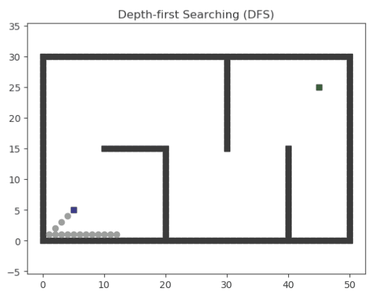

<!--
 * @Author: LOTEAT
 * @Date: 2024-07-28 21:32:14
-->

## DFS Searching
- 前置知识：<a href='../../Basic/PathPlanning/basic.md'>Basic</a>


### 1. 核心算法流程
由于DFS是递归实现，因此这里使用代码形式的伪代码更易于展示。
```python
def DFS(x, y):
    if is_target(x, y):
        backtracking()
        return
    for i in range(-1, 2):
        for j in range(-1, 2):
            next_x, next_y = x+i, y+j
            if is_valid(next_x, next_y):
                mark(next_x, next_y)
                dfs(next_x, next_y)
                cancel_mark(next_x, next_y)
```


### 2. 代码分析
```python
    def searching(self):
        """
        Breadth-first Searching.
        :return: path, visited order
        """

        self.PARENT[self.s_start] = self.s_start
        self.g[self.s_start] = 0
        self.g[self.s_goal] = math.inf
        heapq.heappush(self.OPEN,
                       (0, self.s_start))

        while self.OPEN:
            _, s = heapq.heappop(self.OPEN)
            self.CLOSED.append(s)

            if s == self.s_goal:
                break

            for s_n in self.get_neighbor(s):
                new_cost = self.g[s] + self.cost(s, s_n)

                if s_n not in self.g:
                    self.g[s_n] = math.inf

                if new_cost < self.g[s_n]:  # conditions for updating Cost
                    self.g[s_n] = new_cost
                    self.PARENT[s_n] = s

                    # dfs, add new node to the front of the openset
                    prior = self.OPEN[0][0]-1 if len(self.OPEN)>0 else 0
                    heapq.heappush(self.OPEN, (prior, s_n))

        return self.extract_path(self.PARENT), self.CLOSED
```
代码实现是将递归展开成了循环，整体意义是一样的，使用prior标记入队列先后顺序。这里就不做过多分析了。

### 3. 效果

<center>
    
    <br>
    <div style="color:orange; border-bottom: 1px solid #d9d9d9;
    display: inline-block;
    color: #999;
    padding: 2px;">
      图1：DFS效果图展示
  	</div>
</center>