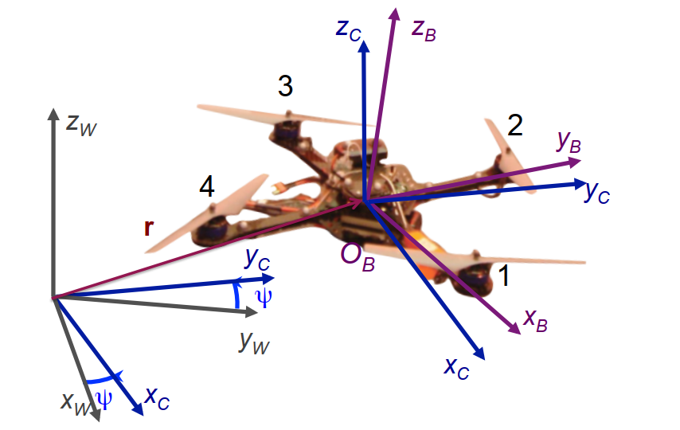
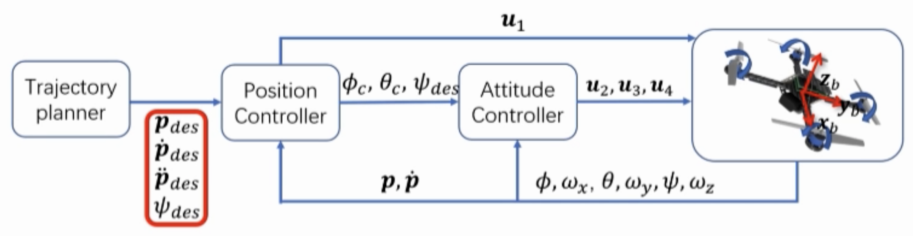
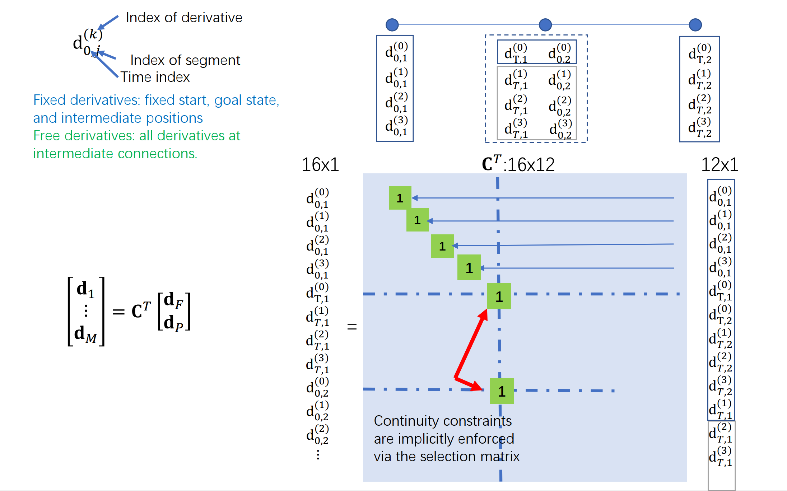

<!--
 * @Author: LOTEAT
 * @Date: 2024-08-02 15:12:21
-->
## Minimum Snap Trajectory Generation and Control for Quadrotors
- 前置知识：四旋翼无人机动力学
- 作者：Daniel Mellinger, Vijay Kumar
- [文章链接](https://ieeexplore.ieee.org/stamp/stamp.jsp?tp=&arnumber=5980409)

### 1. Motivation
在无人机机动飞行的情况下，无人机常常会有水平大角度的偏移，小角度近似难以满足飞行要求，也就是说无法以平稳飞行去估计无人机的飞行姿态。因此，要在这种情况下设计一个好的控制器来控制无人机的飞行。这篇论文就是要解决在以下三个条件的限制下无人机轨迹生成的问题：
- 边界条件：起始状态，终止状态，状态包括速度、加速度、位置等。
- 中间条件：中间需要经过的节点（waypoints）。 
- 平滑准则：需要评价轨迹的光滑程度， waypoint之间，waypoint节点前后状态变换都需要光滑。

### 2. Model 

#### 2.1 Quadrotor Dynamics
在求解这个问题时，需要先对无人机动力学进行建模，以下两个方程分别是从合力平衡以及力矩平衡的方式建模。

- 合力平衡
$$
m \ddot{\mathbf{r}}=-m g \mathbf{z}_W+u_1 \mathbf{z}_B
$$

- 力矩平衡
$$
\dot{\omega}_{\mathcal{B} \mathcal{W}}=\mathcal{I}^{-1}\left[-\omega_{\mathcal{B} \mathcal{W}} \times \mathcal{I}_{{\omega}_{\mathcal{B}\mathcal{W}}}+\left[\begin{array}{l}
u_2 \\
u_3 \\
u_4
\end{array}\right]\right]
$$

注意，$\mathbf{r}$实际上是位置，求两阶导就是加速度。

无人机四个旋翼转子，每个转子都会产生力和力矩，即
$$
F_i=k_F \omega_i^2, M_i=k_M \omega_i^2
$$
那么，$u_1, u_2, u_3, u4$即为

$$
\mathbf{u}=\left[\begin{array}{cccc}
k_F & k_F & k_F & k_F \\
0 & k_F L & 0 & -k_F L \\
-k_F L & 0 & k_F L & 0 \\
k_M & -k_M & k_M & -k_M
\end{array}\right]\left[\begin{array}{l}
\omega_1^2 \\
\omega_2^2 \\
\omega_3^2 \\
\omega_4^2
\end{array}\right]
$$

#### 2.2 Differential Flatness

原文中提到，`the states and the inputs can be written as algebraic functions of four carefully selected flat outputs and their derivatives`。这句话的意思是机器人的状态以及输入， 可以通过flat空间的变量及其导数线性表出。也可以理解为，机器人的高维的状态空间$X$，可以用一个低维的flat空间$\sigma$线性表出。 

无人机的状态空间一共包括12个维度，$[x, y, z, \phi, \theta, \psi, \dot{x}, \dot{y}, \dot{z}, \omega_x, \omega_y, \omega_z]^T$，这十二个变量分别是x，y，z坐标，三个欧拉角roll、pitch、yaw，三个方向速度，三个方向角速度。而flat空间则是四个变量，$[x, y, z, \psi]^T$，$\psi$是yaw角。

我们先从直观理解为什么可以这么表出。$\phi, \theta$这两个是四旋翼无人机的分别沿x轴和y轴的偏转角。对于一个四旋翼无人机而言，无人机的加速度和位姿是绑定在一起的。因为无人机的合力必然是沿着无人机桨平面的法线方向。因此如果合力知道，减去重力，就得到了无人机旋翼自身产生的力（注意这里都是矢量运算）。获得力的同时，也就知道了无人机位姿，或者说偏转的方向（$\phi, \theta$）。但是由于无人机没有所谓的前后左右的概念，所以沿着z轴偏转的角度无法通过力的方向来获取，所以flat空间中我们需要加入$\psi$角。同样的，使用位姿也可表出加速度，对于加速度积分也可以获得速度和位置，但是由于位姿具有很强的非线性，所以我们通常情况下用位置来表出位姿。

$\dot{x}, \dot{y}, \dot{z}$。这三个就是$x,y,z$的导数，所以可以直接表出。 

$\omega_x, \omega_y, \omega_z$。要注意的是，这三个是在body frame坐标系下的角速度，并不是世界坐标系的，具体可参见`图1`中的紫色坐标系。在位姿确定、加速度确定的情况下，求出角速度似乎也是理所当然的。

    
     
    

      图1：三个坐标系统
  	

接下来，我们需要从数学角度推导各个变量的通过flat space的表出公式。不过在此之前，为了更方便推导，先对接下来出现矢量和标量加以区分。

在$\sigma$空间下，变量包括$\sigma=[\sigma_1, \sigma_2, \sigma_3, \sigma_4]$，这里$\sigma_1=x, \sigma_2=y, \sigma_3=z, \sigma_4=\psi$。那么在body frame下，$z _B$的方向即为$t=\frac{t}{||t||}$，其中$t=[\ddot{\sigma_1}, \ddot{\sigma_2}, \ddot{\sigma_3}+g]^T$。这是因为加速度的方向就是无人机推力合力的方向，合力的方向就是$z_B$的方向。可以看出，$z_B$是由flat space变量线性表出的。如果我们能够将body frame的三个坐标轴都通过flat space变量线性表出，那么就等同于表出了三个欧拉角。由于坐标轴旋转的先后顺序会导致欧拉角不同，但是无论怎样，我们可以把坐标轴变换表示为三个坐标轴旋转的分量。

为了计算欧拉角，论文中引入了一个中间坐标系，$x_c-y_c-z_c$。其中，$z_c$与世界坐标系中的$z_w$方向一致，区别在于引入了一个$\psi$角。也就是说，将中间坐标系沿着z轴旋转$\psi$，如`图1`所示。

那么显然，$x_c$的方向是可以只用$\psi$，或者说是$\sigma_4$表示出来的，即$x_c=[cos(\sigma_4), sin(\sigma_4), 0]^T$。因为这里模已经是1，所以无需归一化了。  

那么$y_B$的方向就是$y_B=\frac{z_B\times x_C}{||z_B \times x_C||}$。这是因为$x_c$通过$\psi$的旋转，已经和$z_B, x_B$处于同一个平面中了。所以通过叉乘可以获得法向量的方向，当然这里要注意叉乘的顺序。那么$x_B$也就显而易见的等于$y_B \times z_B$。那么至此body frame坐标系已经求解完成，实际上也就是三个欧拉角已经可以求出来了。

接下来证明角速度可以由平坦空间线性表出，我们先看这个式子：
$$
m \ddot{\mathbf{r}}=-mg\mathbf{z}_W+u_1 \mathbf{z}_B
$$
$\ddot{\mathbf{r}}$实际上就是螺旋桨产生的 加速度$a$，那么如果我们再求导一次，就变成了：
$$
m \dot{\mathbf{a}}= \dot{u}_1 \mathbf{z}_B+\omega_{\mathcal{B} \mathcal{W}} \times u_1 \mathbf{z}_B
$$
这个结果是因为$-m g \mathbf{z}_W$是常量，所以求导为0。那么对$u_1\mathbf{z_B}$求导，就等于$\dot{u_1}z_B + u_1\dot{z_B}$。而$u_1\dot{z_B}=\omega_{\mathcal{B} \mathcal{W}} \times u_1 \mathbf{z}_B$（这部分内容似乎是涉及到刚体动力学，后面学习后再补充这部分内容）。其中 $\omega_{\mathcal{B} \mathcal{W}}$就是在世界坐标系下看机体的角速度。此外，$u_1$是垂直桨平面的合力，那么$\dot{u_1}=\mathbf{z_B} ·m\dot{a}$。带入后，就可以获得：
$$
\mathbf{h}_\omega=\omega_{\mathcal{B} \mathcal{W}} \times \mathbf{z}_B=\frac{m}{u_1}\left(\dot{\mathbf{a}}-\left(\mathbf{z}_B \cdot \dot{\mathbf{a}}\right) \mathbf{z}_B\right)
$$

同时，我们也知道 $\omega_{\mathcal{B} \mathcal{W}}=\omega_x \mathbf{x_B} + \omega_y  \mathbf{y_B} + \omega_z \mathbf{z_B}$。两边叉乘 $\mathbf{z_B}$，可以得到  $\mathbf{h_{\omega}}=-\omega_x \mathbf{y_B} + \omega_y \mathbf{x_B}$。显然，$\mathbf{h_\omega}·\mathbf{y_B}=-\omega_x$，即 $\omega_x=-\mathbf{h_\omega}·\mathbf{y_B}$。同理，$\omega_x=\mathbf{h_\omega}·\mathbf{x_B}$。 

对于 $\omega_z$ 的求解则需要另寻方法。 $\mathbf{\omega_{\mathcal{B} \mathcal{W}}} = \mathbf{\omega_{\mathcal{B} \mathcal{C}}} + \mathbf{\omega_{\mathcal{C} \mathcal{W}}}$ 。其中，从中间坐标系观察角速度，实际上是没有 $\omega_z$ 的，因为中间坐标系的yaw角和body坐标系一致。而 $\omega_z=\mathbf{\omega_{\mathcal{B} \mathcal{W}}}·\mathbf{z_B}$。由于 $\omega_{\mathcal{B} \mathcal{C}}$ 没有z轴分量，所以 $\omega_z=\mathbf{\omega_{\mathcal{C} \mathcal{W}}}·\mathbf{z_B}$。 $\mathbf{\omega_{\mathcal{C} \mathcal{W}}}$实际上就是中间坐标系沿着z轴旋转yaw角，或者说是$\psi$的导数，因为中间坐标系与世界坐标系只差一个yaw角。所以 $w_z=\dot{\psi}\mathbf{z_W}·\mathbf{z_B}$。 $\dot{\psi}\mathbf{z_W}$ 是将角速度放到 $\mathbf{z_B}$ 方向上，也就是将标量搬运到矢量上。至此， $\omega_x, \omega_y, \omega_z$ 三个已经完全表示出来了。

至此，我们就可以通过规划$x,y,z,\phi$，来规划无人机整体的轨迹方程了。

#### 2.3 Trajectories Generation

论文总体的工作流程如`图2`所示，输入是位置、速度、加速度，还有一个yaw角。这些输入送入到Position Controller中求解出位姿，然后送入Attitude Controller中求解出力和力矩，从而操控无人机。

    
     
    

      图2：workflow
  	

论文在生成轨迹时，选择使用多项式函数构造轨迹。这是因为我们希望轨迹是平滑的，多项式函数可以很好的定义平滑准则，例如我们用轨迹n阶导数的平方。另外，多项式函数可以很快求导，从而获得速度和加速度。此外，多项式函数可以很容易分解到三个坐标轴上，分解后仍然是多项式函数。 

我们先考虑一个简单的情况，定义一个轨迹$x(t)$，其中$x(0)=a, x(T)=b$，且轨迹是一个多项式函数，那么这就是一个OBVP问题了。但是和OBVP问题不一样的是，我们需要经过多个waypoints。OBVP问题中我们可以假定终点的加速度速度都是0，但是在中间节点中，我们是要保证上一段轨迹的末状态是要被下一段轨迹的初状态继承的。而中间节点的加速度和速度如果是人为指定的话，大概率是无法获得一个最优值的，因此我们需要用minimum snap去求解中间节点的加速度和速度。 

在先前证明Differential Flatness中，我们提到了加速度和位姿（也就是欧拉角）是绑定关系的。那么对加速度求导获得jerk，也就是和欧拉角的导数角速度是绑定关系的。最小化jerk就是最小化角速度，最小化角速度就能够减小视差，这样有利于视觉任务。同时，角速度和推力也是绑定的（我也不知道为什么）。所以对jerk求导，获得的snap是与推力导数绑定的，最小化snap能够最小化推力变化，这样有利于减少能量损耗。

现在的问题就变成了，在一段轨迹中，满足轨迹经过中间节点，且中间节点左右极限的值以及高阶导数相同，我们优化这段轨迹的snap。问题就可以被建模为

$$
\sigma_T(t)=\left\{\begin{array}{cc}
\sum_{i=0}^n \sigma_{T i 1} t^i & t_0 \leq t<t_1 \\
\sum_{i=0}^n \sigma_{T i 2} t^i & t_1 \leq t<t_2 \\
\vdots & \\
\sum_{i=0}^n \sigma_{T i m} t^i & t_{m-1} \leq t \leq t_m
\end{array}\right.
$$  

$\sigma$就是多项式的系数。为了简化问题，我们将每段轨迹多项式的次数设定为一样的。此外，这里每一段的时间间隔是已知的，这是和OBVP问题不一样的一个点。

在工程中，我们如果最小化jerk，通常是要求解$p,v,a$三个量。初状态和末状态各有3个未知量，因此自由度是6，那么轨迹方程需要提供六个自由度的变量。因为轨迹方程是多项式，所以轨迹方程最少是$2*3-1=5$次多项式。同理，如果最小化snap，轨迹方程最少是$2*4-1=7$次多项式。

如果我们是最小化 jerk，那么考虑到初始状态，终止状态的$p,v,a$是确定的，中间k个waypoint我们只限制$p$，因为$v,a$是优化出来的。那么我们一共有$3+3+(k-1)=k+5$个约束。我们假定是多项式次数是$N$，那么未知量的个数是$N+1$，我们有k个waypoint，所以未知数的总数是$(N+1)*k$。为了让方程有解，需要满足
$$
(N+1)*k \geq k+5\\
N \geq \frac{5}{k}
$$ 
由于我们难以保证搜索出来路径waypoint的数量，因此我们通常以最坏的情况考虑问题，也就是当k=1时的5次轨迹方程规划。  

那么，对于我们要优化的问题，最小化snap，其实就是最小化每一段轨迹方程的4阶导数。以一段四阶导数为例，我们的目标是最小化snap，但是snap存在正负，因此我们通过最小化snap的平方来优化问题。  

这个最小化的snap，可以通过以下求解出来。
$$
\begin{aligned}
& f(t)=\sum_i p_i t^i \\
& \Rightarrow f^{(4)}(t)=\sum_{i \geq 4} i(i-1)(i-2)(i-3) t^{i-4} p_i \\
& \Rightarrow\left(f^{(4)}(t)\right)^2=\sum_{i \geq 4, l \geq 4} i(i-1)(i-2)(i-3) l(l-1)(l-2)(l-3) t^{i+l-8} p_i p_l \\
& \Rightarrow J(T)=\int_{T_{j-1}}^{T_j}\left(f^4(t)\right)^2 d t=\sum_{i \geq 4, l \geq 4} \frac{i(i-1)(i-2)(i-3) j(l-1)(l-2)(l-3)}{i+l-7}\left(T_j^{i+l-7}-T_{j-1}^{i+l-7}\right) p_i p_l \\
& \Rightarrow J(T)=\int_{T_{j-1}}^{T_j}\left(f^4(t)\right)^2 d t \\
& =\left[\begin{array}{c}
\vdots \\
p_i \\
\vdots
\end{array}\right]^T\left[\begin{array}{ccc}
&&\vdots \\
 &\ldots & \frac{i(i-1)(i-2)(i-3) l(l-1)(l-2)(l-3)}{i+l-7} T^{i+l-7} & \ldots \\
& & \vdots & 
\end{array}\right]\left[\begin{array}{c}
\vdots \\
p_l \\
\vdots
\end{array}\right] \\
& \Rightarrow J_j(T)=\mathbf{p}_j^T \mathbf{Q}_j \mathbf{p}_j \\
&
\end{aligned}
$$

将$J(T)=\int_{T_{j-1}}^{T_j}\left(f^4(t)\right)^2 d t$积分求导，即可展开为上述的矩阵乘法公式。

此外，我们还需要施加导数约束，这是因为在每一段末尾，加速度和速度应该等于一个定值

$$
\begin{aligned}
& f_j^{(k)}\left(T_j\right)=x_j^{(k)} \\
& \Rightarrow \sum_{i \geq k} \frac{i!}{(i-k)!} T_j^{i-k} p_{j, i}=x_{T, j}^{(k)} \\
& \Rightarrow\left[\begin{array}{lll}
\cdots & \frac{i!}{(i-k)!} T_j^{i-k} & \cdots
\end{array}\right]\left[\begin{array}{c}
\vdots \\
p_{j, i} \\
\vdots
\end{array}\right]=x_{T, j}^{(k)} \\
& \Rightarrow\left[\begin{array}{ccc}
\cdots & \frac{i!}{(i-k)!} T_{j-1}^{i-k} & \cdots \\
\cdots & \frac{i!}{(i-k)!} T_j^{i-k} & \cdots
\end{array}\right]\left[\begin{array}{c}
\vdots \\
p_{j, i} \\
\vdots
\end{array}\right]=\left[\begin{array}{c}
x_{0, j}^{(k)} \\
x_{T, j}^{(k)}
\end{array}\right] \\
& \Rightarrow \mathbf{A}_j \mathbf{p}_j=\mathbf{d}_j \\
&
\end{aligned}
$$

此外，还有连续性约束，也就是两段首尾导数应该一致。

$$
\begin{aligned}
& f_j^{(k)}\left(T_j\right)=f_{j+1}^{(k)}\left(T_j\right) \\
& \Rightarrow \sum_{i \geq k} \frac{i!}{(i-k)!} T_j^{i-k} p_{j, i}-\sum_{l \geq k} \frac{l!}{(l-k)!} T_j^{l-k} p_{j+1, l}=0 \\
& \Rightarrow\left[\begin{array}{lllll}
\cdots & \frac{i!}{(i-k)!} T_j^{i-k} & \cdots & -\frac{l!}{(l-k)!} T_j^{l-k} & \cdots
\end{array}\right]\left[\begin{array}{c}
\vdots \\
p_{j, i} \\
\vdots \\
p_{j+1, l} \\
\vdots
\end{array}\right]=0 \\
& \Rightarrow\left[\begin{array}{ll}
\mathbf{A}_j & -\mathbf{A}_{j+1}
\end{array}\right]\left[\begin{array}{c}
\mathbf{p}_j \\
\mathbf{p}_{j+1}
\end{array}\right]=0 \\
&
\end{aligned}
$$

至此，问题建模已经结束，损失函数，限制条件都已给出。

#### 2.4 Problem Solution
这其实是一个典型的Quadratic Programming问题。我们可以把这个问题抽象为以下形式：

$$
\begin{aligned}
& \min \left[\begin{array}{c}
\mathbf{p}_1 \\
\vdots \\
\mathbf{p}_M
\end{array}\right]^T \quad\left[\begin{array}{ccc}
\mathbf{Q}_1 & \mathbf{0} & \mathbf{0} \\
\mathbf{0} & \ddots & \mathbf{0} \\
\mathbf{0} & \mathbf{0} & \mathbf{Q}_M
\end{array}\right]\left[\begin{array}{c}
\mathbf{p}_1 \\
\vdots \\
\mathbf{p}_M
\end{array}\right] \\
& \text { s.t. } \quad \mathbf{A}_{\mathrm{eq}}\left[\begin{array}{c}
\mathbf{p}_1 \\
\vdots \\
\mathbf{p}_M
\end{array}\right]=\mathbf{d}_{e q} \\
&
\end{aligned}
$$

在求解之前，考虑到这个问题优化的是多项式系数，但是多项式系数并不具备物理含义。而当T的幂次方很大时，最终可能会导致优化出来的高次多项式系数非常小，这会导致轨迹优化问题的数值不稳定性。因此，我们希望把多项式系数优化问题，转化为导数约束问题，也就是速度和加速度优化问题。所以，我们就是要把优化无物理意义的多项式系数，转化为优化具有物理意义的v和a。v和a有意义，就不会优化的结果过于离谱。也就是说，我们通过构建一个$M$矩阵，使得$d=Mp$。要注意的是，下面公式中加入了下标，这是因为我们每一段轨迹都要进行映射，实际上下标就是为了标记参数所属的轨迹的。

$$
J=\left[\begin{array}{c}
\mathbf{p}_1 \\
\vdots \\
\mathbf{p}_M
\end{array}\right]^T\left[\begin{array}{ccc}
\mathbf{Q}_1 & \mathbf{0} & \mathbf{0} \\
\mathbf{0} & \ddots & \mathbf{0} \\
\mathbf{0} & \mathbf{0} & \mathbf{Q}_M
\end{array}\right]\left[\begin{array}{c}
\mathbf{p}_1 \\
\vdots \\
\mathbf{p}_M
\end{array}\right]
$$

$$
J=\left[\begin{array}{c}
\mathbf{d}_1 \\
\vdots \\
\mathbf{d}_M
\end{array}\right]^T\left[\begin{array}{ccc}
\boldsymbol{M}_1 & \mathbf{0} & \mathbf{0} \\
\mathbf{0} & \ddots & \mathbf{0} \\
\mathbf{0} & \mathbf{0} & \boldsymbol{M}_M
\end{array}\right]^{-T}\left[\begin{array}{ccc}
\mathbf{Q}_1 & \mathbf{0} & \mathbf{0} \\
\mathbf{0} & \ddots & \mathbf{0} \\
\mathbf{0} & \mathbf{0} & \mathbf{Q}_M
\end{array}\right]\left[\begin{array}{ccc}
\boldsymbol{M}_1 & \mathbf{0} & \mathbf{0} \\
\mathbf{0} & \ddots & \mathbf{0} \\
\mathbf{0} & \mathbf{0} & \boldsymbol{M}_M
\end{array}\right]^{-1}\left[\begin{array}{c}
\mathbf{d}_1 \\
\vdots \\
\mathbf{d}_M
\end{array}\right]
$$

接下来，我们求解这个$M$矩阵，我们先对$x$求导，观察速度和加速的函数。
$$
\begin{aligned}
& x(t)=p_5 t^5+p_4 t^4+p_3 t^3+p_2 t^2+p_1 t+p_0 \\
& x^{\prime}(t)=5 p_5 t^4+4 p_4 t^3+3 p_3 t^2+2 p_2 t+p_1 \\
& x^{\prime \prime}(t)=20 p_5 t^3+12 p_4 t^2+6 p_3 t+2 p_2 \\
\end{aligned}
$$
通过观察，我们可以轻易的求解出M矩阵。 
$$
M=\left[\begin{array}{cccccc}
0 & 0 & 0 & 0 & 0 & 1 \\
0 & 0 & 0 & 0 & 1 & 0 \\
0 & 0 & 0 & 2 & 0 & 0 \\
T^5 & T^4 & T^3 & T^2 & T & 1 \\
5 T^4 & 4 T^3 & 3 T^2 & 2 T & 1 & 0 \\
20 T^3 & 12 T^2 & 6 T & 2 & 0 & 0
\end{array}\right] 
$$

那么，为了求解QP问题（可查找一些凸优化书籍帮助理解），我们还需进行一步。我们需要构造选择矩阵$C$，将free variables，也就是待优化变量，和constrained variables，也就是已经固定的变量进行分离。也就是如下面公式所示。

$$
\mathbf{C}^T\left[\begin{array}{c}
\mathbf{d}_F \\
\mathbf{d}_P
\end{array}\right]=\left[\begin{array}{c}
\mathbf{d}_1 \\
\vdots \\
\mathbf{d}_M
\end{array}\right] 
$$

$$
J=\left[\begin{array}{c}
\mathbf{d}_F \\
\mathbf{d}_P
\end{array}\right]^T \underbrace{\mathbf{C} \boldsymbol{M}^{-T} \mathbf{Q} \boldsymbol{M}^{-1} \mathbf{C}^T}_{\mathbf{R}}\left[\begin{array}{l}
\mathbf{d}_F \\
\mathbf{d}_P
\end{array}\right]=\left[\begin{array}{l}
\mathbf{d}_F \\
\mathbf{d}_P
\end{array}\right]^T\left[\begin{array}{ll}
\mathbf{R}_{F F} & \mathbf{R}_{F P} \\
\mathbf{R}_{P F} & \mathbf{R}_{P P}
\end{array}\right]\left[\begin{array}{l}
\mathbf{d}_F \\
\mathbf{d}_P
\end{array}\right]
$$
最终可以化简为

$$
\begin{gathered}
J=\mathbf{d}_F^T \mathbf{R}_{F F} \mathbf{d}_F+\mathbf{d}_F^T \mathbf{R}_{F P} \mathbf{d}_P+\mathbf{d}_P^T \mathbf{R}_{P F} \mathbf{d}_F+\mathbf{d}_P^T \mathbf{R}_{P P} \mathbf{d}_P \\
\mathbf{d}_P^*=-\mathbf{R}_{P P}^{-1} \mathbf{R}_{F P}^T \mathbf{d}_F
\end{gathered}
$$
其实这个选择矩阵的构造是很简单的，就是通过01向量对变量的顺序进行调换。不过要注意的是，由于连续性约束的存在，我们会在不同的位置使用相同的变量。

    
     
    

      图3：选择矩阵  
  	

#### 2.5 Practical Considerations
##### 2.5.1 Safety
在minimum snap轨迹优化中，前端生成的代码经过优化后可能会触碰到障碍物。论文中的做法是在碰到障碍物那段轨迹中，从前端轨迹两端之间选择一个点作为waypoint，然后重新求解minimum snap。如果还会触碰障碍物，那么继续添加waypoint，直至生成的轨迹不在触碰障碍物。

##### 2.5.2 Time Normalization
在多段轨迹中，可能会存在某一段时间很长，某一段时间很短的情况。例如，某一段的估计需要10s。考虑到轨迹方程是个多项式方程，10s的高次方会非常大，很容易造成数值不稳定的情况。

因此，我们需要对时间归一化。
$$
f(t)=\left\{\begin{array}{cc}
\sum_{i=0}^N p_{1, i}\left(\frac{t-T_0}{T_1-T_0}\right)^i & T_0 \leq t \leq T_1 \\
\sum_{i=0}^N p_{2, i}\left(\frac{t-T_1}{T_2-T_1}\right)^i & T_1 \leq t \leq T_2 \\
\vdots & \vdots \\
\sum_{i=0}^N p_{M, i}\left(\frac{t-T_{M-1}}{T_M-T_{M-1}}\right)^i & T_{M-1} \leq t \leq T_M
\end{array}\right.
$$

##### 2.5.3 Spatial Normalization
通过论文方法计算出来的轨迹可能会非常长，或者轨迹差别非常大。因此，工程中常常会先缩小成一个沙盘大小，然后再按比例放大。

##### 2.5.4 Time Allocation
在每一段轨迹的时间分配同样也是一个问题，通常有两种方法。
- 第一种方法是估算时间，将无人机初始状态设定为加速度为0，匀加速加速到速度v，然后均减速到0。通过这样预估每段轨迹的时间。
- 第二种方法是可以加入一个时间惩罚，即$J_T = J_T + k_T\Sigma_{i=1}^MT_i $，然后利用梯度下降算法求解。

##### 2.5.5 Dynamics Limit
在某一段轨迹中，求解出来的加速度和速度可能会超过上限，解决方法是将所有的轨迹的时间按比例拉长，直至满足各个轨迹的动力学要求。 

#### 2.5.6 Others
在本文中，对时间是采用$[0, t_1],[t_1, t_2], [t_2, t_3]...$这种表达方式去规定每一段轨迹的时间的。但是在工程实践中，采用$[0, t_1],[0, t_2-t_1], [0, t_3-t_2]...$这种方式求解数值上会更稳定。

